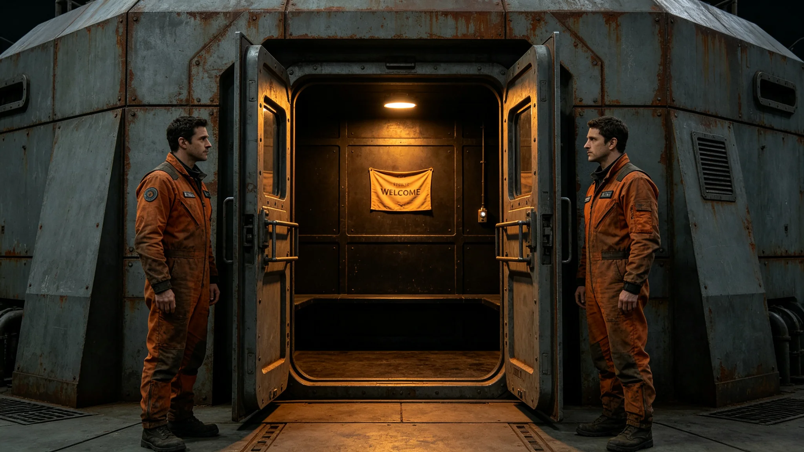

# 首次异星文明代表驻节迎宾礼仪式规程公报

**发布机构**：三恒星系文明联合体文化仪式署
**发布日期**：3613年6月1日
**文件等级**：跨星系公开

## 一、规程背景

3612年分级响应降黄后（见GS-3612-01），经三级人类决策锁首次开启，联合体与第六恒星系方向文明代表达成首次无人探测器互访。互访顺利后，双方约定3613年6月1日在中立空间带驻节舱举行首次异星文明代表驻节迎宾礼。本规程为该仪式的正式记录。

## 二、会面地点与时间

- 地点：中立空间带驻节舱（双方距离中点）
- 时间：3613年6月1日UTC 08:00开始
- 时长：四小时（见GS-3604-01会面礼仪规定）

## 三、参与人员

- 我方首席代表：闻信诚（见GS-3643-01同批任命）
- 我方随员六人：翻译言通津（见GS-3611-01）、礼宾闻揖让（见GS-3633-01）、医官、工程师、信号观测员、记录员
- 对方代表：一人，随员两人
- 双方均带独立翻译官，不共用翻译系统

## 四、仪式流程

| 时段 | 动作 |
|---|---|
| 08:00-08:15 | 双方代表在驻节舱对接口会合 |
| 08:15-09:30 | 首轮会谈，仅交换素数序列与二进制图形 |
| 09:30-09:45 | 静默休息 |
| 09:45-11:00 | 次轮会谈，交换文化信物 |
| 11:00-11:30 | 互赠纪念章（见GS-3629-01口径） |
| 11:30-12:00 | 双方代表在驻节舱气闸告别 |

## 五、礼品与纪念章

依GS-3604-01礼仪准则，我方仅赠已公开文化信物：一枚无图案纯灰纪念章（与GS-3605-01升旗礼同色系）。对方赠一件未公开信物，我方接收后不立即拆解，封存于驻节舱数据柜。

## 六、仪式纪律

1. 不奏乐；
2. 不拥抱，不握手（身体接触由双方各自礼仪决定）；
3. 不主动拍照，仅双方记录员各录一份；
4. 不在驻节舱外悬挂任何旗帜；
5. 信号观测员在驻节舱外保持静默监听。

## 七、仪式意义

文化仪式署注明：这是第一次面对面。我们这一代终于从素数序列走到了对接口。四小时。够了。多了也不安排。

## 八、仪式现场记录

仪式当日，驻节舱对接口位于中立空间带，距双方主基地各约二点一光年。恒星直射方向与对接口夹角约二十三度。双方代表在对接口会合时，我方首席代表闻信诚按我方礼仪微微低头，对方代表按其礼仪以一种我方未记录的方式回应。双方未握手，未拥抱。

首轮会谈中，双方仅交换素数序列与二进制图形。我方图形为一枚无图案纯灰方块，对方图形为一种我方未见过的几何排列。翻译言通津记录，礼宾闻揖让在场。次轮会谈中，双方交换文化信物。我方信物为纯灰纪念章，对方信物为一件未公开物品。

## 九、仪式未安排的事

文化仪式署注明：本仪式未安排合影，未安排直播，未安排母港观礼。四小时到了就结束。多一分钟不安排。这不是冷淡，是礼仪准则（见GS-3604-01）定的。

## 十、对未来互访的交代

本仪式为首次，不是末次。文化仪式署注明：下一次互访，仍在驻节舱，仍四小时，仍不奏乐。等我们学会了对方的礼仪，再调整。现在先按我们的来，也按对方的来。

## 十一、末段签批

本规程经文化仪式署签批，副本分发至外交使团署及三哨站。仪式原始录音录像封存于驻节舱数据柜，双方各存一份。
