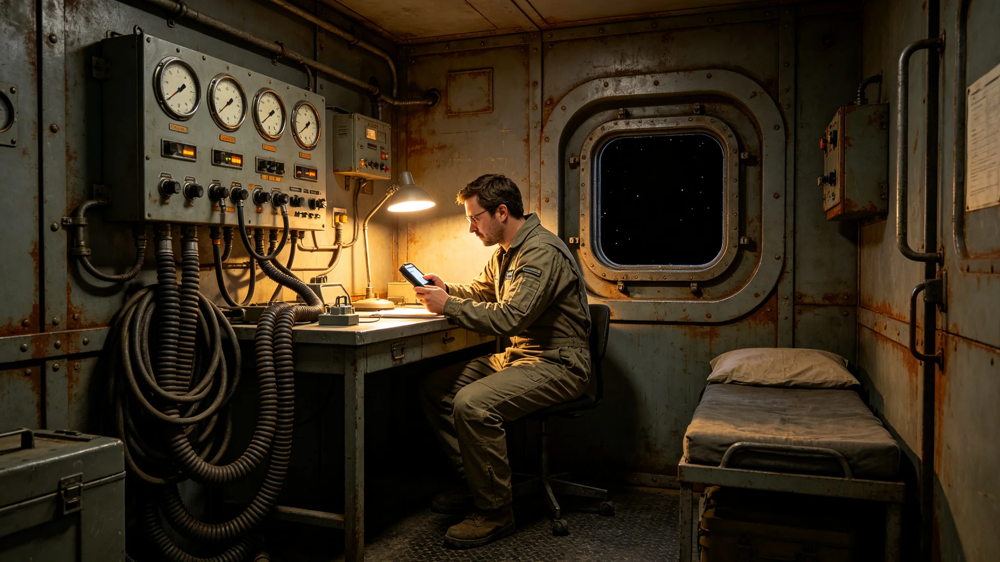

# 异星文明代表驻节舱异星大气适应性首年监测公报

**编制单位**：联合体生态研究所深空生保室
**报告日期**：3615年12月12日
**文件等级**：跨星系公开

## 一、监测背景

3613年6月首次异星文明代表驻节迎宾礼后（见GS-3613-01），双方约定在中立空间带驻节舱设立长期驻节区。异星代表在驻节舱内按其自身大气环境生活，我方代表按地球大气环境生活。驻节舱中部设混合大气过渡区。本公报为异星代表在驻节舱内首年（3613年6月至3615年11月）大气适应性监测结果。

## 二、监测参数

| 参数 | 异星代表舱设定 | 我方舱设定 | 混合区 |
|---|---|---|---|
| 氧气分压 | 不适用 | 21kPa | 15kPa |
| 氮气分压 | 不适用 | 78kPa | 40kPa |
| 二氧化碳分压 | 不适用 | 0.4kPa | 5kPa |
| 温度 | 摄氏18度 | 摄氏22度 | 摄氏20度 |
| 湿度 | 40% | 50% | 45% |

## 三、首年监测结果

首年监测显示：

1. 异星代表舱大气参数稳定，未发生泄漏；
2. 混合区二氧化碳分压略高，但未达警戒值；
3. 我方代表在混合区停留不超过两小时，未出现不适；
4. 异星代表在混合区停留不超过两小时，未出现不适；
5. 驻节舱密封环年度检查一次，无磨损超标。

## 四、未发生的事

- 未发生大气泄漏；
- 未发生我方代表异星大气过敏；
- 未发生异星代表地球大气不适；
- 未发生混合区交叉污染；
- 未发生微生物交叉。

## 五、改进建议

生态研究所建议：

1. 混合区二氧化碳分压由5kPa降至3kPa，减少我方代表不适感；
2. 驻节舱密封环统一改用第十代合金，降低微漏概率；
3. 异星代表舱大气样本定期采集，每次不超过5毫升，经对方同意。

## 六、监测日常记录

驻节舱医官每月采集一次大气样本，每次不超过五毫升，经对方同意。首年共采集样本十二次，对方均同意。样本分析在驻节舱内设的小型分析台进行，不外带。医官注明：异星代表舱大气成分与我方差异较大，但首年未见交叉污染。

我方代表在混合区停留不超过两小时，每次停留后医官记录心率、呼吸频率、皮肤反应。首年我方代表进入混合区约四十次，均无异常。异星代表进入混合区次数相当，亦无异常。

## 七、对方代表的大气

生态研究所注明：异星代表舱大气中含有一种我方未记录的气体成分，浓度约百分之三。我方未要求对方公开该成分，对方也未主动公开。双方约定：该成分不进入混合区。混合区大气经双方共同监测，确保不含该成分。

## 八、首年未发生的事补记

首年未发生微生物交叉。驻节舱密封环年度检查一次，无磨损超标。我方代表无一人出现异星大气过敏，异星代表无一人出现地球大气不适。

## 九、末段签批

本公报经生态研究所深空生保室签批，副本分发至外交使团署及驻节舱。原始监测数据封存于生态研究所恒温柜。后续每年发布一次。
