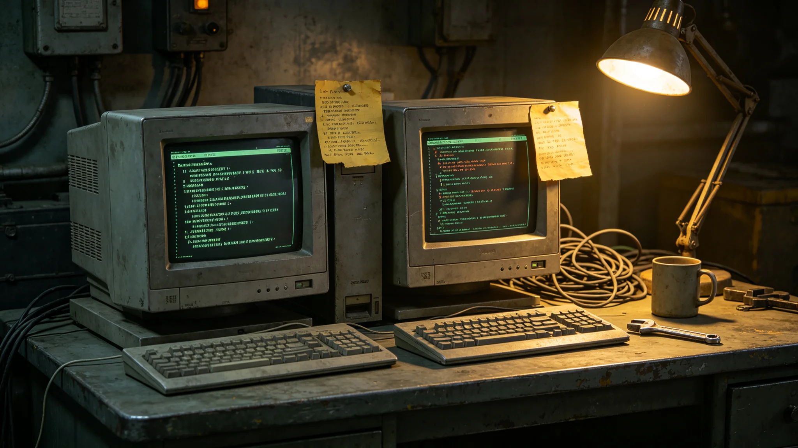

# 首次互访中自动翻译协议版本不兼容致照会误译事件通报

**发布机构**：联合体安全协调委员会事件处置署
**发布日期**：3616年3月20日
**文件等级**：跨星系内部

## 一、事件经过

3616年2月14日，首次互访第二轮会谈在驻节舱举行。会谈中，我方自动翻译系统将对方照会中"间隔三倍"误译为"间隔三分之一"。误译由对方首席翻译官当场指出，我方翻译言通津（见GS-3611-01）立即手动更正。会谈暂停四十分钟后恢复。

## 二、误译原因

经排查，误译原因为：我方自动翻译系统版本为第七代，对方系统版本为第八代，两版本对"间隔"一词的二进制编码约定不同。我方按第七代解码，对方按第八代编码，导致比例倒置。

## 三、处置过程

| 时刻（UTC） | 事件 |
|---|---|
| 3616年2月14日10:20 | 会谈进行中 |
| 10:35 | 对方翻译指出误译 |
| 10:40 | 言通津手动更正 |
| 10:40-11:20 | 会谈暂停，双方排查 |
| 11:20 | 恢复会谈，改用人工翻译 |
| 12:00 | 会谈结束，未造成后果 |

## 四、误译是否造成后果

事件处置署评估：误译未造成实际外交后果。对方指出及时，我方更正及时。会谈改人工翻译后顺利结束。双方未因此中断互访。

## 五、整改措施

事件处置署决定：

1. 双方自动翻译系统统一升级至同一版本，升级前不使用自动翻译；
2. 后续会谈一律以人工翻译为准，自动翻译仅作辅助；
3. 言通津记口头提醒一次，不记过；
4. 本次事件原始记录封存于驻节舱数据柜。

## 六、与3520年事件对照

GS-3520-01为跨系庭审中翻译系统版本滞后致误译事件。本次为互访中版本不兼容致误译。两次事件均无重大后果。

## 七、事件处置过程细节

误译发生时，会谈进行到第二轮，议题为"下次会谈间隔"。对方照会原文为"间隔三倍于上次"，我方自动翻译系统按第七代解码为"间隔三分之一于上次"。比例倒置，事关下次会谈时间，若不纠正可能导致双方在不同时间到达对接口。

对方首席翻译官在照会递出后五分钟指出误译。言通津立即核对原文，确认误译，手动更正为"间隔三倍"。会谈暂停四十分钟。双方技术人员排查自动翻译系统版本，确认我方第七代、对方第八代编码约定不同。恢复会谈后，双方约定改用人工作为唯一翻译，自动翻译仅作辅助。

## 八、事件未造成的后果

本次事件未导致双方在不同时间到达对接口。下次会谈时间按更正后的"间隔三倍"执行，双方均在约定时间到达。互访未中断。

## 九、对未来翻译工作的交代

事件处置署注明：这次误译提醒我们，自动翻译不是万能的。版本不一致的时候，人上。言通津在签认书上写：翻错一个比例，事小；翻错一个时间，人就到不齐了。

## 十、末段签批

本通报经事件处置署签批，副本分发至外交使团署及双方驻节人员。
