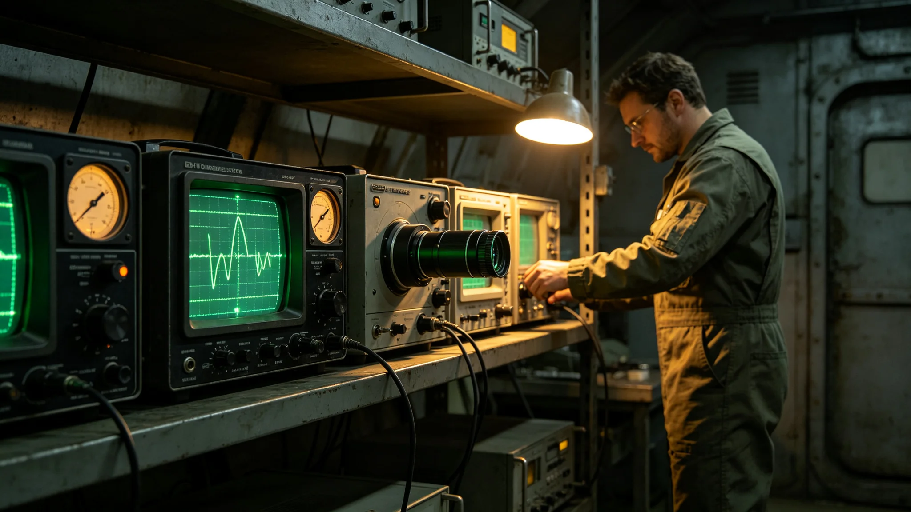

# 第六代深空信号监测网主动光学窄带甄别技术报告

**编制单位**：联合体通信工程研究院信号监测室
**报告日期**：3617年7月7日
**文件等级**：跨星系工程公开

## 一、技术背景

第五代干涉阵（见GS-3565-01）自3565年运行以来，已捕获窄带周期信号多次（见GS-3573-01、GS-3608-01、GS-3612-01）。但第五代阵仅能被动接收，无法主动甄别信号源是原生还是反射。3612年分级响应升橙事件中（见GS-3612-01），母港比对耗时六十三小时，主因被动接收无法区分反射。经通信工程研究院立项，第六代信号监测网增加主动光学窄带甄别功能，自3617年起组网运行。

## 二、技术原理

第六代阵在被动接收基础上，增加一台低功率定向光学发射机。当被动接收捕获疑似新方向窄带信号时，第六代阵向该方向发送一束极低功率光学脉冲（功率不超过对方信号功率的百分之一），测量返回信号的时延与波形。若返回信号与原生信号一致，则为原生源；若返回信号有反射特征，则为反射源。

## 三、技术指标

| 参数 | 规范值 |
|---|---|
| 探测脉冲功率 | 对方信号功率的1%以下 |
| 定向精度 | 优于0.005度 |
| 单次探测时长 | 不超过十秒 |
| 静默观察期 | 探测后不少于三倍信号间隔 |
| 安全联锁 | 三级决策锁未开即拒发 |

## 四、与第五代对照

| 指标 | 第五代 | 第六代 |
|---|---|---|
| 接收模式 | 被动 | 被动加主动 |
| 反射甄别能力 | 无 | 有 |
| 比对耗时 | 63小时 | 6小时 |
| 定向精度 | 0.05度 | 0.005度 |

## 五、安全约束

第六代阵主动发射探测脉冲，功率仅为对方信号百分之一，且时长不超过十秒，静默观察期不少于三倍信号间隔。依GS-3604-01礼仪准则，该探测脉冲不属于应答，不构成主动接触。三级人类决策锁未开时，第六代阵仅被动接收，不主动探测。

## 六、首年运行数据

自3617年1月组网以来，第六代阵共执行主动探测两次，均为对已记录信号源的验证性探测，未对新信号源发射。两次探测均未引起对方反应。

## 七、与3612年事件的关系

3612年分级响应升橙事件中（见GS-3612-01），母港比对耗时六十三小时，主因第五代阵无法区分反射源。第六代阵组网后，同类事件比对耗时可缩短至六小时。通信工程研究院注明：这不是为了更快应答，而是为了更快降黄。降黄快一点，哨站少紧张一点。

## 八、首年运行细节

第六代阵自3617年1月组网以来，每月由值更工程师巡检一次。巡检内容包括：定向透镜表面检查、发射脉冲功率校准、安全联锁测试。两次主动探测均为对3573年已记录信号源的验证性探测，未对新方向发射。通信工程研究院注明：第六代阵不是武器，是一面更准的望远镜。望远镜只能看，不能打。

## 九、末段签批

本报告经通信工程研究院信号监测室签批，副本分发至前出部署署及三哨站。原始设计图纸封存于研究院恒温柜。
