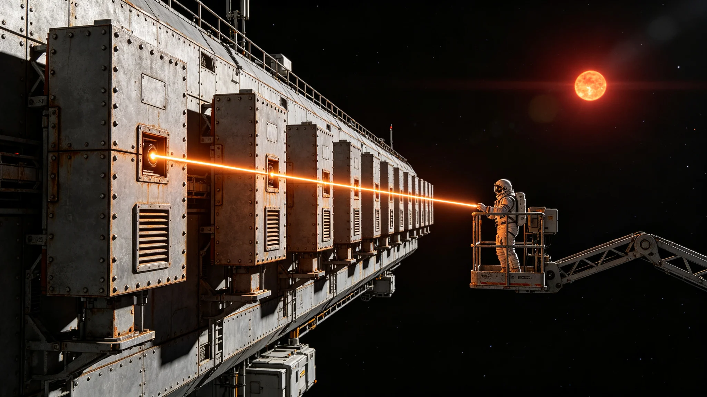

# 第十一代深空激光通信中继阵列跨星系链路技术报告

**编制单位**：联合体通信工程研究院激光通信室
**报告日期**：3618年10月10日
**文件等级**：跨星系工程公开

## 一、技术背景

跨星系港至第六方向前哨站光时延约四年半（见GS-3601-01）。原有第十代激光中继阵列仅能传输加密状态摘要，带宽不足以回传原始监听磁带。3613年首次互访后（见GS-3613-01），外交使团署要求回传驻节舱会谈记录。经通信工程研究院立项，第十一代激光中继阵列于3618年组网，跨星系链路带宽较第十代提升五倍。

## 二、技术指标

| 参数 | 第十代 | 第十一代 |
|---|---|---|
| 链路带宽 | 1Mbps | 5Mbps |
| 中继站数量 | 4座 | 6座 |
| 中继舱形态 | 方盒子型 | 圆柱形加压舱 |
| 单站寿命 | 15年 | 25年 |
| 误码率 | 1e-6 | 1e-8 |

## 三、中继站部署

第十一代中继站沿跨星系港至第六方向航线部署六座，均为圆柱形加压金属舱体，带小方形舷窗与RCS姿态喷口，无轮子。中继站之间间距约零点七光年。中继站不亮尾喷，仅靠惯性保持位置。

## 四、链路用途

第十一代链路用于以下数据回传：

1. 前哨站监听磁带原始记录（每十八个月轮换时带回，不实时回传）；
2. 驻节舱会谈记录（经双方同意后回传）；
3. 加密状态摘要（实时）。

依GS-3601-01口径，监听原始磁带不在驻守期间实时回传，仅随轮换带回。第十一代链路带宽提升仅为未来互访记录回传预留，不改变磁带封存制度。

## 五、安全约束

第十一代链路不发射任何窄带信号给第六方向文明。中继站仅向跨星系港方向发射激光，不向对方方向发射。依GS-3604-01礼仪准则，该激光链路不属于应答。

## 六、首年运行数据

自3618年1月组网以来，第十一代链路运行稳定，误码率符合规范。全年回传驻节舱会谈记录约一百二十场，未中断。

## 七、中继站形态细节

六座中继站均为圆柱形加压金属舱体，直径约十二米，长约三十米。每座带小方形舷窗两排、RCS姿态喷口四个、对接端口一个。中继站外壁有微陨石擦痕与金属氧化痕迹，无光滑塑料漆面。中继站之间间距约零点七光年，靠惯性保持位置，不亮尾喷。

中继站不设轮子。中继站不设开放式桁架。中继站不发射任何窄带信号给第六方向文明。

## 八、链路安全

第十一代链路仅向跨星系港方向发射激光，不向对方方向发射。激光束窄到对方在四光年半外几乎无法接收。依GS-3604-01礼仪准则，该链路不属于应答。外交使团署注明：我们把数据传回母港，不是发给对方。

## 九、末段签批

本报告经通信工程研究院激光通信室签批，副本分发至前出部署署及外交使团署。原始设计图纸封存于研究院恒温柜。
