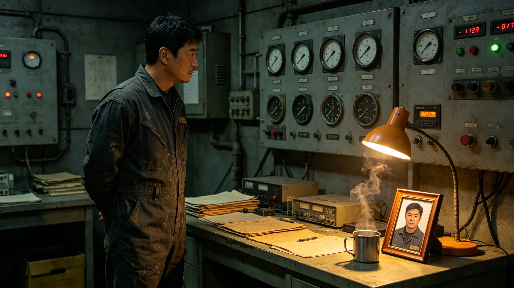

# 第六恒星系方向先遣科考站首任站长闻拓荒二十九年考勤与封舱签认档案

**归档单位**：联合体深空人事署
**归档日期**：3619年11月11日
**档案等级**：内部人事

## 一、基本登记

- 姓名：闻拓荒
- 性别：男
- 出生：3560年，跨星系港出生
- 现任：第六恒星系方向先遣科考站首任站长（3619年就任）
- 工号：DS-STA-3619-001

## 二、历轮考勤摘要

闻拓荒自3590年入役至3619年10月，共执行长航程任务二十九次，累计在航约3600天。考勤摘要如下：

| 时段 | 职务 | 任务次数 | 缺勤 | 迟到 | 备注 |
|---|---|---|---|---|---|
| 3590-3595 | 见习工程师 | 5 | 0 | 0 | 长航程进修 |
| 3595-3600 | 工程师 | 6 | 0 | 0 | 参与GS-3569先飞轨道设计 |
| 3600-3610 | 高级工程师 | 8 | 0 | 0 | 参与前哨站建设 |
| 3610-3619 | 站长 | 10 | 0 | 0 | 先遣科考站筹建 |

## 三、封舱签认记录

闻拓荒在3619年科考站落成点灯礼（见GS-3621-01）前，共签认封舱十二次，均为科考站各舱段在启用前的密封检查签认。十二次封舱签认均一次通过，无泄漏。

## 四、体检摘要

| 年份 | 骨密度T值 | 前庭评分 | 视力 |
|---|---|---|---|
| 3600 | -0.7 | 良好 | 1.0/1.0 |
| 3610 | -1.2 | 良好 | 0.9/1.0 |
| 3619 | -1.4 | 良好 | 0.9/0.9 |

骨密度T值逐年下降，未触发转岗。

## 五、处分记录

闻拓荒二十九年来共受处分一次：3598年某次值更日志漏记一次，书面检查一份。除此无其他处分。

## 六、家庭与家属

配偶在跨星系港任教师，一子一女均在跨星系港。闻拓荒每次任务后休整不少于三十天。

## 七、任站长评价

外交使团署与前出部署署联合评价：闻拓荒筹建科考站九年，封舱十二次一次通过，考勤稳健，无逾界行为。

## 八、筹建科考站的具体工作

闻拓荒自3610年起主持先遣科考站筹建。九年间，他带队三赴跨星系港第七总装车间，核对各舱段密封件；四赴前哨站实地测量对接端口尺寸；六次修改科考站平面图。3619年11月，科考站各舱段总装完成，闻拓荒逐舱签认封舱，共十二次。

封舱签认时，闻拓荒在每舱段密封环上贴一张黄色标签，标签上写舱号与封舱日期。十二张标签字迹工整，无涂改。

## 九、人事署审阅意见

人事署审阅组认为：闻拓荒二十九年考勤稳健，体检稳定，处分轻微，封舱签认可辨。其筹建科考站九年，未发生舱段泄漏，未发生预算超支。审阅组建议：闻拓荒可任科考站首任站长，36个月轮换一次。

## 十、末段签批

本档案袋经深空人事署审阅，记录完整。档案袋密封后存于人事署恒温柜。
