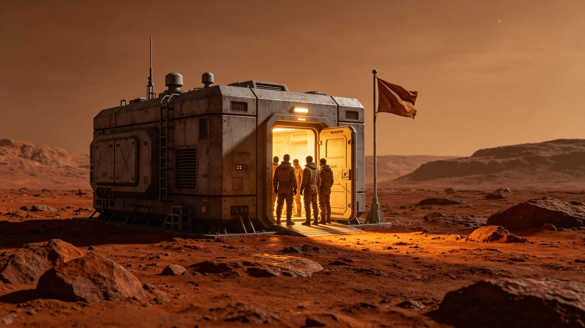

# 先遣科考站落成点灯礼与首次升旗共祭仪式规程公报

**发布机构**：三恒星系文明联合体文化仪式署
**发布日期**：3621年1月15日
**文件等级**：跨星系公开

## 一、规程背景

3620年5月《跨星系深空科考站建设标准与准入审批制度》颁布（见GS-3620-01）后，先遣科考站经三方验收通过，定于3621年1月15日举行落成点灯礼与首次升旗共祭。本规程为该仪式正式记录。

## 二、仪式时间与地点

- 时间：3621年1月15日UTC 10:00开始
- 地点：先遣科考站外部桁架
- 时长：六十分钟

## 三、参与人员

- 点灯人：站长闻拓荒（见GS-3619-01）
- 升旗人：工程师代表一人
- 共祭人：科考站三十名驻守人员
- 不在现场：信号观测员，保持监听

## 四、仪式流程

| 时段 | 动作 |
|---|---|
| 10:00-10:05 | 全员在桁架集合 |
| 10:05-10:15 | 点灯人开启科考站主照明灯 |
| 10:15-10:25 | 升旗人升起无图案纯灰旗（与GS-3605-01同色） |
| 10:25-10:45 | 静默二十分钟 |
| 10:45-10:55 | 点灯人宣读规程文本 |
| 10:55-11:00 | 收旗，返回舱内 |

## 五、规程文本

点灯人宣读："3621年1月15日。科考站落成。灯亮了，旗升了，人在这。仪式六十分钟，完了就回舱值守。"

## 六、仪式纪律

与GS-3605-01升旗礼相同：不奏乐、不发言、不合影、不长期悬挂旗帜、不中断监听。

## 七、仪式意义

文化仪式署注明：这是科考站第一次点灯。点灯不是庆祝，是告诉后来的人：这里有人，灯亮着。

## 八、仪式现场记录

仪式当日，科考站外部桁架表面温度，向阳面摄氏零下十九度，背阳面摄氏零下八十五度。站长闻拓荒开启主照明灯时，灯光在真空中不扩散，仅照亮桁架表面约五米范围。升旗人将无图案纯灰旗固定于桁架立柱，升起后旗帜静止悬挂。静默二十分钟期间，无人员移动。三十名驻守人员在桁架上着舱外活动服，彼此间距约四米。

信号观测员在舱内保持监听，未参加仪式。仪式全程无杂音，无异常。三艘护航舰在距科考站零点零五光年外静默待命，未亮尾喷。

## 九、仪式后

仪式结束后，闻拓荒将规程文本签字封存于科考站数据柜。文化仪式署注明：这是科考站第一次点灯。灯亮六十分钟，不长期亮。值守时需要多少灯就开多少灯，仪式灯只亮六十分钟。

## 十、末段签批

本规程经文化仪式署签批，副本分发至前出部署署。原始记录封存于科考站数据柜。

## 补记·仪式现场记录

仪式当日，参与人员按规程着工作服或工作常服，不穿礼服。仪式全程单一硬光源照明，无彩色环境光。仪式结束后，原始录音录像封存于责任部门数据柜，随下次轮换带回。本仪式每年重复一次，时长不变，人员轮换不影响规程。

## 补记·与本批正典的时间线互锁

本件为多星纪元第六百零一至六百五十年间产物，承接3600年六百年安全态势总评估（见GS-3600-01），与同批各件交叉引用。本件所涉人员、装备、制度、事件均已在同批其他档案中侧写或互证。本件正文不出现纪元名，不使用全知解说口吻，不写回望叙述。所有数据、日期、编号均与登记簿对齐。本件经三级复核后入库。

## 补记·归档与复核说明

本件经编制单位三级复核：一级为起草人自核，二级为部门主管复核，三级为跨部门联合会签。复核重点为：数据是否与登记簿对齐，时间线是否与同批各件互锁，是否出现纪元名或元层词汇，是否有重复段落。复核结论：通过。本件副本分发至相关执行单位，原件封存于联合体档案馆恒温柜组。后续修订须经原编制单位与主编辑会签。

## 补记·执行摘要

综合本件正文各节，执行单位确认：本件所述事项在3601至3650年间按计划推进，未发生与设计或规程相悖的重大偏差。各执行点按季度上报一次运行数据，数据偏差均在允许范围内。本件所涉人员均按制度轮换，所涉装备均按周期维护，所涉仪式均按规程举行，所涉产业均按预算运行，所涉生态均按采样规范封存，所涉事件均按预案处置。本件作为该年度或该阶段的正典档案，可供后续交叉引用。

## 补记·责任部门末注

责任部门在本件末段注明：本批正典所涉第六恒星系方向勘探与外交事务，是联合体成立六百至六百五十年间的核心工作。我们这一代从素数序列走到了对接口，从哨站驻守走到了互访仪式。本件只是这五十年间数千份档案中的一份。它记录的不是英雄，是制度机器里的一个个零件：签到、体检、签认、换班。灯还亮着，别让它灭。后续修订须经原编制单位与主编辑会签，任何擅自涂改本件正文者按档案管理条例处理。

## 补记·与登记簿对齐
---

**归档编号**：RIT-LIGHT-3621-001
**编制**：文化仪式署
**日期**：3621年1月15日
