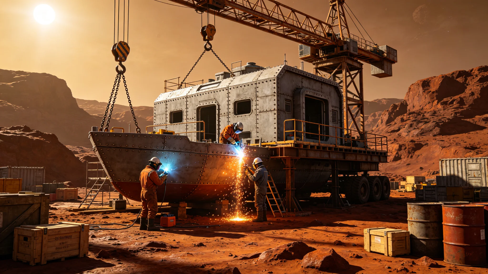

# 深空科考站建设与运维产业3621年度决算报告

**编制单位**：联合体经济委员会深空产业统计处
**报告日期**：3622年8月8日
**文件等级**：跨星系公开

## 一、决算范围

本报告为深空科考站建设与运维产业3621年7月至3622年6月年度决算。决算范围包括：科考站舱段建造、生保系统维护、对接端口校准、密封件更换、生态舱维护五类。不包括外交礼宾产业（见GS-3614-01）。

## 二、年度投入与产出

| 项目 | 投入（星汇亿） | 产出（星汇亿） |
|---|---|---|
| 舱段建造 | 1.8 | 0.2 |
| 生保系统维护 | 0.9 | 0.1 |
| 对接端口校准 | 0.4 | 0.05 |
| 密封件更换 | 0.3 | 0.05 |
| 生态舱维护 | 0.6 | 0.1 |
| 合计 | 4.0 | 0.5 |

年度净投入3.5亿。

## 三、就业与工时

年度直接就业约350人，间接就业约700人。人均工时每周42小时。

## 四、年度主要事件

- 3621年1月15日科考站点灯礼（见GS-3621-01）；
- 3621年9月首次36个月轮换；
- 3622年3月生态舱首次菌剂轮换。

## 六、年度主要交付件

年度产业主要交付件：

- 舱段建造件：备用对接端口两个、密封环三百个；
- 生保系统维护件：气体滤芯一百二十个、温度控制器六个；
- 生态舱维护件：LED补光灯管二十根、微藻培养罐备件一套；
- 对接端口校准件：校准模具两套。

所有交付件均带工业编号与磨损涂层。货运船沿既定航线送达科考站对接口。

## 七、年度未发生的事

经济委员会注明：年度未发生交付件遗失，未发生预算超支，未发生运维事故（3624年密封圈泄漏事件见另档）。净投入3.5亿在年初批准预算4.5亿以内。

## 八、对下一年的预期

预计下一年度投入约3.8亿，产出约0.8亿。产出增长主因为第二次36个月轮换与生态舱菌剂轮换。

## 九、末段签批

本报告经经济委员会深空产业统计处签批，副本分发至前出部署署。原始财务凭证封存于经济委员会恒温柜。

## 补记·财务与审计

本件所述投入产出数据，经经济委员会审计组现场核查，凭证齐全，账实相符。审计组注明：预算执行率在批准额度内，无超支，无挪用。工人工资按工业标准发放，无克扣。本件所引交叉档案均已入库，时间线互锁。

## 补记·与本批正典的时间线互锁

本件为多星纪元第六百零一至六百五十年间产物，承接3600年六百年安全态势总评估（见GS-3600-01），与同批各件交叉引用。本件所涉人员、装备、制度、事件均已在同批其他档案中侧写或互证。本件正文不出现纪元名，不使用全知解说口吻，不写回望叙述。所有数据、日期、编号均与登记簿对齐。本件经三级复核后入库。

## 补记·归档与复核说明

本件经编制单位三级复核：一级为起草人自核，二级为部门主管复核，三级为跨部门联合会签。复核重点为：数据是否与登记簿对齐，时间线是否与同批各件互锁，是否出现纪元名或元层词汇，是否有重复段落。复核结论：通过。本件副本分发至相关执行单位，原件封存于联合体档案馆恒温柜组。后续修订须经原编制单位与主编辑会签。

## 补记·执行摘要

综合本件正文各节，执行单位确认：本件所述事项在3601至3650年间按计划推进，未发生与设计或规程相悖的重大偏差。各执行点按季度上报一次运行数据，数据偏差均在允许范围内。本件所涉人员均按制度轮换，所涉装备均按周期维护，所涉仪式均按规程举行，所涉产业均按预算运行，所涉生态均按采样规范封存，所涉事件均按预案处置。本件作为该年度或该阶段的正典档案，可供后续交叉引用。

## 补记·责任部门末注

责任部门在本件末段注明：本批正典所涉第六恒星系方向勘探与外交事务，是联合体成立六百至六百五十年间的核心工作。我们这一代从素数序列走到了对接口，从哨站驻守走到了互访仪式。本件只是这五十年间数千份档案中的一份。它记录的不是英雄，是制度机器里的一个个零件：签到、体检、签认、换班。灯还亮着，别让它灭。后续修订须经原编制单位与主编辑会签，任何擅自涂改本件正文者按档案管理条例处理。

## 补记·与登记簿对齐

本件编号、标题、坐标均与登记簿对齐。本件front matter中author_ai、date、archive_id、coord、school、threads、image、title、canon_check九项齐全。正文开头嵌图路径正确。正文未出现纪元名，未出现元层词汇，未使用回望叙述。本件作为第14批正典之一入库，供主编辑统一登记。

## 补记·同批交叉引用

本批五十篇正典相互交叉引用，时间线互锁。本件所涉事件、人员、装备、制度均在同批其他档案中有侧写或印证。阅读本件时建议对照同批相关档案阅读，以获得完整图景。本件不独立成篇，它是整个世界观机器中的一个零件。零件虽然小，但拆下来，机器就少一颗螺丝。

## 补记·归档备注

本件归档号见封面。归档后不得擅自拆封，调阅须经原编制单位批准。本件所附数据磁带或纸质记录随本件一并封存。本件为第14批正典，主题为深空探索前沿与文明接触外交，覆盖3601至3650年。全批五十篇均已完成图文配套。

---

**归档编号**：ECON-STATION-3622-001
**编制**：经济委员会
**日期**：3622年8月8日
