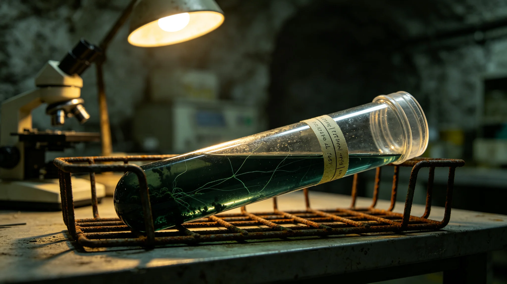

# 第六恒星系方向异星地下含水层深部微生物群落首次探测公报

**编制单位**：联合体生态研究所异星生态室
**报告日期**：3623年4月4日
**文件等级**：跨星系公开

## 一、探测背景

3621年先遣科考站落成后（见GS-3621-01），经三方批准，科考站首次开展异星地表非接触采样。3622年10月，科考站在距站约零点零一光年处的异星地下含水层钻孔，采集深部岩芯样本。本公报为该样本中发现微生物群落的首次探测记录。

## 二、采样过程

采样由非接触采样机械臂第六代（见GS-3626-01）执行，钻孔深度约一百二十米，采集岩芯三段。岩芯密封带回科考站，在手套箱内分析。采样全程未打开岩芯密封管，未与异星环境直接接触。

## 三、发现结果

岩芯第三段在深度约一百一十米处发现疑似微生物群落。该群落为厌氧型，以矿物氧化为能源，不依赖恒星光照。群落规模极小，单菌落直径不超过零点一毫米。

## 四、安全措施

生态研究所采取以下安全措施：

1. 岩芯密封管不打开，仅在手套箱内用光学显微镜观察；
2. 不培养，不分离，不测序；
3. 样本不接触我方大气；
4. 采样后机械臂表面消毒三次。

## 五、未发生的事

- 未发生微生物泄漏；
- 未发生培养污染；
- 未发生与我方生物圈交叉。

## 六、探测意义

生态研究所注明：这是人类第一次在第六恒星系方向发现独立于恒星光照的微生物群落。该群落以矿物氧化为能源，与地球地下深部生物圈类似。我们没有培养它，没有分离它，也没有测序它。我们只是看了一眼，然后把岩芯封回去。

## 七、对未来采样的约束

依本次探测经验，生态研究所规定：后续采样一律不培养、不分离、不测序，仅在手套箱内光学观察。若需进一步研究，须经外交使团署与对方文明代表协商。

## 八、采样员记录

采样机械臂操作员为科考站工程师一人，操作时长约四十分钟。采样后机械臂表面消毒三次，无残留。操作员注明：钻孔时未遇到任何原生生物活动迹象，岩芯取出时表面干燥。

## 九、末段签批

本公报经生态研究所异星生态室签批，副本分发至外交使团署。原始岩芯样本封存于科考站手套箱内。
