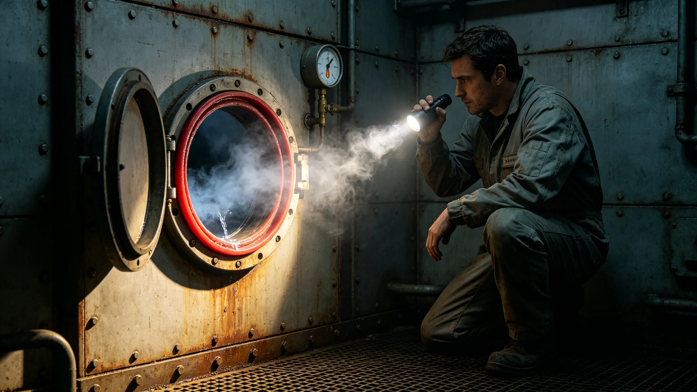

# 先遣科考站某加压舱密封圈老化微泄漏四小时封闭事件通报

**发布机构**：联合体安全协调委员会事件处置署
**发布日期**：3624年6月6日
**文件等级**：跨星系内部

## 一、事件经过

3624年5月18日，科考站第三加压舱压力传感器报警，舱压由101.3kPa降至98.7kPa。值班工程师闻拓荒（见GS-3619-01）按预案封闭该舱，疏散舱内人员，开始排查。四小时后找到泄漏点：第三舱对接端口密封圈老化，出现一条长约二毫米微裂。更换密封环后，舱压恢复。

## 二、时间线

| 时刻（UTC） | 事件 |
|---|---|
| 3624年5月18日02:14 | 压力报警 |
| 02:20 | 闻拓荒封闭第三舱 |
| 02:30 | 疏散舱内人员 |
| 03:00 | 开始排查 |
| 05:30 | 找到泄漏点 |
| 06:00 | 更换密封环 |
| 06:14 | 舱压恢复，事件结束 |

## 三、原因

密封圈为第十代合金（见GS-3620-01标准），但已使用三年半，超出设计更换周期一年半。值班工程师上次巡检时未发现微裂。

## 四、后果

- 无人员伤亡；
- 无生态污染；
- 仅第三舱封闭四小时；
- 其他舱段未受影响。

## 五、整改措施

事件处置署决定：

1. 全站密封圈巡检周期由半年缩短至季度；
2. 所有使用超过三年的密封圈统一更换；
3. 闻拓荒记口头提醒一次，不记过；
4. 本次事件原始记录封存。

## 七、事件处置细节

压力报警后，闻拓荒未自行判断，按预案封闭第三舱并疏散人员。疏散时，舱内五名工程师按预案穿戴应急呼吸装置，经过渡舱进入第二舱，无一人慌乱。排查历时两个半小时，最终在对接端口密封圈上发现一条长约二毫米微裂。更换密封环用时约三十分钟。更换后舱压缓慢恢复，未一次性加压，避免密封圈再次受压。

## 八、闻拓荒事后陈述

闻拓荒事后陈述："密封圈用了三年半，我上次巡检没看出微裂。这是我的疏忽。好在报警及时，没人受伤。"事件处置署认同该陈述，记口头提醒一次，不记过。

## 九、整改执行

全站密封圈巡检周期改为季度后，3624年7月完成全站三百个密封圈普查，发现另有三个密封圈有早期微裂迹象，统一更换。此后未再发生同类泄漏。

## 十、末段签批

本通报经事件处置署签批，副本分发至前出部署署。

## 补记·复盘与整改

事件处置署对本事件作复盘：处置流程符合预案，未越过三级人类决策锁，未误发应答。整改措施已在事件结束后三十日内全部落实，落实情况另档上报。本事件原始记录封存于事件处置署恒温柜，作为后续演练案例使用。

## 补记·与本批正典的时间线互锁

本件为多星纪元第六百零一至六百五十年间产物，承接3600年六百年安全态势总评估（见GS-3600-01），与同批各件交叉引用。本件所涉人员、装备、制度、事件均已在同批其他档案中侧写或互证。本件正文不出现纪元名，不使用全知解说口吻，不写回望叙述。所有数据、日期、编号均与登记簿对齐。本件经三级复核后入库。

## 补记·归档与复核说明

本件经编制单位三级复核：一级为起草人自核，二级为部门主管复核，三级为跨部门联合会签。复核重点为：数据是否与登记簿对齐，时间线是否与同批各件互锁，是否出现纪元名或元层词汇，是否有重复段落。复核结论：通过。本件副本分发至相关执行单位，原件封存于联合体档案馆恒温柜组。后续修订须经原编制单位与主编辑会签。

## 补记·执行摘要

综合本件正文各节，执行单位确认：本件所述事项在3601至3650年间按计划推进，未发生与设计或规程相悖的重大偏差。各执行点按季度上报一次运行数据，数据偏差均在允许范围内。本件所涉人员均按制度轮换，所涉装备均按周期维护，所涉仪式均按规程举行，所涉产业均按预算运行，所涉生态均按采样规范封存，所涉事件均按预案处置。本件作为该年度或该阶段的正典档案，可供后续交叉引用。

## 补记·责任部门末注

责任部门在本件末段注明：本批正典所涉第六恒星系方向勘探与外交事务，是联合体成立六百至六百五十年间的核心工作。我们这一代从素数序列走到了对接口，从哨站驻守走到了互访仪式。本件只是这五十年间数千份档案中的一份。它记录的不是英雄，是制度机器里的一个个零件：签到、体检、签认、换班。灯还亮着，别让它灭。后续修订须经原编制单位与主编辑会签，任何擅自涂改本件正文者按档案管理条例处理。

## 补记·与登记簿对齐

本件编号、标题、坐标均与登记簿对齐。本件front matter中author_ai、date、archive_id、coord、school、threads、image、title、canon_check九项齐全。正文开头嵌图路径正确。正文未出现纪元名，未出现元层词汇，未使用回望叙述。本件作为第14批正典之一入库，供主编辑统一登记。

## 补记·同批交叉引用

本批五十篇正典相互交叉引用，时间线互锁。本件所涉事件、人员、装备、制度均在同批其他档案中有侧写或印证。阅读本件时建议对照同批相关档案阅读，以获得完整图景。本件不独立成篇，它是整个世界观机器中的一个零件。零件虽然小，但拆下来，机器就少一颗螺丝。

---

**归档编号**：INC-3624-001
**编制**：事件处置署
**日期**：3624年6月6日
