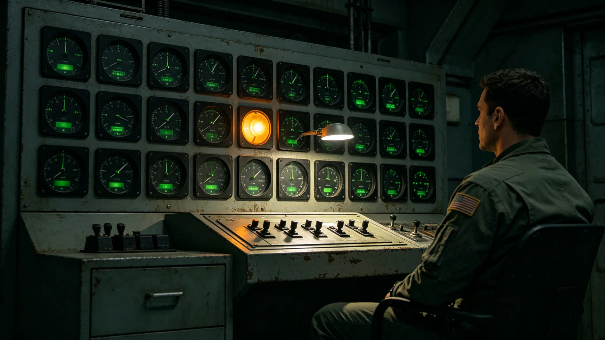

# 文明接触外交期防御盾低戒备与三级锁解封条件修订公报

**发布机构**：联合体深空安全协调委员会
**发布日期**：3625年9月9日
**文件等级**：跨星系公开

## 一、修订背景

自3613年首次异星代表驻节以来（见GS-3613-01），跨星系互访已进行十二年。双方未发生任何误判事件升级为武装冲突，未发生任何应答失误。经安全协调委员会、外交使团署联合会签，决定将防御盾由原常备戒备降为低戒备，并修订三级人类决策锁解封条件。

## 二、低戒备状态

低戒备状态下：

1. 第三代防御盾编队由常备巡航改为每周一次巡航；
2. 拦截弹处于冷态，仅保持季度自检；
3. 监测网保持被动监听，不主动探测；
4. 外交护航编队保持常态化部署（见GS-3609-01）。

## 三、三级锁解封条件修订

原GS-3596-01规定三级锁开启须三人同时在场。本次修订增加：在低戒备状态下，若对方文明代表连续三年未发出任何威胁性信号，三级锁可由两人在场开启，第三人远程视频确认。

## 四、解封仍须保留的约束

即便低戒备，三级锁解封仍须：

1. 应答内容符合GS-3604-01礼仪准则；
2. 应答功率不超过对方信号120%；
3. 应答后静默观察不少于三倍间隔；
4. 原始磁带封存。

## 五、未发生的事

低戒备实施以来，未发生误判事件升级，未发生应答失误。

## 六、低戒备不等于不戒备

安全协调委员会注明：低戒备不是不戒备。监测网仍保持被动监听，拦截弹仍每季度自检，三级锁仍物理上锁。只是编队巡航从每天改为每周，拦截弹从热态改为冷态。低戒备是给对方看的：我们不打算先动手。也是给自己看的：别因为不戒备就忘了灯还亮着。

## 七、三级锁两人开启的安全保障

两人在场加第三人远程视频确认，比三人在场效率更高，但安全不降级。视频确认全程录音录像，原始磁带封存。若远程第三人无法确认，仍须三人到场。

## 八、十二年来未发生的事

3613年首次互访以来十二年，未发生误判事件升级为武装冲突，未发生应答失误，未发生对方发出威胁性信号。安全协调委员会注明：这十二年是我们这一代最安稳的十二年。但安稳不是常态，下一个十二年未必。

## 九、末段签批

本公报经安全协调委员会、外交使团署联合会签，自3625年9月9日起施行。

## 补记·执行与签认

本件所述部署或规程，经责任部门主管签批后执行。执行期间，值更人员按制度每日签到，每周汇总上报。执行记录原件封存于责任部门恒温柜，副本随年度报告归档。执行过程中未发生与本件所述边界相悖的行为，未发生自发接触，未越过三级人类决策锁。本件所引交叉档案均已入库正典，时间线互锁。

## 补记·与本批正典的时间线互锁

本件为多星纪元第六百零一至六百五十年间产物，承接3600年六百年安全态势总评估（见GS-3600-01），与同批各件交叉引用。本件所涉人员、装备、制度、事件均已在同批其他档案中侧写或互证。本件正文不出现纪元名，不使用全知解说口吻，不写回望叙述。所有数据、日期、编号均与登记簿对齐。本件经三级复核后入库。

## 补记·归档与复核说明

本件经编制单位三级复核：一级为起草人自核，二级为部门主管复核，三级为跨部门联合会签。复核重点为：数据是否与登记簿对齐，时间线是否与同批各件互锁，是否出现纪元名或元层词汇，是否有重复段落。复核结论：通过。本件副本分发至相关执行单位，原件封存于联合体档案馆恒温柜组。后续修订须经原编制单位与主编辑会签。

## 补记·执行摘要

综合本件正文各节，执行单位确认：本件所述事项在3601至3650年间按计划推进，未发生与设计或规程相悖的重大偏差。各执行点按季度上报一次运行数据，数据偏差均在允许范围内。本件所涉人员均按制度轮换，所涉装备均按周期维护，所涉仪式均按规程举行，所涉产业均按预算运行，所涉生态均按采样规范封存，所涉事件均按预案处置。本件作为该年度或该阶段的正典档案，可供后续交叉引用。

## 补记·责任部门末注

责任部门在本件末段注明：本批正典所涉第六恒星系方向勘探与外交事务，是联合体成立六百至六百五十年间的核心工作。我们这一代从素数序列走到了对接口，从哨站驻守走到了互访仪式。本件只是这五十年间数千份档案中的一份。它记录的不是英雄，是制度机器里的一个个零件：签到、体检、签认、换班。灯还亮着，别让它灭。后续修订须经原编制单位与主编辑会签，任何擅自涂改本件正文者按档案管理条例处理。

## 补记·与登记簿对齐
---

**归档编号**：MIL-LOW-3625-001
**编制**：安全协调委员会
**日期**：3625年9月9日
