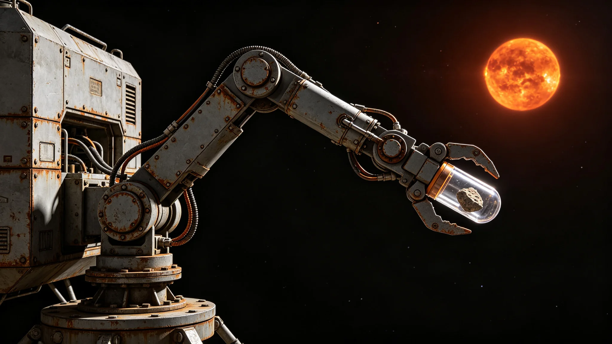

# 异星生态非接触采样机械臂第六代长臂技术报告

**编制单位**：联合体航天工程研究院异星采样室
**报告日期**：3626年2月2日
**文件等级**：跨星系工程公开

## 一、技术背景

3623年首次地下含水层采样（见GS-3623-01）使用第五代机械臂，臂长八米，钻孔深度一百二十米。第五代臂重、精度有限。经航天工程研究院立项，第六代长臂于3626年交付科考站。

## 二、技术指标

| 参数 | 第五代 | 第六代 |
|---|---|---|
| 臂长 | 8米 | 12米 |
| 末端精度 | ±5毫米 | ±2毫米 |
| 自重 | 120公斤 | 90公斤 |
| 钻孔深度 | 120米 | 200米 |
| 末端执行器 | 钻头 | 钻头加采样管 |

## 三、形态细节

第六代机械臂为多关节长臂，由科考站气闸伸出，不设开放式船体。臂端为密封采样管，采样后缩回气闸，在手套箱内分析。机械臂不设轮子，不设开放式甲板。

## 四、安全约束

第六代臂采样后表面消毒三次，采样管密封不打开。依GS-3623-01规定，不培养、不分离、不测序。

## 五、首年运行

自3626年1月交付以来，第六代臂执行采样三次，均一次成功，无泄漏。

## 六、第六代臂形态细节

第六代臂从科考站气闸伸出，臂身由多节圆柱形金属段组成，带外露液压管线与电缆桥架。臂端为密封采样管，采样后缩回气闸。臂身无轮子，无开放式甲板，无船首。臂身表面有微陨石擦痕与金属氧化痕迹，无光滑塑料漆面。

第六代臂末端精度由第五代的正负五毫米提升至正负二毫米，主因关节轴承改用第十代陶瓷球轴承。钻孔深度由一百二十米提升至二百米，主因钻杆材料改用碳化钨复合材料。

## 七、首年运行细节

自3626年1月交付以来，第六代臂执行采样三次：

- 第一次：3626年3月，地下含水层第二次采样，深度一百五十米；
- 第二次：3626年7月，地表矿物样本采样，深度十米；
- 第三次：3626年11月，地下含水层第三次采样，深度一百八十米。

三次采样均一次成功，无泄漏，无交叉污染。采样后机械臂表面消毒三次。

## 八、末段签批

本报告经航天工程研究院异星采样室签批，副本分发至生态研究所。
