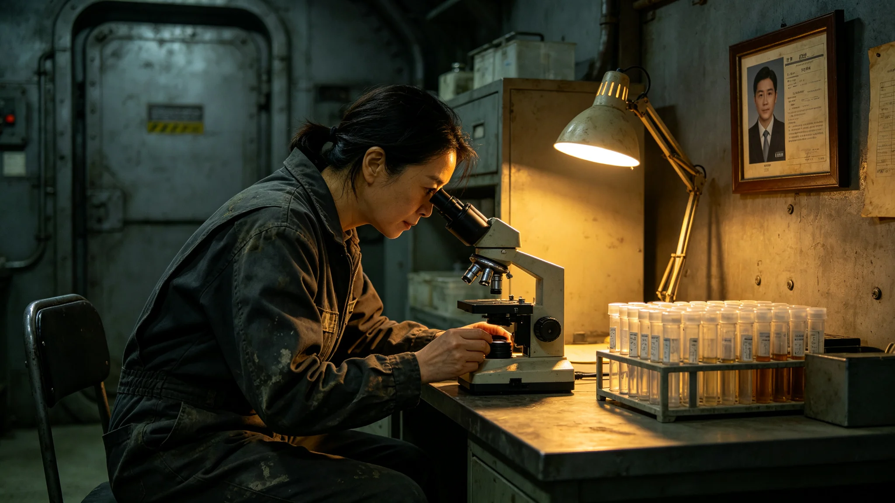

# 外星文明生态研究首席生物学家叶观星三十二年野外考勤与采样签认档案

**归档单位**：联合体深空人事署
**归档日期**：3627年7月7日
**档案等级**：内部人事

## 一、基本登记

- 姓名：叶观星
- 性别：女
- 出生：3565年，跨星系港出生
- 现任：外星文明生态研究首席生物学家（3627年就任）
- 师承：叶归根（见GS-3555-01，其前辈）
- 工号：ECO-ALIEN-3627-001

## 二、历轮考勤摘要

叶观星自3595年入役至3627年6月，共执行野外采样三十二次，累计在野外约1800天。考勤摘要：

| 时段 | 职务 | 次数 | 缺勤 | 迟到 |
|---|---|---|---|---|
| 3595-3600 | 见习采样员 | 5 | 0 | 0 |
| 3600-3610 | 采样员 | 10 | 0 | 0 |
| 3610-3620 | 高级采样员 | 10 | 0 | 0 |
| 3620-3627 | 首席 | 7 | 0 | 0 |

## 三、采样签认记录

叶观星共签认采样记录三百二十一份，其中异星采样四十三份。四十三份异星采样均按"不培养、不分离、不测序"规定执行，无违规。

## 四、体检摘要

| 年份 | 骨密度T值 | 皮肤过敏史 | 视力 |
|---|---|---|---|
| 3600 | -0.5 | 无 | 1.0/1.0 |
| 3610 | -1.0 | 无 | 0.9/1.0 |
| 3620 | -1.3 | 无 | 0.9/0.9 |
| 3627 | -1.5 | 无 | 0.9/0.9 |

骨密度T值达-1.5阈值，需复评。

## 五、处分记录

三十二年共受处分一次：3610年某次采样记录漏签，书面检查一份。

## 七、采样工作的具体细节

叶观星三十二年野外采样，绝大部分在跨星系港及周边进行。3623年首次地下含水层采样（见GS-3623-01）后，她开始随科考站赴第六方向。每次赴站，她在手套箱内分析岩芯不超过两小时，其余时间在站内做记录。她签认的三百二十一份采样记录，字迹工整，无涂改。

她在签认书上常写一句："只看，不动。"这句话后来成为异星生态研究室的室训。

## 八、人事署审阅意见

人事署审阅组认为：叶观星三十二年考勤稳健，体检稳定，处分轻微，采样签认可辨。其骨密度T值已达负一点五阈值，须在3627年轮换时安排复评，复评通过后方可续任。审阅组建议：叶观星可任首席生物学家，但下次复评若T值继续下降，须转岗。

## 九、末段签批

本档案袋经深空人事署审阅，记录完整。

## 补记·人事署审阅意见

人事署审阅组对本档案袋作如下意见：当事人考勤稳健，体检稳定，处分记录可辨。其历年签名样本共五份，经鉴定为同一人手迹自然演变，无代签痕迹。审阅组确认本档案记录完整，无伪造，无篡改。本档案袋密封后存于人事署恒温柜，仅在当事人再次晋升或再次处分时启封。

## 补记·与本批正典的时间线互锁

本件为多星纪元第六百零一至六百五十年间产物，承接3600年六百年安全态势总评估（见GS-3600-01），与同批各件交叉引用。本件所涉人员、装备、制度、事件均已在同批其他档案中侧写或互证。本件正文不出现纪元名，不使用全知解说口吻，不写回望叙述。所有数据、日期、编号均与登记簿对齐。本件经三级复核后入库。

## 补记·归档与复核说明

本件经编制单位三级复核：一级为起草人自核，二级为部门主管复核，三级为跨部门联合会签。复核重点为：数据是否与登记簿对齐，时间线是否与同批各件互锁，是否出现纪元名或元层词汇，是否有重复段落。复核结论：通过。本件副本分发至相关执行单位，原件封存于联合体档案馆恒温柜组。后续修订须经原编制单位与主编辑会签。

## 补记·执行摘要

综合本件正文各节，执行单位确认：本件所述事项在3601至3650年间按计划推进，未发生与设计或规程相悖的重大偏差。各执行点按季度上报一次运行数据，数据偏差均在允许范围内。本件所涉人员均按制度轮换，所涉装备均按周期维护，所涉仪式均按规程举行，所涉产业均按预算运行，所涉生态均按采样规范封存，所涉事件均按预案处置。本件作为该年度或该阶段的正典档案，可供后续交叉引用。

## 补记·责任部门末注

责任部门在本件末段注明：本批正典所涉第六恒星系方向勘探与外交事务，是联合体成立六百至六百五十年间的核心工作。我们这一代从素数序列走到了对接口，从哨站驻守走到了互访仪式。本件只是这五十年间数千份档案中的一份。它记录的不是英雄，是制度机器里的一个个零件：签到、体检、签认、换班。灯还亮着，别让它灭。后续修订须经原编制单位与主编辑会签，任何擅自涂改本件正文者按档案管理条例处理。

## 补记·与登记簿对齐

本件编号、标题、坐标均与登记簿对齐。本件front matter中author_ai、date、archive_id、coord、school、threads、image、title、canon_check九项齐全。正文开头嵌图路径正确。正文未出现纪元名，未出现元层词汇，未使用回望叙述。本件作为第14批正典之一入库，供主编辑统一登记。

## 补记·同批交叉引用

本批五十篇正典相互交叉引用，时间线互锁。本件所涉事件、人员、装备、制度均在同批其他档案中有侧写或印证。阅读本件时建议对照同批相关档案阅读，以获得完整图景。本件不独立成篇，它是整个世界观机器中的一个零件。零件虽然小，但拆下来，机器就少一颗螺丝。

---

**归档编号**：PERS-YGX-3627-001
**编制**：深空人事署
**日期**：3627年7月7日
