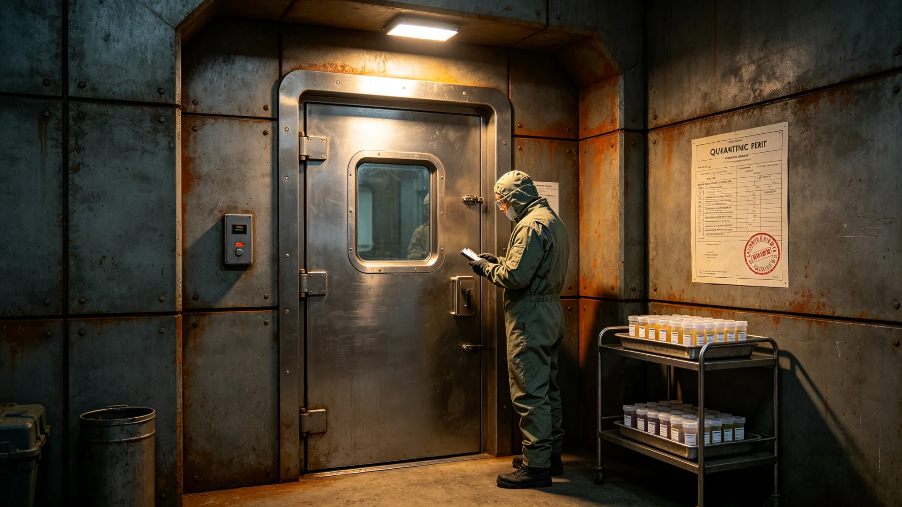

# 跨星系文明互访检疫与生物样本通关制度修订公报

**发布机构**：联合体法律事务署检疫司
**发布日期**：3628年10月10日
**文件等级**：跨星系公开

## 一、修订背景

自3613年首次互访以来（见GS-3613-01），双方人员与样本往来渐多。原检疫制度仅适用于我方人员跨系往来，未涵盖异星代表与生物样本。经法律事务署、生态研究所、外交使团署三方联合会签，修订检疫制度。

## 二、人员检疫

异星代表驻节前须在驻节舱隔离区观察十四天，无异常后方可进入混合区。我方代表赴对方驻节舱前同样隔离十四天。隔离期间不与对方直接接触。

## 三、生物样本通关

生物样本通关规定：

1. 所有样本须密封封装；
2. 不培养、不分离、不测序（见GS-3623-01）；
3. 样本不进入我方主港；
4. 仅在驻节舱手套箱内分析；
5. 样本出境须经对方同意。

## 四、违规处置

违反检疫制度：

- 样本泄漏：立即停职，移交事件处置署；
- 未经培养：当事人降级；
- 样本进主港：当事单位负责人记过。

## 五、隔离区设置

驻节舱设隔离区一间，面积约六平方米，带独立大气循环。异星代表驻节前在隔离区观察十四天，医官每日远程检查一次，不直接接触。十四天无异常后，代表方可进入混合区。我方代表赴对方驻节舱前同样在隔离区观察十四天。

隔离区不设窗户，仅设一只传物口。传物口双面密封，递物后关闭三分钟方可开启。

## 六、与既往检疫制度的衔接

原检疫制度适用于我方人员跨系往来（见GS-3499-01养老航线护航口径）。本修订增加异星代表与生物样本两类对象。原制度不废止，与新制度并行。

## 七、违规案例

本制度颁布前，3624年曾有一名工程师未经批准将一块异星岩芯带入主港，在跨星系港第三医院被查获。该工程师记过一次，岩芯退回驻节舱。此案例作为本制度修订的背景之一。

## 八、末段签批

本公报经三方联合会签，自3628年10月10日起施行。
