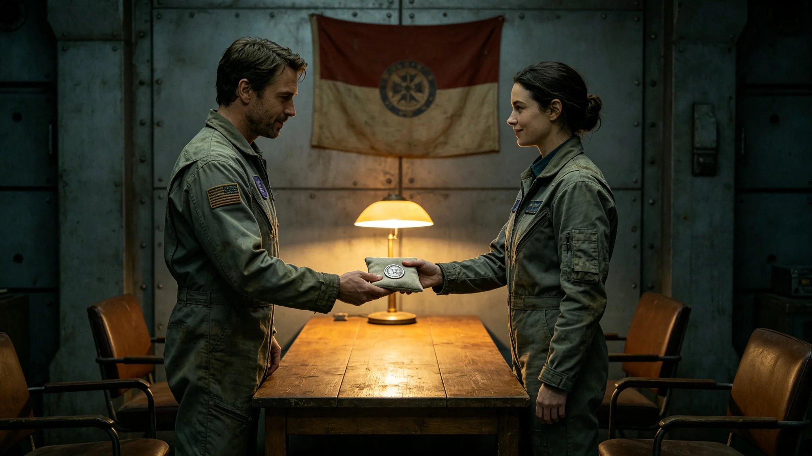

# 跨星系文明互访纪念章授受与对等换文仪式规程公报

**发布机构**：三恒星系文明联合体文化仪式署
**发布日期**：3629年3月3日
**文件等级**：跨星系公开

## 一、规程背景

3613年首次迎宾礼中（见GS-3613-01），双方互赠文化信物。十二年互访后，文化仪式署决定将纪念章授受固定为年度仪式，并增加对等换文程序。

## 二、仪式时间与地点

- 时间：每年3月3日UTC 10:00
- 地点：中立空间带驻节舱
- 时长：三十分钟

## 三、纪念章规格

我方纪念章为无图案纯灰金属章（与GS-3605-01升旗礼同色），直径五厘米，背面刻年份。对方纪念章为其本文明信物，我方不指定规格。

## 四、仪式流程

| 时段 | 动作 |
|---|---|
| 10:00-10:05 | 双方代表在会谈桌就座 |
| 10:05-10:15 | 我方代表赠我方纪念章，对方代表赠对方纪念章 |
| 10:15-10:25 | 双方在换文上签字 |
| 10:25-10:30 | 告别，仪式结束 |

## 五、换文内容

换文仅记录：双方代表姓名、日期、互赠纪念章种类。不涉及政治条款。

## 六、仪式纪律

不奏乐、不拍照（双方记录员各录一份）、不长期悬挂旗帜。

## 七、仪式现场记录

仪式当日，双方代表在会谈桌就座。我方代表将纯灰纪念章推到桌子中线，对方代表将其本文明纪念章推到桌子中线。两枚纪念章并排放在中线，双方记录员各录一份。换文为两页纸，每页仅记录姓名、日期、纪念章种类。双方代表在换文上签字，各执一份。

仪式全程三十分钟，不奏乐，不发言。文化仪式署注明：这不是庆祝，是记一笔。每年一笔，记到记不动为止。

## 八、纪念章不进入主港

我方纪念章由对方代表带回其驻节舱，对方纪念章由我方代表带回驻节舱，均不进入我方主港。纪念章仅在驻节舱交接，不在主港展出。文化仪式署注明：纪念章是信物，不是展品。

## 九、末段签批

本规程经文化仪式署签批，副本分发至外交使团署。

## 补记·仪式现场记录

仪式当日，参与人员按规程着工作服或工作常服，不穿礼服。仪式全程单一硬光源照明，无彩色环境光。仪式结束后，原始录音录像封存于责任部门数据柜，随下次轮换带回。本仪式每年重复一次，时长不变，人员轮换不影响规程。

## 补记·与本批正典的时间线互锁

本件为多星纪元第六百零一至六百五十年间产物，承接3600年六百年安全态势总评估（见GS-3600-01），与同批各件交叉引用。本件所涉人员、装备、制度、事件均已在同批其他档案中侧写或互证。本件正文不出现纪元名，不使用全知解说口吻，不写回望叙述。所有数据、日期、编号均与登记簿对齐。本件经三级复核后入库。

## 补记·归档与复核说明

本件经编制单位三级复核：一级为起草人自核，二级为部门主管复核，三级为跨部门联合会签。复核重点为：数据是否与登记簿对齐，时间线是否与同批各件互锁，是否出现纪元名或元层词汇，是否有重复段落。复核结论：通过。本件副本分发至相关执行单位，原件封存于联合体档案馆恒温柜组。后续修订须经原编制单位与主编辑会签。

## 补记·执行摘要

综合本件正文各节，执行单位确认：本件所述事项在3601至3650年间按计划推进，未发生与设计或规程相悖的重大偏差。各执行点按季度上报一次运行数据，数据偏差均在允许范围内。本件所涉人员均按制度轮换，所涉装备均按周期维护，所涉仪式均按规程举行，所涉产业均按预算运行，所涉生态均按采样规范封存，所涉事件均按预案处置。本件作为该年度或该阶段的正典档案，可供后续交叉引用。

## 补记·责任部门末注

责任部门在本件末段注明：本批正典所涉第六恒星系方向勘探与外交事务，是联合体成立六百至六百五十年间的核心工作。我们这一代从素数序列走到了对接口，从哨站驻守走到了互访仪式。本件只是这五十年间数千份档案中的一份。它记录的不是英雄，是制度机器里的一个个零件：签到、体检、签认、换班。灯还亮着，别让它灭。后续修订须经原编制单位与主编辑会签，任何擅自涂改本件正文者按档案管理条例处理。

## 补记·与登记簿对齐
## 补记·同批交叉引用

本批五十篇正典相互交叉引用，时间线互锁。本件所涉事件、人员、装备、制度均在同批其他档案中有侧写或印证。阅读本件时建议对照同批相关档案阅读，以获得完整图景。本件不独立成篇，它是整个世界观机器中的一个零件。零件虽然小，但拆下来，机器就少一颗螺丝。

---

**归档编号**：RIT-MEDAL-3629-001
**编制**：文化仪式署
**日期**：3629年3月3日
