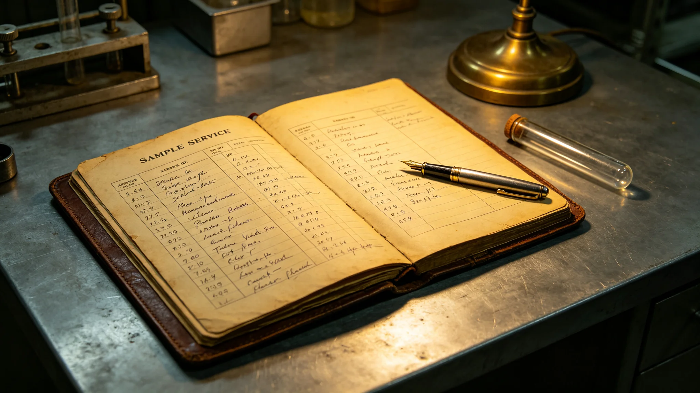

# 跨星系生态科考与外星生物样本服务产业3629年度决算报告

**编制单位**：联合体经济委员会深空产业统计处
**报告日期**：3630年6月6日
**文件等级**：跨星系公开

## 一、决算范围

本报告为跨星系生态科考与外星生物样本服务产业3629年7月至3630年6月年度决算。范围包括：采样机械臂运维、手套箱分析服务、样本封存柜维护、生态研究员薪酬四类。

## 二、年度投入与产出

| 项目 | 投入（星汇亿） | 产出（星汇亿） |
|---|---|---|
| 采样机械臂运维 | 0.5 | 0.05 |
| 手套箱分析服务 | 0.8 | 0.1 |
| 样本封存柜维护 | 0.3 | 0.02 |
| 研究员薪酬 | 1.2 | 0.1 |
| 合计 | 2.8 | 0.27 |

年度净投入2.5亿。

## 三、就业与工时

年度直接就业约180人，其中采样员60人、分析员80人、封存柜维护20人、研究员20人。

## 四、年度主要事件

- 3629年3月纪念章授受仪式（见GS-3629-01）；
- 3629年10月第二次地下含水层采样；
- 3630年2月热液喷口生态科考准备。

## 六、年度主要交付件

年度产业主要交付件：

- 采样机械臂运维件：关节轴承二十个、密封件一百个；
- 手套箱分析件：光学显微镜灯泡十个、采样管二百个；
- 样本封存柜维护件：锁具二十套、温度控制器四个。

所有交付件均带工业编号。货运船沿既定航线送达科考站对接口。

## 七、年度未发生的事

经济委员会注明：年度未发生样本泄漏，未发生培养污染，未发生预算超支。净投入2.5亿在年初批准预算3.5亿以内。

## 八、对下一年的预期

预计下一年度投入约2.6亿，产出约0.4亿。产出增长主因为热液喷口生态科考（见GS-3639-01）启动。

## 九、末段签批

本报告经经济委员会深空产业统计处签批，副本分发至生态研究所。
