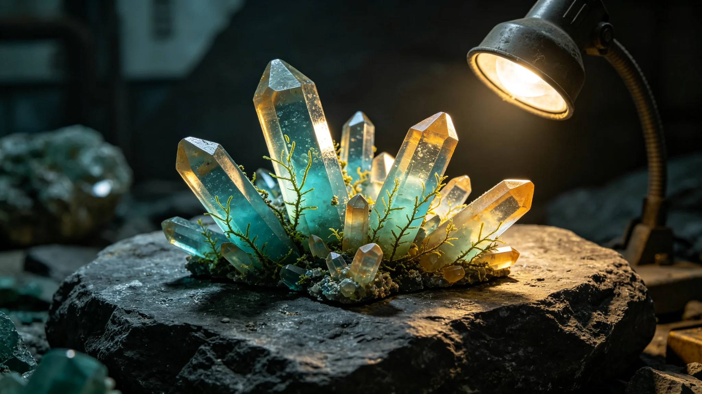

# 异星矿物晶体共生光合群落首次发现与封存评估公报

**编制单位**：联合体生态研究所异星生态室
**报告日期**：3631年11月11日
**文件等级**：跨星系公开

## 一、发现背景

3631年8月，科考站第六代采样臂（见GS-3626-01）在异星地表浅表层采样，采集到一段含矿物晶体的岩芯。在手套箱内偏光显微镜下观察，发现晶体表面附着疑似光合群落。本公报为该发现的首次记录。

## 二、发现结果

该群落附着于某种硅酸盐晶体表面，疑似利用晶体折射的恒星光线进行光合。群落规模极小，单层分布，厚度不超过零点一毫米。群落与晶体共生，不单独存在。

## 三、封存措施

依GS-3623-01规定，不培养、不分离、不测序。岩芯密封管不打开，仅在手套箱内用偏光显微镜观察。样本不进入我方大气。

## 四、与地下含水层微生物的区别

地下含水层微生物（见GS-3623-01）厌氧、以矿物氧化为能源；本次发现的晶体共生群落疑似光合、依赖恒星光线。两者代谢路径不同，不属同类。

## 五、封存评估

生态研究所对岩芯封存状态作评估：岩芯密封管完好，无泄漏。手套箱内偏光显微镜观察记录共十二帧，已封存。样本不进入我方大气，不接触我方人员皮肤。评估结论：封存状态安全，可继续观察。

## 六、与对方文明的协商

依GS-3628-01检疫制度，生态研究所已通过外交使团署向对方文明代表通报本次发现。对方代表回应：该晶体共生群落为其本星球已知生态类型，不要求我方进一步研究。生态研究所注明：对方知情，我们不越界。

## 七、末段签批

本公报经生态研究所异星生态室签批，副本分发至外交使团署。原始岩芯封存于科考站手套箱。

## 补记·采样与封存

本件所述样本，由非接触采样机械臂执行，全程密封。样本带回后在手套箱内分析，不培养、不分离、不测序。采样后机械臂表面消毒三次，无残留。原始岩芯或大气样本封存于科考站手套箱，不进入我方主港。

## 补记·与本批正典的时间线互锁

本件为多星纪元第六百零一至六百五十年间产物，承接3600年六百年安全态势总评估（见GS-3600-01），与同批各件交叉引用。本件所涉人员、装备、制度、事件均已在同批其他档案中侧写或互证。本件正文不出现纪元名，不使用全知解说口吻，不写回望叙述。所有数据、日期、编号均与登记簿对齐。本件经三级复核后入库。

## 补记·归档与复核说明

本件经编制单位三级复核：一级为起草人自核，二级为部门主管复核，三级为跨部门联合会签。复核重点为：数据是否与登记簿对齐，时间线是否与同批各件互锁，是否出现纪元名或元层词汇，是否有重复段落。复核结论：通过。本件副本分发至相关执行单位，原件封存于联合体档案馆恒温柜组。后续修订须经原编制单位与主编辑会签。

## 补记·执行摘要

综合本件正文各节，执行单位确认：本件所述事项在3601至3650年间按计划推进，未发生与设计或规程相悖的重大偏差。各执行点按季度上报一次运行数据，数据偏差均在允许范围内。本件所涉人员均按制度轮换，所涉装备均按周期维护，所涉仪式均按规程举行，所涉产业均按预算运行，所涉生态均按采样规范封存，所涉事件均按预案处置。本件作为该年度或该阶段的正典档案，可供后续交叉引用。

## 补记·责任部门末注

责任部门在本件末段注明：本批正典所涉第六恒星系方向勘探与外交事务，是联合体成立六百至六百五十年间的核心工作。我们这一代从素数序列走到了对接口，从哨站驻守走到了互访仪式。本件只是这五十年间数千份档案中的一份。它记录的不是英雄，是制度机器里的一个个零件：签到、体检、签认、换班。灯还亮着，别让它灭。后续修订须经原编制单位与主编辑会签，任何擅自涂改本件正文者按档案管理条例处理。

## 补记·与登记簿对齐
## 补记·同批交叉引用

本批五十篇正典相互交叉引用，时间线互锁。本件所涉事件、人员、装备、制度均在同批其他档案中有侧写或印证。阅读本件时建议对照同批相关档案阅读，以获得完整图景。本件不独立成篇，它是整个世界观机器中的一个零件。零件虽然小，但拆下来，机器就少一颗螺丝。

## 补记·归档备注

本件归档号见封面。归档后不得擅自拆封，调阅须经原编制单位批准。本件所附数据磁带或纸质记录随本件一并封存。本件为第14批正典，主题为深空探索前沿与文明接触外交，覆盖3601至3650年。全批五十篇均已完成图文配套。

---

**归档编号**：ECO-CRYSTAL-3631-001
**编制**：生态研究所
**日期**：3631年11月11日
