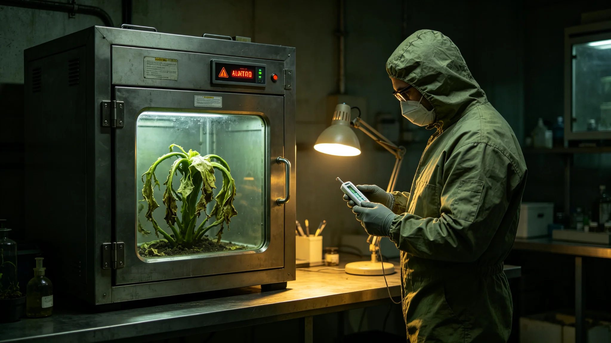

# 某次异星植物样本封装舱温控失效两小时事件处置通报

**发布机构**：联合体安全协调委员会事件处置署
**发布日期**：3632年5月5日
**文件等级**：跨星系内部

## 一、事件经过

3632年4月18日，科考站样本封装舱温度传感器报警，舱温由摄氏四度升至九度。值班工程师立即将样本转移至备用封装舱，排查温控器。两小时后找到故障点：温控器半导体模块烧毁。更换后舱温恢复。

## 二、时间线

| 时刻（UTC） | 事件 |
|---|---|
| 3632年4月18日14:20 | 温度报警 |
| 14:25 | 样本转移至备用舱 |
| 14:30 | 开始排查 |
| 16:00 | 找到故障点 |
| 16:20 | 更换温控器 |
| 16:20 | 事件结束 |

## 三、后果

- 无样本损坏；
- 无人员伤亡；
- 无生态污染；
- 仅样本舱温控失效两小时。

## 四、整改措施

事件处置署决定：

1. 全站温控器巡检周期由季度缩短至月度；
2. 所有样本封装舱加装备用温控器；
3. 值班工程师记口头提醒一次。

## 六、事件处置细节

温度报警后，值班工程师未自行处置，先将样本转移至备用舱，再排查温控器。转移用时五分钟，样本无暴露。排查时发现温控器半导体模块烧毁，更换备用模块后舱温缓慢恢复。恢复时未一次性加压，避免密封管因温度骤变破裂。

## 七、样本安全确认

事后，生态研究所首席生物学家叶观星（见GS-3627-01）检查样本，确认无损坏。样本仍按"不培养、不分离、不测序"规定封存。

## 八、整改执行

全站温控器巡检周期改为月度后，3632年7月完成全站二十个温控器普查，发现另有两个温控器有早期烧毁迹象，统一更换。此后未再发生同类失效。

## 九、末段签批

本通报经事件处置署签批，副本分发至生态研究所。
