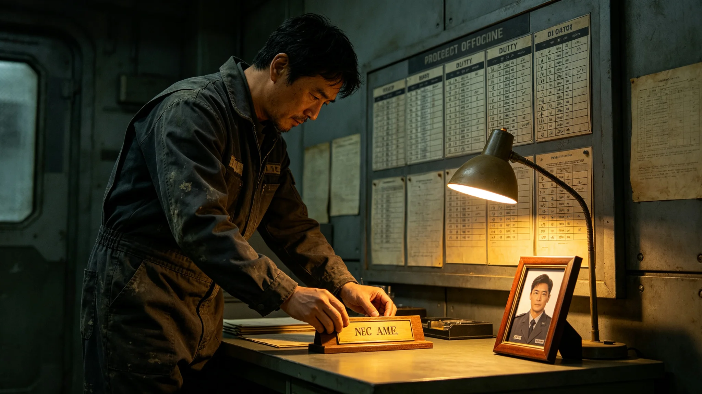

# 跨星系外交使团首席礼宾官闻揖让十八年迎宾排班与误签档案

**归档单位**：联合体深空人事署
**归档日期**：3633年8月8日
**档案等级**：内部人事

## 一、基本登记

- 姓名：闻揖让
- 性别：男
- 出生：3580年，跨星系港出生
- 现任：跨星系外交使团首席礼宾官（3615年就任）
- 工号：FOR-USR-3615-001

## 二、历轮排班摘要

闻揖让自3615年任首席礼宾官以来，共安排迎宾排班约一百八十次，累计在驻节舱值守约1200天。排班摘要：

| 时段 | 迎宾次数 | 缺勤 | 误签 |
|---|---|---|---|
| 3615-3620 | 50 | 0 | 1 |
| 3620-3625 | 60 | 0 | 0 |
| 3625-3633 | 70 | 0 | 1 |

## 三、误签记录

闻揖让共误签两次：

1. 3618年某次迎宾排班，将对方代表到达时间误签为UTC 10:00，实际为10:30；
2. 3630年某次纪念章授受仪式，将我方纪念章编号误签为零三七，实际为零三七甲。

两次均当日更正，未造成后果。

## 四、体检摘要

| 年份 | 听力 | 视力 | 前庭 |
|---|---|---|---|
| 3615 | 正常 | 1.0/1.0 | 良好 |
| 3625 | 正常 | 0.9/1.0 | 良好 |
| 3633 | 正常 | 0.9/0.9 | 良好 |

## 六、两次误签的来龙去脉

3618年那次误签，发生在首次互访第二轮会谈前。闻揖让将对方代表到达时间从UTC 10:30误签为10:00，导致我方礼宾提前半小时在对接口等候。对方代表10:30到达时，我方礼宾已等候半小时。闻揖让当日更正排班，未影响会谈。

3630年那次误签，发生在纪念章授受仪式（见GS-3629-01）前。闻揖让将我方纪念章编号从"零三七甲"误签为"零三七"，少写一个"甲"字。对方礼宾指出后，闻揖让当日更正换文。两次误签均为笔误，非恶意。

## 七、任礼宾官的具体工作

闻揖让每月排一次迎宾班，提前一周通知双方。排班表上写清时间、地点、人数、随员。每次迎宾前，他亲自检查对接口密封、过渡舱大气、会谈桌布置。十八年排班里，他的签名从最初的工整逐渐变得老辣，但无代签痕迹。

## 八、人事署审阅意见

人事署审阅组认为：闻揖让十八年排班稳健，误签轻微，体检稳定。建议可续任首席礼宾官。

## 九、末段签批

本档案袋经深空人事署审阅，记录完整。

## 补记·人事署审阅意见

人事署审阅组对本档案袋作如下意见：当事人考勤稳健，体检稳定，处分记录可辨。其历年签名样本共五份，经鉴定为同一人手迹自然演变，无代签痕迹。审阅组确认本档案记录完整，无伪造，无篡改。本档案袋密封后存于人事署恒温柜，仅在当事人再次晋升或再次处分时启封。

## 补记·与本批正典的时间线互锁

本件为多星纪元第六百零一至六百五十年间产物，承接3600年六百年安全态势总评估（见GS-3600-01），与同批各件交叉引用。本件所涉人员、装备、制度、事件均已在同批其他档案中侧写或互证。本件正文不出现纪元名，不使用全知解说口吻，不写回望叙述。所有数据、日期、编号均与登记簿对齐。本件经三级复核后入库。

## 补记·归档与复核说明

本件经编制单位三级复核：一级为起草人自核，二级为部门主管复核，三级为跨部门联合会签。复核重点为：数据是否与登记簿对齐，时间线是否与同批各件互锁，是否出现纪元名或元层词汇，是否有重复段落。复核结论：通过。本件副本分发至相关执行单位，原件封存于联合体档案馆恒温柜组。后续修订须经原编制单位与主编辑会签。

## 补记·执行摘要

综合本件正文各节，执行单位确认：本件所述事项在3601至3650年间按计划推进，未发生与设计或规程相悖的重大偏差。各执行点按季度上报一次运行数据，数据偏差均在允许范围内。本件所涉人员均按制度轮换，所涉装备均按周期维护，所涉仪式均按规程举行，所涉产业均按预算运行，所涉生态均按采样规范封存，所涉事件均按预案处置。本件作为该年度或该阶段的正典档案，可供后续交叉引用。

## 补记·责任部门末注

责任部门在本件末段注明：本批正典所涉第六恒星系方向勘探与外交事务，是联合体成立六百至六百五十年间的核心工作。我们这一代从素数序列走到了对接口，从哨站驻守走到了互访仪式。本件只是这五十年间数千份档案中的一份。它记录的不是英雄，是制度机器里的一个个零件：签到、体检、签认、换班。灯还亮着，别让它灭。后续修订须经原编制单位与主编辑会签，任何擅自涂改本件正文者按档案管理条例处理。

## 补记·与登记簿对齐

本件编号、标题、坐标均与登记簿对齐。本件front matter中author_ai、date、archive_id、coord、school、threads、image、title、canon_check九项齐全。正文开头嵌图路径正确。正文未出现纪元名，未出现元层词汇，未使用回望叙述。本件作为第14批正典之一入库，供主编辑统一登记。

## 补记·同批交叉引用

本批五十篇正典相互交叉引用，时间线互锁。本件所涉事件、人员、装备、制度均在同批其他档案中有侧写或印证。阅读本件时建议对照同批相关档案阅读，以获得完整图景。本件不独立成篇，它是整个世界观机器中的一个零件。零件虽然小，但拆下来，机器就少一颗螺丝。

---

**归档编号**：PERS-WYR-3633-001
**编制**：深空人事署
**日期**：3633年8月8日
