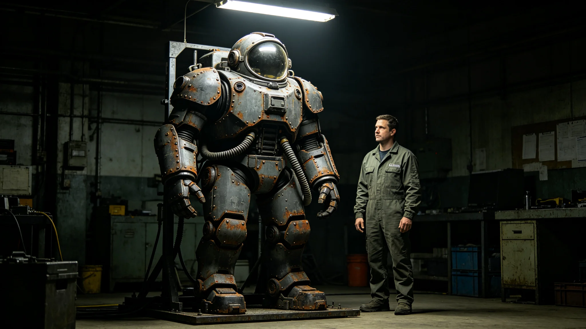

# 深空长航程舱外活动外骨骼第十一代技术鉴定报告

**编制单位**：联合体航天工程研究院舱外活动室
**报告日期**：3634年12月12日
**文件等级**：跨星系工程公开

## 一、鉴定对象

本报告鉴定第十一代舱外活动外骨骼，配装先遣科考站及外交护航编队。第十一代在第十代基础上改进，主要用于异星地表非接触采样与科考站外部检修。

## 二、技术指标

| 参数 | 第十代 | 第十一代 |
|---|---|---|
| 自重 | 28公斤 | 22公斤 |
| 活动时长 | 6小时 | 8小时 |
| 关节自由度 | 22 | 28 |
| 散热 | 被动 | 被动加微液冷 |
| 外壳材质 | 钛合金复合 | 碳化钨复合 |

## 三、形态细节

外骨骼为全封闭加压服，带小面罩观察窗（非单个大圆窗），背部生命维持背包。外壳有金属磨损与铆钉焊缝，无光滑塑料漆面。外骨骼不设轮子，不设开放式船体。

## 四、首年运行

自3634年1月配发以来，第十一代外骨骼共执行舱外活动约一百二十次，均一次完成，无故障。

## 六、外骨骼使用记录

第十一代外骨骼配发后，科考站工程师闻拓荒（见GS-3619-01）首次着服进行外部检修。检修历时四小时，关节活动灵活，无卡顿。医官注明：着服人员心率、呼吸均在正常范围。

外骨骼背部生命维持背包带外露管线与散热肋片，外壳有金属磨损与铆钉焊缝，无光滑塑料漆面。面罩为小长方形观察窗，非单个大圆窗。

## 七、与第十代对照

第十代外骨骼自3606年配发以来（见GS-3606-01），累计使用约五百次。第十一代在第十代基础上减重六公斤、延长活动时长两小时、增加六个关节自由度。改进主因长航程舱外活动频次增加。

## 八、末段签批

本报告经航天工程研究院舱外活动室签批，副本分发至前出部署署。
