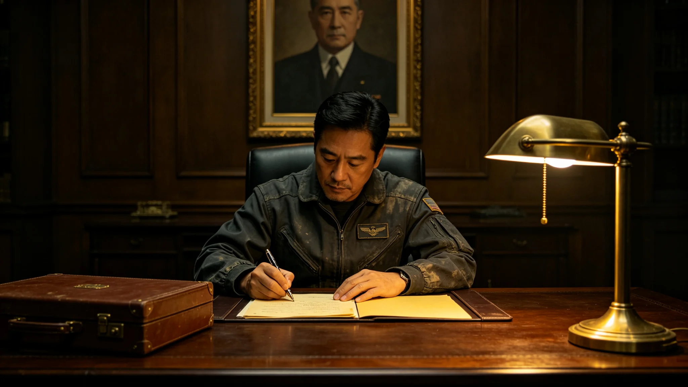

# 跨星系外交制度首任总理事闻协睦二十五年考勤与照会签认档案

**归档单位**：联合体深空人事署
**归档日期**：3635年9月9日
**档案等级**：内部人事

## 一、基本登记

- 姓名：闻协睦
- 性别：男
- 出生：3560年，跨星系港出生
- 现任：跨星系外交制度首任总理事（3610年就任）
- 工号：FOR-GEN-3610-001

## 二、历轮考勤摘要

闻协睦自3610年任总理事以来，共处理跨星系照会约九百份，累计在岗约3000天。考勤摘要：

| 时段 | 照会数 | 缺勤 | 迟到 |
|---|---|---|---|
| 3610-3615 | 150 | 0 | 0 |
| 3615-3625 | 350 | 0 | 0 |
| 3625-3635 | 400 | 0 | 0 |

## 三、照会签认记录

闻协睦签认照会约九百份，其中涉及争端者十二份。十二份争端均通过外交途径解决，无一件升级为武装冲突。

## 四、体检摘要

| 年份 | 骨密度T值 | 血压 | 视力 |
|---|---|---|---|
| 3610 | -0.6 | 正常 | 1.0/1.0 |
| 3620 | -1.0 | 正常 | 0.9/1.0 |
| 3630 | -1.3 | 正常 | 0.9/0.9 |
| 3635 | -1.4 | 正常 | 0.9/0.9 |

## 五、处分记录

二十五年共受处分零次。

## 七、十二份争端的处理

闻协睦任总理事二十五年，共处理争端十二份。争端涉及：航线补贴分摊、样本通关时间、纪念章编号、驻节舱扩建费用。十二份争端均通过照会往来解决，最长一次持续四十天，最短一次三天。无一件升级为武装冲突，无一件移交仲裁庭（仲裁庭制度见GS-3644-01）。

## 八、任总理事的具体工作

闻协睦每日早班先阅前一日照会，再排当日照会。他在驻节舱内有固定工位，工位上放着《跨星系文明接触外交礼仪准则》（见GS-3604-01）原件。他签认的照会，字迹工整，无涂改。

## 九、人事署审阅意见

人事署审阅组认为：闻协睦二十五年考勤稳健，体检稳定，处分零次，照会签认可辨。建议可续任总理事至3645年轮换。

## 十、末段签批

本档案袋经深空人事署审阅，记录完整。
