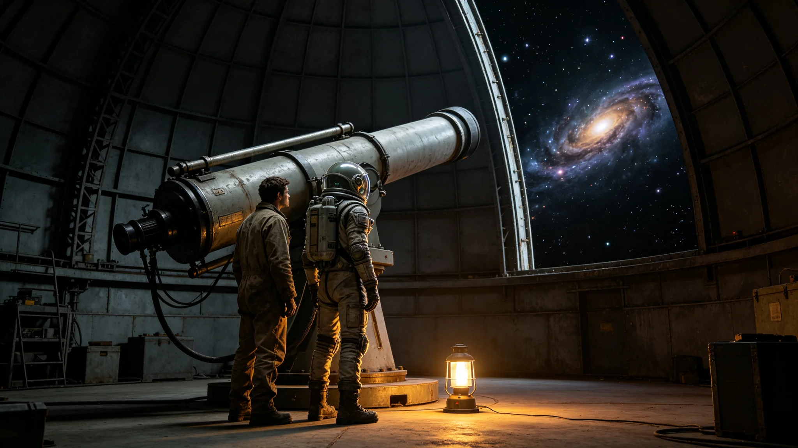

# 首次跨星系文明联合天文观测共祭仪式规程公报

**发布机构**：三恒星系文明联合体文化仪式署
**发布日期**：3637年7月7日
**文件等级**：跨星系公开

## 一、规程背景

3637年7月7日，双方约定在驻节舱观测窗进行首次联合天文观测，观测目标为第六恒星系方向某超新星遗迹。本规程为该仪式正式记录。

## 二、仪式时间与地点

- 时间：3637年7月7日UTC 22:00
- 地点：中立空间带驻节舱观测窗
- 时长：两小时

## 三、参与人员

- 我方代表三人：首席代表闻信诚（见GS-3643-01）、翻译言通津（见GS-3611-01）、礼宾闻揖让（见GS-3633-01）
- 对方代表三人
- 双方记录员各一人

## 四、仪式流程

| 时段 | 动作 |
|---|---|
| 22:00-22:10 | 双方代表在观测窗就座 |
| 22:10-23:30 | 联合观测超新星遗迹 |
| 23:30-23:50 | 双方交换观测记录 |
| 23:50-24:00 | 告别 |

## 五、仪式纪律

不奏乐、不发言（仅交换观测记录）、不拍照。

## 七、仪式现场记录

仪式当日，驻节舱观测窗朝向超新星遗迹方向。双方代表在观测窗前就座，不发言，不拍照。观测持续八十分钟，期间双方仅交换观测记录纸。记录纸上写有各自对该遗迹的观测参数：亮度、红移、距离。

文化仪式署注明：这是第一次一起看星星。不是谈判，不是交换信物，就是一起看。看完了，各自带记录回去。

## 八、观测记录的处理

双方观测记录各存一份，不公开。记录上不署名，仅写年份与双方代表编号。文化仪式署注明：看星星不需要署名。

## 九、末段签批

本规程经文化仪式署签批，副本分发至外交使团署。
