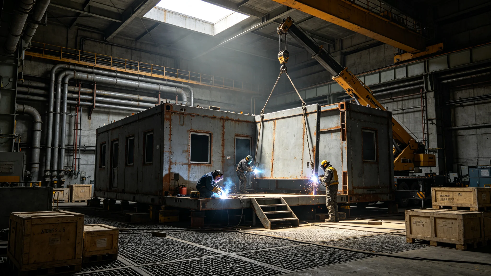

# 深空外交使团建设与跨系航线补贴产业3637年度决算报告

**编制单位**：联合体经济委员会外交产业统计处
**报告日期**：3638年10月10日
**文件等级**：跨星系公开

## 一、决算范围

本报告为深空外交使团建设与跨系航线补贴产业3637年7月至3638年6月年度决算。范围包括：驻节舱扩建、外交使团舱位建设、跨系航线补贴三类。

## 二、年度投入与产出

| 项目 | 投入（星汇亿） | 产出（星汇亿） |
|---|---|---|
| 驻节舱扩建 | 1.5 | 0.2 |
| 使团舱位建设 | 0.8 | 0.1 |
| 航线补贴 | 1.0 | 0.1 |
| 合计 | 3.3 | 0.4 |

年度净投入2.9亿。

## 三、就业与工时

年度直接就业约250人，人均工时每周42小时。

## 四、年度主要事件

- 3637年7月联合天文观测（见GS-3637-01）；
- 3637年11月驻节舱扩建开工；
- 3638年3月航线补贴第三次调整。

## 六、年度主要交付件

年度产业主要交付件：

- 驻节舱扩建件：新过渡舱一个、密封环二百个；
- 使团舱位建设件：随员舱六个、医疗舱一个；
- 航线补贴件：护航编队燃料补给、货运船运费。

所有交付件均带工业编号。货运船沿既定航线送达驻节舱对接口。

## 七、年度未发生的事

经济委员会注明：年度未发生交付件遗失，未发生预算超支，未发生护航事故。净投入2.9亿在年初批准预算3.8亿以内。

## 八、对下一年的预期

预计下一年度投入约3.0亿，产出约0.6亿。产出增长主因为互访频次增加与驻节舱扩建完成。

## 九、末段签批

本报告经经济委员会外交产业统计处签批，副本分发至外交使团署。
