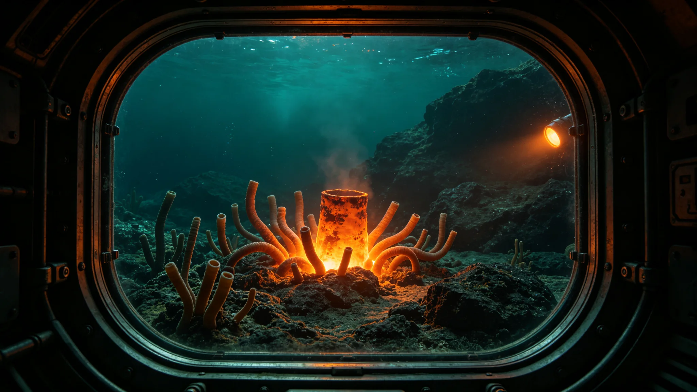

# 异星海洋热液喷口自营生态系统首次科考公报

**编制单位**：联合体生态研究所异星生态室
**报告日期**：3639年5月5日
**文件等级**：跨星系公开

## 一、科考背景

3638年10月，科考站第六代采样臂（见GS-3626-01）在异星浅海海域投放一台无人潜水探测艇，探测海底热液喷口。3639年3月，探测艇回传图像与数据，确认热液喷口附近存在自营生态系统。本公报为首次科考记录。

## 二、科考结果

热液喷口附近发现自营生态系统，以喷口化学能为能源，不依赖恒星光照。系统中存在疑似多细胞生物，呈管状，长度约五至二十厘米。

## 三、安全措施

探测艇为全封闭加压金属艇，带小舷窗，无开放式船体。采样管密封带回，不培养、不分离、不测序。

## 四、与既往发现的区别

地下含水层微生物（见GS-3623-01）为单细胞厌氧；晶体共生群落（见GS-3631-01）为光合单层；本次热液喷口生态为多细胞自营。三者代谢路径不同。

## 六、探测艇形态

无人潜水探测艇为全封闭加压金属艇，直径约三米，长约五米。艇身带小方形舷窗两排，尾部推进器，底部采样管。艇身无轮子，无开放式船体，无船首。艇身表面有海水腐蚀痕迹与铆钉焊缝，无光滑塑料漆面。探测艇在海底作业时，主推进器保持关闭，仅靠RCS微调位置。

## 七、科考意义

生态研究所注明：这是第一次在异星海洋发现多细胞自营生态。该系统不依赖恒星光照，与地球深海热液生态类似。我们没有采样活体，只带回图像与密封管中的矿物碎屑。生态研究所注明：看见就够了，不动。

## 八、与对方文明的协商

生态研究所已通过外交使团署向对方通报本次科考。对方代表回应：该热液喷口生态为其本星球已知类型，不要求我方进一步采样。

## 九、末段签批

本公报经生态研究所异星生态室签批，副本分发至外交使团署。

## 补记·采样与封存

本件所述样本，由非接触采样机械臂执行，全程密封。样本带回后在手套箱内分析，不培养、不分离、不测序。采样后机械臂表面消毒三次，无残留。原始岩芯或大气样本封存于科考站手套箱，不进入我方主港。

## 补记·与本批正典的时间线互锁

本件为多星纪元第六百零一至六百五十年间产物，承接3600年六百年安全态势总评估（见GS-3600-01），与同批各件交叉引用。本件所涉人员、装备、制度、事件均已在同批其他档案中侧写或互证。本件正文不出现纪元名，不使用全知解说口吻，不写回望叙述。所有数据、日期、编号均与登记簿对齐。本件经三级复核后入库。

## 补记·归档与复核说明

本件经编制单位三级复核：一级为起草人自核，二级为部门主管复核，三级为跨部门联合会签。复核重点为：数据是否与登记簿对齐，时间线是否与同批各件互锁，是否出现纪元名或元层词汇，是否有重复段落。复核结论：通过。本件副本分发至相关执行单位，原件封存于联合体档案馆恒温柜组。后续修订须经原编制单位与主编辑会签。

## 补记·执行摘要

综合本件正文各节，执行单位确认：本件所述事项在3601至3650年间按计划推进，未发生与设计或规程相悖的重大偏差。各执行点按季度上报一次运行数据，数据偏差均在允许范围内。本件所涉人员均按制度轮换，所涉装备均按周期维护，所涉仪式均按规程举行，所涉产业均按预算运行，所涉生态均按采样规范封存，所涉事件均按预案处置。本件作为该年度或该阶段的正典档案，可供后续交叉引用。

## 补记·责任部门末注

责任部门在本件末段注明：本批正典所涉第六恒星系方向勘探与外交事务，是联合体成立六百至六百五十年间的核心工作。我们这一代从素数序列走到了对接口，从哨站驻守走到了互访仪式。本件只是这五十年间数千份档案中的一份。它记录的不是英雄，是制度机器里的一个个零件：签到、体检、签认、换班。灯还亮着，别让它灭。后续修订须经原编制单位与主编辑会签，任何擅自涂改本件正文者按档案管理条例处理。

## 补记·与登记簿对齐

本件编号、标题、坐标均与登记簿对齐。本件front matter中author_ai、date、archive_id、coord、school、threads、image、title、canon_check九项齐全。正文开头嵌图路径正确。正文未出现纪元名，未出现元层词汇，未使用回望叙述。本件作为第14批正典之一入库，供主编辑统一登记。

## 补记·同批交叉引用

本批五十篇正典相互交叉引用，时间线互锁。本件所涉事件、人员、装备、制度均在同批其他档案中有侧写或印证。阅读本件时建议对照同批相关档案阅读，以获得完整图景。本件不独立成篇，它是整个世界观机器中的一个零件。零件虽然小，但拆下来，机器就少一颗螺丝。

---

**归档编号**：ECO-HYDRO-3639-001
**编制**：生态研究所
**日期**：3639年5月5日
