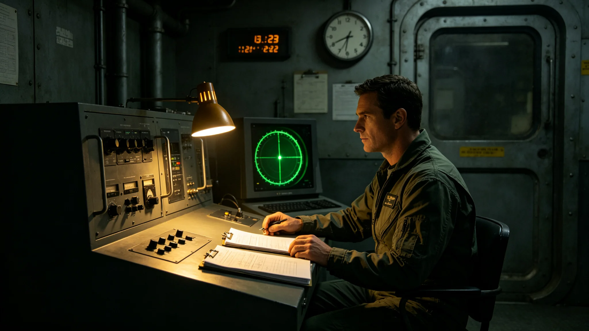

# 先遣队某次窄带信号应答窗口延迟九十分钟复盘通报

**发布机构**：联合体安全协调委员会事件处置署
**发布日期**：3640年8月8日
**文件等级**：跨星系内部

## 一、事件经过

3640年6月15日，前哨-乙收到对方窄带信号，约定应答窗口为UTC 14:00至14:30。因第六代光学应答阵列（见GS-3610-01）定向透镜校准延迟，我方实际应答时间为UTC 15:30，较窗口晚九十分钟。

## 二、时间线

| 时刻（UTC） | 事件 |
|---|---|
| 3640年6月15日13:50 | 应答窗口开启 |
| 14:00 | 透镜校准未完成 |
| 14:30 | 窗口关闭，未应答 |
| 15:00 | 透镜校准完成 |
| 15:30 | 我方补应答 |
| 16:00 | 事件结束 |

## 三、延迟原因

透镜校准延迟系第六代阵列第三组透镜在低温下结霜，加热棒启动慢。

## 四、后果

- 对方未追问；
- 未造成外交后果；
- 对方下一次信号按时到达。

## 五、整改措施

事件处置署决定：

1. 透镜加热棒在应答窗口前一小时预热；
2. 校准周期由季度缩短至月度；
3. 值更官记口头提醒一次。

## 七、事件处置细节

应答窗口14:00开启时，值更官发现透镜加热棒启动慢，第三组透镜表面结霜。值更官未强行发射，按预案等待加热。窗口14:30关闭时仍未完成校准。15:00透镜校准完成，值更官立即补应答。补应答时严格遵守GS-3604-01礼仪准则：功率不超过对方120%、时长不超过对方信号、静默观察三倍间隔。

## 八、对方反应

我方补应答后，对方未追问延迟原因。对方下一次窄带信号按时到达，未改变周期。事件处置署注明：对方没问，我们不解释。解释反而显得心虚。

## 九、整改执行

透镜加热棒在应答窗口前一小时预热的制度，自3640年9月起执行。此后未再发生应答窗口延迟。

## 十、末段签批

本通报经事件处置署签批，副本分发至外交使团署。

## 补记·复盘与整改

事件处置署对本事件作复盘：处置流程符合预案，未越过三级人类决策锁，未误发应答。整改措施已在事件结束后三十日内全部落实，落实情况另档上报。本事件原始记录封存于事件处置署恒温柜，作为后续演练案例使用。

## 补记·与本批正典的时间线互锁

本件为多星纪元第六百零一至六百五十年间产物，承接3600年六百年安全态势总评估（见GS-3600-01），与同批各件交叉引用。本件所涉人员、装备、制度、事件均已在同批其他档案中侧写或互证。本件正文不出现纪元名，不使用全知解说口吻，不写回望叙述。所有数据、日期、编号均与登记簿对齐。本件经三级复核后入库。

## 补记·归档与复核说明

本件经编制单位三级复核：一级为起草人自核，二级为部门主管复核，三级为跨部门联合会签。复核重点为：数据是否与登记簿对齐，时间线是否与同批各件互锁，是否出现纪元名或元层词汇，是否有重复段落。复核结论：通过。本件副本分发至相关执行单位，原件封存于联合体档案馆恒温柜组。后续修订须经原编制单位与主编辑会签。

## 补记·执行摘要

综合本件正文各节，执行单位确认：本件所述事项在3601至3650年间按计划推进，未发生与设计或规程相悖的重大偏差。各执行点按季度上报一次运行数据，数据偏差均在允许范围内。本件所涉人员均按制度轮换，所涉装备均按周期维护，所涉仪式均按规程举行，所涉产业均按预算运行，所涉生态均按采样规范封存，所涉事件均按预案处置。本件作为该年度或该阶段的正典档案，可供后续交叉引用。

## 补记·责任部门末注

责任部门在本件末段注明：本批正典所涉第六恒星系方向勘探与外交事务，是联合体成立六百至六百五十年间的核心工作。我们这一代从素数序列走到了对接口，从哨站驻守走到了互访仪式。本件只是这五十年间数千份档案中的一份。它记录的不是英雄，是制度机器里的一个个零件：签到、体检、签认、换班。灯还亮着，别让它灭。后续修订须经原编制单位与主编辑会签，任何擅自涂改本件正文者按档案管理条例处理。

## 补记·与登记簿对齐

本件编号、标题、坐标均与登记簿对齐。本件front matter中author_ai、date、archive_id、coord、school、threads、image、title、canon_check九项齐全。正文开头嵌图路径正确。正文未出现纪元名，未出现元层词汇，未使用回望叙述。本件作为第14批正典之一入库，供主编辑统一登记。

## 补记·同批交叉引用

本批五十篇正典相互交叉引用，时间线互锁。本件所涉事件、人员、装备、制度均在同批其他档案中有侧写或印证。阅读本件时建议对照同批相关档案阅读，以获得完整图景。本件不独立成篇，它是整个世界观机器中的一个零件。零件虽然小，但拆下来，机器就少一颗螺丝。

## 补记·归档备注

本件归档号见封面。归档后不得擅自拆封，调阅须经原编制单位批准。本件所附数据磁带或纸质记录随本件一并封存。本件为第14批正典，主题为深空探索前沿与文明接触外交，覆盖3601至3650年。全批五十篇均已完成图文配套。

---

**归档编号**：INC-3640-001
**编制**：事件处置署
**日期**：3640年8月8日
