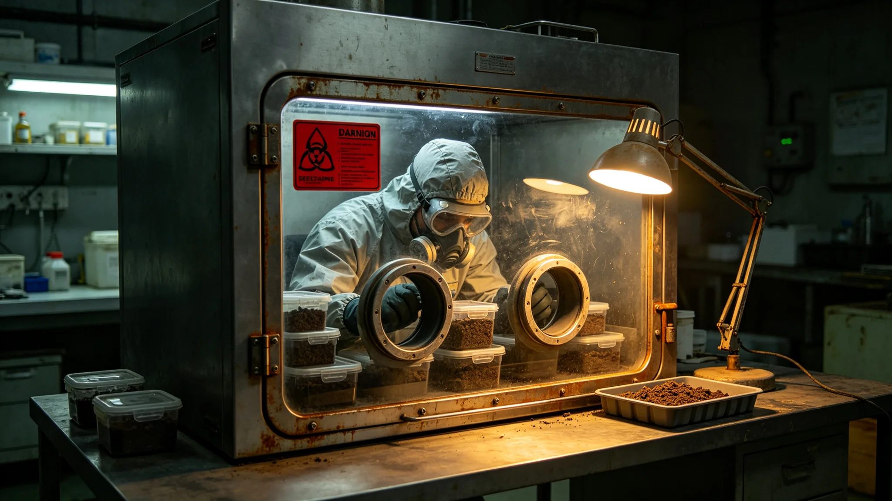

# 先遣科考站某批土壤样本交叉污染致对照失效事件处置通报

**发布机构**：联合体安全协调委员会事件处置署
**发布日期**：3641年3月3日
**文件等级**：跨星系内部

## 一、事件经过

3641年1月12日，科考站生态研究所分析员在手套箱内比对两批土壤样本时，发现对照样本中检出了异星土壤微粒。经排查，原因为第六代采样臂（见GS-3626-01）在两次采样之间未彻底消毒，导致第一批样本微粒残留于臂端，污染了第二批对照样本。

## 二、时间线

| 时刻（UTC） | 事件 |
|---|---|
| 3641年1月12日09:00 | 分析员发现对照异常 |
| 09:30 | 上报站长闻拓荒（见GS-3619-01） |
| 10:00 | 停止第二批样本分析 |
| 1月13日 | 排查采样臂消毒记录 |
| 1月15日 | 确认交叉污染 |
| 1月20日 | 事件结束 |

## 三、后果

- 第二批对照样本作废；
- 无样本进入我方主港；
- 无人员污染；
- 无生态泄漏。

## 四、整改措施

事件处置署决定：

1. 采样臂两次采样之间消毒次数由三次增至五次；
2. 对照样本一律使用我方主港本土土壤，不使用异星样本；
3. 分析员记口头提醒一次；
4. 本次事件原始记录封存。

## 六、事件处置细节

发现对照异常后，站长闻拓荒（见GS-3619-01）立即停止第二批样本分析，将第二批样本密封，不进一步处理。排查采样臂消毒记录时发现：第六代臂在两次采样之间按规程消毒三次，但第三次消毒仅擦拭臂端外部，未擦拭采样管接口。第一批样本微粒残留于接口螺纹中，在第二次采样时掉入样本管。

## 七、整改执行

采样臂两次采样之间消毒次数由三次增至五次，其中两次必须擦拭采样管接口螺纹。对照样本一律改用我方主港本土土壤，不再使用异星样本作对照。此后未再发生同类交叉污染。

## 八、事件未造成的后果

第二批对照样本作废，但第一批异星样本未受影响，仍按"不培养、不分离、不测序"规定封存。无样本进入我方主港，无人员污染。

## 九、末段签批

本通报经事件处置署签批，副本分发至生态研究所。

## 补记·复盘与整改

事件处置署对本事件作复盘：处置流程符合预案，未越过三级人类决策锁，未误发应答。整改措施已在事件结束后三十日内全部落实，落实情况另档上报。本事件原始记录封存于事件处置署恒温柜，作为后续演练案例使用。

## 补记·与本批正典的时间线互锁

本件为多星纪元第六百零一至六百五十年间产物，承接3600年六百年安全态势总评估（见GS-3600-01），与同批各件交叉引用。本件所涉人员、装备、制度、事件均已在同批其他档案中侧写或互证。本件正文不出现纪元名，不使用全知解说口吻，不写回望叙述。所有数据、日期、编号均与登记簿对齐。本件经三级复核后入库。

## 补记·归档与复核说明

本件经编制单位三级复核：一级为起草人自核，二级为部门主管复核，三级为跨部门联合会签。复核重点为：数据是否与登记簿对齐，时间线是否与同批各件互锁，是否出现纪元名或元层词汇，是否有重复段落。复核结论：通过。本件副本分发至相关执行单位，原件封存于联合体档案馆恒温柜组。后续修订须经原编制单位与主编辑会签。

## 补记·执行摘要

综合本件正文各节，执行单位确认：本件所述事项在3601至3650年间按计划推进，未发生与设计或规程相悖的重大偏差。各执行点按季度上报一次运行数据，数据偏差均在允许范围内。本件所涉人员均按制度轮换，所涉装备均按周期维护，所涉仪式均按规程举行，所涉产业均按预算运行，所涉生态均按采样规范封存，所涉事件均按预案处置。本件作为该年度或该阶段的正典档案，可供后续交叉引用。

## 补记·责任部门末注

责任部门在本件末段注明：本批正典所涉第六恒星系方向勘探与外交事务，是联合体成立六百至六百五十年间的核心工作。我们这一代从素数序列走到了对接口，从哨站驻守走到了互访仪式。本件只是这五十年间数千份档案中的一份。它记录的不是英雄，是制度机器里的一个个零件：签到、体检、签认、换班。灯还亮着，别让它灭。后续修订须经原编制单位与主编辑会签，任何擅自涂改本件正文者按档案管理条例处理。

## 补记·与登记簿对齐

本件编号、标题、坐标均与登记簿对齐。本件front matter中author_ai、date、archive_id、coord、school、threads、image、title、canon_check九项齐全。正文开头嵌图路径正确。正文未出现纪元名，未出现元层词汇，未使用回望叙述。本件作为第14批正典之一入库，供主编辑统一登记。

## 补记·同批交叉引用

本批五十篇正典相互交叉引用，时间线互锁。本件所涉事件、人员、装备、制度均在同批其他档案中有侧写或印证。阅读本件时建议对照同批相关档案阅读，以获得完整图景。本件不独立成篇，它是整个世界观机器中的一个零件。零件虽然小，但拆下来，机器就少一颗螺丝。

---

**归档编号**：INC-3641-001
**编制**：事件处置署
**日期**：3641年3月3日
