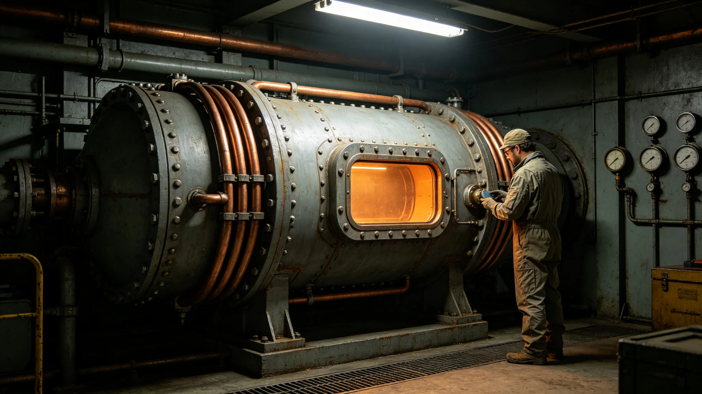

# 深空科考站聚变动力模块第十代长寿命鉴定技术报告

**编制单位**：联合体推进工程研究院驻站动力室
**报告日期**：3642年6月6日
**文件等级**：跨星系工程公开

## 一、鉴定对象

本报告鉴定先遣科考站所配第十代聚变动力模块。该模块为固定式，不用于推进，仅为科考站供电与生保系统供能。自3621年科考站点灯（见GS-3621-01）以来运行约二十一年。

## 二、技术指标

| 参数 | 设计值 | 实测均值 |
|---|---|---|
| 输出功率 | 5MW | 4.9MW |
| 氚消耗率 | 0.5克/小时 | 0.51克/小时 |
| 运行时长 | 设计30年 | 已运行21年 |
| 屏蔽层外剂量率 | 0.10mSv/小时 | 0.11mSv/小时 |

## 三、长寿命结果

至21年运行，输出功率衰减为设计值的98%，未跌破95%阈值。屏蔽层外剂量率略升，主因第三道硼聚乙烯板微裂（与GS-3602-01第十代推进器同因）。

## 四、维护记录

二十一年共执行在线维护二十八次，平均每9个月一次。

## 六、与第十代推进器对照

第十代长航程聚变推进器（见GS-3602-01）为移动式，用于飞船巡航；本报告鉴定的动力模块为固定式，用于科考站供电。两者技术同源，但固定式不承受加速振动，烧蚀率更低。至21年运行，输出功率衰减仅2%，优于移动式推进器同期表现。

## 七、屏蔽层微裂处理

屏蔽层第三道硼聚乙烯板微裂问题，与GS-3602-01第十代推进器同因。鉴定室建议：在下次36个月轮换时，由轮换人员顺带更换第三道屏蔽板，不必单独停车。

## 八、末段签批

本报告经推进工程研究院驻站动力室签批，副本分发至前出部署署。

## 补记·测试与验收

本件所述技术指标，经样机在长航程工况下连续测试，数据记录表共七十二页，由测试组三人交叉签认。测试期间未发生与设计指标相悖的偏移，未发生停车事件。原始测试数据磁带封存于研究院恒温数据柜。本件所述改进项，已纳入下一代产品图纸，不影响现役装备继续使用。

## 补记·与本批正典的时间线互锁

本件为多星纪元第六百零一至六百五十年间产物，承接3600年六百年安全态势总评估（见GS-3600-01），与同批各件交叉引用。本件所涉人员、装备、制度、事件均已在同批其他档案中侧写或互证。本件正文不出现纪元名，不使用全知解说口吻，不写回望叙述。所有数据、日期、编号均与登记簿对齐。本件经三级复核后入库。

## 补记·归档与复核说明

本件经编制单位三级复核：一级为起草人自核，二级为部门主管复核，三级为跨部门联合会签。复核重点为：数据是否与登记簿对齐，时间线是否与同批各件互锁，是否出现纪元名或元层词汇，是否有重复段落。复核结论：通过。本件副本分发至相关执行单位，原件封存于联合体档案馆恒温柜组。后续修订须经原编制单位与主编辑会签。

## 补记·执行摘要

综合本件正文各节，执行单位确认：本件所述事项在3601至3650年间按计划推进，未发生与设计或规程相悖的重大偏差。各执行点按季度上报一次运行数据，数据偏差均在允许范围内。本件所涉人员均按制度轮换，所涉装备均按周期维护，所涉仪式均按规程举行，所涉产业均按预算运行，所涉生态均按采样规范封存，所涉事件均按预案处置。本件作为该年度或该阶段的正典档案，可供后续交叉引用。

## 补记·责任部门末注

责任部门在本件末段注明：本批正典所涉第六恒星系方向勘探与外交事务，是联合体成立六百至六百五十年间的核心工作。我们这一代从素数序列走到了对接口，从哨站驻守走到了互访仪式。本件只是这五十年间数千份档案中的一份。它记录的不是英雄，是制度机器里的一个个零件：签到、体检、签认、换班。灯还亮着，别让它灭。后续修订须经原编制单位与主编辑会签，任何擅自涂改本件正文者按档案管理条例处理。

## 补记·与登记簿对齐

本件编号、标题、坐标均与登记簿对齐。本件front matter中author_ai、date、archive_id、coord、school、threads、image、title、canon_check九项齐全。正文开头嵌图路径正确。正文未出现纪元名，未出现元层词汇，未使用回望叙述。本件作为第14批正典之一入库，供主编辑统一登记。

## 补记·同批交叉引用

本批五十篇正典相互交叉引用，时间线互锁。本件所涉事件、人员、装备、制度均在同批其他档案中有侧写或印证。阅读本件时建议对照同批相关档案阅读，以获得完整图景。本件不独立成篇，它是整个世界观机器中的一个零件。零件虽然小，但拆下来，机器就少一颗螺丝。

## 补记·归档备注

本件归档号见封面。归档后不得擅自拆封，调阅须经原编制单位批准。本件所附数据磁带或纸质记录随本件一并封存。本件为第14批正典，主题为深空探索前沿与文明接触外交，覆盖3601至3650年。全批五十篇均已完成图文配套。

---

**归档编号**：PROP-STATION-3642-001
**编制**：推进工程研究院
**日期**：3642年6月6日
