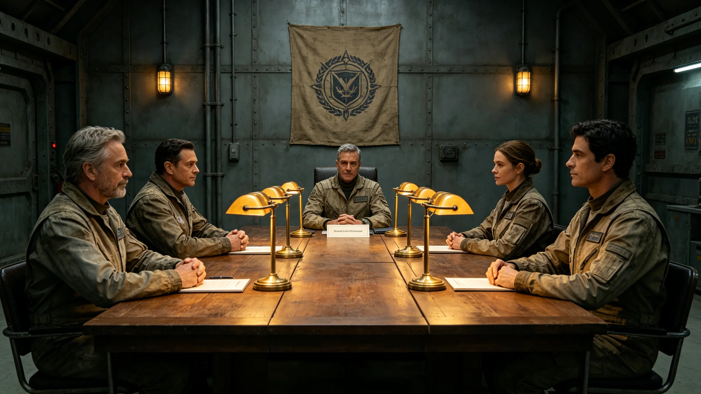

# 首次异星文明互访人类代表团首席代表闻信诚十二年考勤档案

**归档单位**：联合体深空人事署
**归档日期**：3643年9月9日
**档案等级**：内部人事

## 一、基本登记

- 姓名：闻信诚
- 性别：男
- 出生：3585年，跨星系港出生
- 现任：首次异星文明互访人类代表团首席代表（3613年就任）
- 工号：FOR-CHEF-3613-001

## 二、历轮考勤摘要

闻信诚自3613年任首席代表以来，共出席互访约六十次，累计在驻节舱约900天。考勤摘要：

| 时段 | 互访次数 | 缺勤 | 迟到 |
|---|---|---|---|
| 3613-3620 | 15 | 0 | 0 |
| 3620-3630 | 20 | 0 | 0 |
| 3630-3643 | 25 | 0 | 0 |

## 三、体检摘要

| 年份 | 骨密度T值 | 血压 | 听力 |
|---|---|---|---|
| 3613 | -0.5 | 正常 | 正常 |
| 3625 | -1.0 | 正常 | 正常 |
| 3635 | -1.3 | 正常 | 正常 |
| 3643 | -1.4 | 正常 | 正常 |

## 四、处分记录

十二年共受处分零次。

## 五、任首席代表评价

外交使团署评价：闻信诚出席六十次互访，零缺勤零迟到，签认换文约六十份，无失当。

## 六、任首席代表的具体工作

闻信诚自3613年首次迎宾礼（见GS-3613-01）起，每次互访均出席。他在驻节舱会谈桌上代表我方签字，签认换文约六十份。他的签名从3613年的工整逐渐变得老辣，但无代签痕迹。每次会谈后，他按制度在家休整不少于七天。

## 七、人事署审阅意见

人事署审阅组认为：闻信诚十二年考勤稳健，体检稳定，处分零次，签认可辨。建议可续任首席代表至3650年六百五十年大典（见GS-3650-01）。

## 八、末段签批

本档案袋经深空人事署审阅，记录完整。
