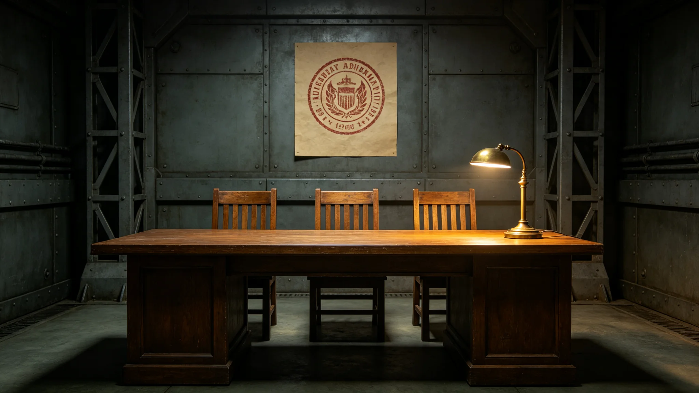

# 跨星系外交仲裁与争端解决常设庭制度建立公报

**发布机构**：联合体法律事务署
**发布日期**：3644年4月4日
**文件等级**：跨星系公开

## 一、建立背景

跨星系互访三十余年，争端多通过照会解决（见GS-3635-01），但部分争端久拖不决。经法律事务署、外交使团署联合会签，建立跨星系外交仲裁与争端解决常设庭。

## 二、仲裁庭组成

仲裁庭设仲裁员五名：我方三名，对方两名。仲裁庭设于中立空间带驻节舱，不设于任一方主港。

## 三、受案范围

仲裁庭受理以下争端：

1. 航线补贴分摊；
2. 样本通关争议；
3. 纪念章与信物规格争议；
4. 驻节舱扩建费用分摊。

仲裁庭不受理信号应答争议（应答争议仍由三级人类决策锁决定）。

## 四、仲裁程序

仲裁程序：

1. 一方提起诉求；
2. 另一方答辩；
3. 五名仲裁员闭门评议；
4. 表决以多数决；
5. 裁决双方执行。

## 五、仲裁庭首次受案

仲裁庭成立后，3644年8月首次受案：双方就驻节舱扩建费用分摊产生争议。我方主张各半，对方主张我方承担六成。仲裁庭五名仲裁员闭门评议两小时，以三比二表决各半。裁决双方执行。

## 六、与照会制度的衔接

仲裁庭是照会制度的补充，不是替代。争端仍先经照会协商，协商不成再提交仲裁庭。闻协睦总理事（见GS-3635-01）处理的十二份争端中，后两份因久拖不决提交仲裁庭，仲裁庭一次解决。

## 七、仲裁庭不受理的事

仲裁庭不受理信号应答争议。应答争议仍由三级人类决策锁决定。仲裁庭不受理武装冲突，武装冲突由防御盾处理。仲裁庭只管钱、物、时间。

## 八、末段签批

本公报经法律事务署、外交使团署联合会签，自3644年4月4日起施行。
