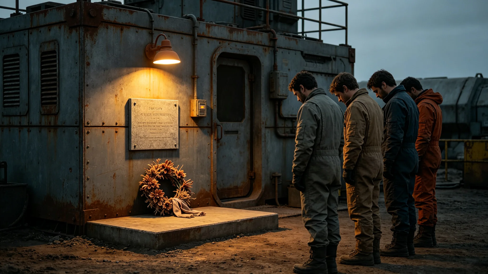

# 跨星系文明接触纪念日沉默与应答周年仪式规程公报

**发布机构**：三恒星系文明联合体文化仪式署
**发布日期**：3645年6月6日
**文件等级**：跨星系公开

## 一、规程背景

3613年6月1日为首次异星代表驻节迎宾礼（见GS-3613-01）。文化仪式署将每年6月1日定为接触纪念日，举行沉默与应答周年仪式。

## 二、仪式时间与地点

- 时间：每年6月1日UTC 06:00
- 地点：中立空间带驻节舱观测窗
- 时长：一小时

## 三、仪式流程

| 时段 | 动作 |
|---|---|
| 06:00-06:30 | 双方代表在观测窗前静默三十分钟 |
| 06:30-06:50 | 我方按礼仪准则发送素数序列应答 |
| 06:50-07:00 | 双方告别 |

## 四、仪式纪律

不奏乐、不发言、不合影。静默三十分钟期间，双方代表不交谈。

## 六、仪式现场记录

仪式当日，双方代表在观测窗前静默三十分钟。观测窗外是深空，无行星，无星云，只有星点。三十分钟后，我方按礼仪准则发送素数序列应答，时长不超过对方信号时长。应答后静默观察三倍间隔。全程不发言，不拍照。

文化仪式署注明：这一天我们先沉默三十分钟，再开口。沉默是等了几百年，开口是终于说话。

## 七、与静默夜的区别

静默夜（见GS-3580-01）是不说话的夜；接触纪念日是说话的周年。静默夜在母港举行，接触纪念日在驻节舱举行。静默夜不发送应答，接触纪念日发送一次素数序列。

## 八、末段签批

本规程经文化仪式署签批，副本分发至外交使团署。
