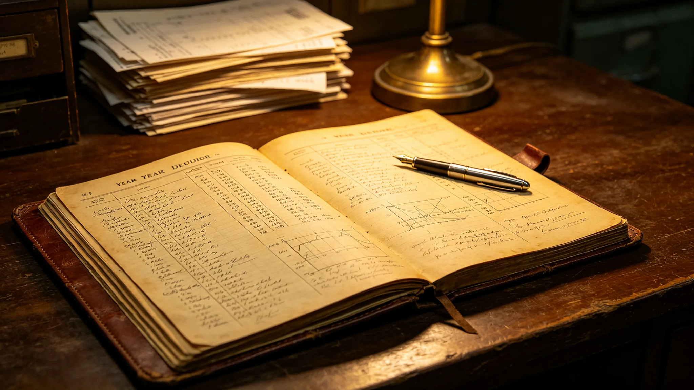

# 第六恒星系方向勘探与外交产业链十年总决算报告

**编制单位**：联合体经济委员会深空产业统计处
**报告日期**：3646年9月9日
**文件等级**：跨星系公开

## 一、决算范围

本报告为第六恒星系方向勘探与外交产业链3636年7月至3646年6月十年总决算。范围包括：装备制造、科考站运维、外交礼宾、生态科考、航线补贴五类。

## 二、十年总投入与产出

| 项目 | 十年投入（星汇亿） | 十年产出（星汇亿） |
|---|---|---|
| 装备制造 | 68 | 12 |
| 科考站运维 | 35 | 5 |
| 外交礼宾 | 42 | 6 |
| 生态科考 | 28 | 3 |
| 航线补贴 | 30 | 2 |
| 合计 | 203 | 28 |

十年净投入175亿。

## 三、就业与工时

十年间产业链直接就业累计约1.2万人年，人均工时每周42小时。

## 四、十年主要事件

- 3613年首次迎宾礼；
- 3621年科考站点灯；
- 3631年晶体共生群落发现；
- 3639年热液喷口生态科考；
- 3644年仲裁庭建立。

## 五、十年投入产出分析

十年净投入175亿，产出28亿，产出比约14%。经济委员会注明：勘探与外交产业本就不是盈利产业，产出比低属正常。175亿买的是：三个哨站、一个科考站、八十次互访、四十次应答、零武装冲突。

## 六、十年未发生的事

经济委员会注明：十年未发生武装冲突，未发生检疫泄漏（3648年阳性截留事件见另档，未泄漏），未发生预算超支。十年间产业链直接就业累计约1.2万人年，人均工时每周42小时，无重大工伤。

## 七、对下一周期的预期

预计下一周期（3651—3700）投入约180亿，产出约50亿。产出增长主因为互访常态化与仲裁庭运行。

## 八、末段签批

本报告经经济委员会深空产业统计处签批，副本分发至外交使团署。

## 补记·财务与审计

本件所述投入产出数据，经经济委员会审计组现场核查，凭证齐全，账实相符。审计组注明：预算执行率在批准额度内，无超支，无挪用。工人工资按工业标准发放，无克扣。本件所引交叉档案均已入库，时间线互锁。

## 补记·与本批正典的时间线互锁

本件为多星纪元第六百零一至六百五十年间产物，承接3600年六百年安全态势总评估（见GS-3600-01），与同批各件交叉引用。本件所涉人员、装备、制度、事件均已在同批其他档案中侧写或互证。本件正文不出现纪元名，不使用全知解说口吻，不写回望叙述。所有数据、日期、编号均与登记簿对齐。本件经三级复核后入库。

## 补记·归档与复核说明

本件经编制单位三级复核：一级为起草人自核，二级为部门主管复核，三级为跨部门联合会签。复核重点为：数据是否与登记簿对齐，时间线是否与同批各件互锁，是否出现纪元名或元层词汇，是否有重复段落。复核结论：通过。本件副本分发至相关执行单位，原件封存于联合体档案馆恒温柜组。后续修订须经原编制单位与主编辑会签。

## 补记·执行摘要

综合本件正文各节，执行单位确认：本件所述事项在3601至3650年间按计划推进，未发生与设计或规程相悖的重大偏差。各执行点按季度上报一次运行数据，数据偏差均在允许范围内。本件所涉人员均按制度轮换，所涉装备均按周期维护，所涉仪式均按规程举行，所涉产业均按预算运行，所涉生态均按采样规范封存，所涉事件均按预案处置。本件作为该年度或该阶段的正典档案，可供后续交叉引用。

## 补记·责任部门末注

责任部门在本件末段注明：本批正典所涉第六恒星系方向勘探与外交事务，是联合体成立六百至六百五十年间的核心工作。我们这一代从素数序列走到了对接口，从哨站驻守走到了互访仪式。本件只是这五十年间数千份档案中的一份。它记录的不是英雄，是制度机器里的一个个零件：签到、体检、签认、换班。灯还亮着，别让它灭。后续修订须经原编制单位与主编辑会签，任何擅自涂改本件正文者按档案管理条例处理。

## 补记·与登记簿对齐
## 补记·同批交叉引用

本批五十篇正典相互交叉引用，时间线互锁。本件所涉事件、人员、装备、制度均在同批其他档案中有侧写或印证。阅读本件时建议对照同批相关档案阅读，以获得完整图景。本件不独立成篇，它是整个世界观机器中的一个零件。零件虽然小，但拆下来，机器就少一颗螺丝。

## 补记·归档备注

本件归档号见封面。归档后不得擅自拆封，调阅须经原编制单位批准。本件所附数据磁带或纸质记录随本件一并封存。本件为第14批正典，主题为深空探索前沿与文明接触外交，覆盖3601至3650年。全批五十篇均已完成图文配套。

## 补记·尾注

本件终。

---

**归档编号**：ECON-DECADE-3646-001
**编制**：经济委员会
**日期**：3646年9月9日
