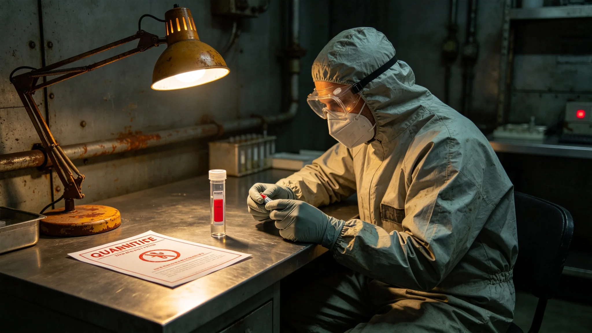

# 跨星系外交使团某件生物样本检疫阳性截留事件通报

**发布机构**：联合体安全协调委员会事件处置署
**发布日期**：3648年5月5日
**文件等级**：跨星系内部

## 一、事件经过

3648年3月20日，外交使团某件拟带入主港的生物样本在驻节舱检疫间被检出阳性。按GS-3628-01检疫制度，样本不得进入主港。事件处置署决定截留样本，密封于驻节舱手套箱。

## 二、时间线

| 时刻（UTC） | 事件 |
|---|---|
| 3648年3月20日10:00 | 检疫检测阳性 |
| 10:15 | 医官上报 |
| 10:30 | 决定截留 |
| 3月21日 | 通知外交使团署 |
| 3月25日 | 事件结束 |

## 三、后果

- 样本未进入主港；
- 无人员污染；
- 无生态泄漏。

## 四、整改措施

事件处置署决定：

1. 所有拟带入主港的样本一律在驻节舱检疫间检测；
2. 阳性样本一律截留，不退回；
3. 本次事件原始记录封存。

## 六、事件处置细节

样本在驻节舱检疫间被检出阳性后，医官沈脉和（见GS-3649-01）立即按预案将样本密封，不进一步检测。事件处置署决定截留样本，不退回对方，也不带入主港。样本密封于驻节舱手套箱，钥匙由医官与站长各持一把。

## 七、对方反应

我方通过外交使团署通知对方：样本检疫阳性，按制度截留。对方未追问，未要求退回。事件处置署注明：对方知道我们的检疫制度，不意外。

## 八、事件未造成的后果

样本未进入主港，无人员污染，无生态泄漏。本次事件是检疫制度（见GS-3628-01）建立后首次阳性截留，制度经受住了检验。

## 九、末段签批

本通报经事件处置署签批，副本分发至法律事务署。
