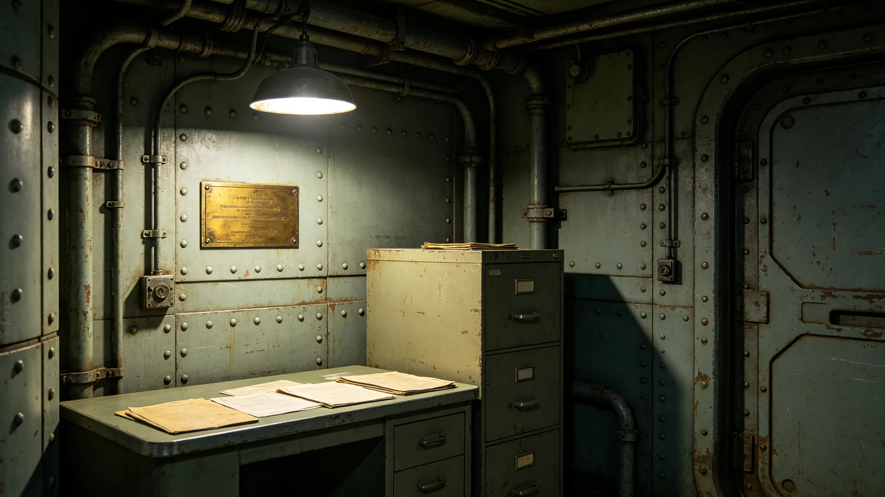

# 三恒星系文明联合体第八任秘书长林卓臣就职考勤与体检档案

**归档单位**：联合体人事档案司秘书长任期卷
**卷宗号**：SEC-ARCH-3651-08
**卷内文件数**：二十四件

## 一、基本登记

姓名：林卓臣。出生：3598年。籍贯：鲸鱼座τ星地下城第七居住层。前任职务：跨星系航道调度署副署长（3645—3651）。经3651年2月公民大会换届选举当选，3651年3月15日就职，任期四十年。

本卷不收传记性评语。以下文件均为任期起始九十日内产生的原始公务物证，不收录媒体记述、家世评议与个人著述。

## 二、就职当日考勤签到

签到时间：3651年3月15日08时12分。签到方式：声纹加履历双因子连续核验（见GS-3505-01）。签到记录备注：08时12分入场，08时47分于前厅等候，09时00分正式入席。当日考勤员：裴慎之。考勤员备注：签到时左手持卷，右手按压指纹，指纹识别一次通过，无重采。当日前厅候签者共七人，林卓臣为第四个到签，先到者为各星区驻节领事署代表。

## 三、就职当日体检通报

体检机构：联合体中央医务署。体检日期：3651年3月14日，即就职前一日。

| 项目 | 数值 | 基准 |
|---|---|---|
| 身高 | 171.4厘米 | — |
| 体重 | 64.8千克 | 正常 |
| 骨密度（腰椎） | 0.982克每平方厘米 | 跨星系长期居住基准0.95 |
| 血压 | 118比76 | 正常 |
| 视网膜 | 未见微裂 | 合格 |
| 前庭功能 | 转椅试验误差百分之三 | 合格 |
| 静息心率 | 62次每分 | 正常 |
| 肺功能 | FVC占预计值百分之九十一 | 合格 |

医务署签注：可任职。附注：林卓臣长期居住于0.62g离心环，骨密度略低于0.8g地表基准，属跨星系长期居住者正常区间（见GS-3462-01）。医务署另注：其左耳听力在3千赫处较基准低4分贝，建议每两年复查一次，不构成任职障碍。

## 四、就职首周签批记录

| 日期 | 签批件 | 签名状态 |
|---|---|---|
| 3月16日 | 中期大修年度预算分拨案 | 签名一次成，无涂改 |
| 3月17日 | 第四代领导层交接清单第3项 | 签名末尾"臣"字末笔略抖 |
| 3月18日 | 防御盾临时轮换通报阅知 | 签名完整 |
| 3月19日 | 跨星系文化融合节预算复核 | "林"字首笔有涂改重描 |
| 3月20日 | 通信网第四代升级节点确认 | 签名一次成 |
| 3月21日 | 生态系统第十次大轮换预备案 | 签名完整 |

档案司注：3月19日"林"字涂改，经秘书组说明为当日上午连续签批七件，笔误后重描，不构成笔迹异常。3月17日"臣"字末笔略抖，医务署判断与前夜睡眠不足有关，嘱当日下午提前退席。

## 五、就职首月缺勤与请假记录

3651年3月全月：应到勤二十二日，实到二十二日，无请假。唯4月2日请半日事假，事由：赴第七居住层原籍探望住院之母。事假审批人：秘书长办公厅值班主任。事假登记附医院探视证明复印件一件。4月5日请半日病假，主诉：上呼吸道不适，体温37.8度。医务署诊断：舱内气溶胶浓度偶发偏高，嘱休息半日，未隔离。

## 六、与第三任交接卷对照

前任第七任秘书长骆元洲（见GS-3451-01）任期交接卷于3651年3月14日封存。交接清单共一百四十二条，林卓臣当日逐条点收，签字确认一百四十一条，余一条——第六恒星系方向先飞器数据回收预案——标注"待续"，延至4月内补签。

档案司注明：该条延期非拒签，系先飞器数据未回传，预案未定稿，无法点收。4月18日先飞器回传首批数据包（另见GS-3675-01关联节点），林卓臣当日补签该条，签名完整。

## 七、首季信任投票

3651年6月，按GS-3459-01修订之换届制度，举行第四代首任秘书长首季信任投票。计票系统双机比对一致，未出现GS-3479-01之延迟事件。投票结果：信任票百分之七十一点四，不信任票百分之十八点二，弃权百分之十点四。监票长为第四代轮换制下首任监票官。

## 八、首季度公务出行记录

3651年3月至6月，林卓臣跨星出行三次：3月28日赴轨道船坞视察中期大修预勘（见GS-3666-01）；4月18日赴通信中继站出席第四代升级节点确认；5月9日赴鲸鱼座τ星地下城出席生态轮换预案会。三次出行均乘接驳艇，无单独搭乘未登记载具记录。

## 九、首季度考勤迟到与早退记录

3月17日上午议事例会，林卓臣迟到三分钟，迟到原因经考勤员登记：接驳艇前一班次气压阀复查延误。4月2日事假半日，前述。5月19日下午技术汇报会早退十二分钟，原因：医务署临时通知其母病情变化，需接通讯电话。考勤司注明：迟到一次、早退一次，均有客观事由登记，未构成考勤扣分。秘书长办公厅另附：本季度无无故缺席、无代签到、无拒签记录。

## 十、本卷未收内容

本卷不收：就职演说全文（另存于文化仪式卷，见GS-3680-01）、家世评议、媒体记述、个人著述、私下谈话。本卷只收考勤、体检、签批、请假、交接、计票、出行七类物证。

## 十一、档案司末注

林卓臣就职时五十三岁，任内将统筹世代飞船船体第三次中期大修、第十代聚变换装、通信网第四代升级三项大工程（见GS-3666、3667、3668）。本卷为任期起始卷，后续每年续卷归档。档案司注明：本卷所有物证均为公务系统自动留痕加人工签认双轨留存，无补录、无追记。

---

**立卷人**：档案司秘书长任期卷组
**立卷日期**：3651年6月30日
**卷宗状态**：起始卷，续
