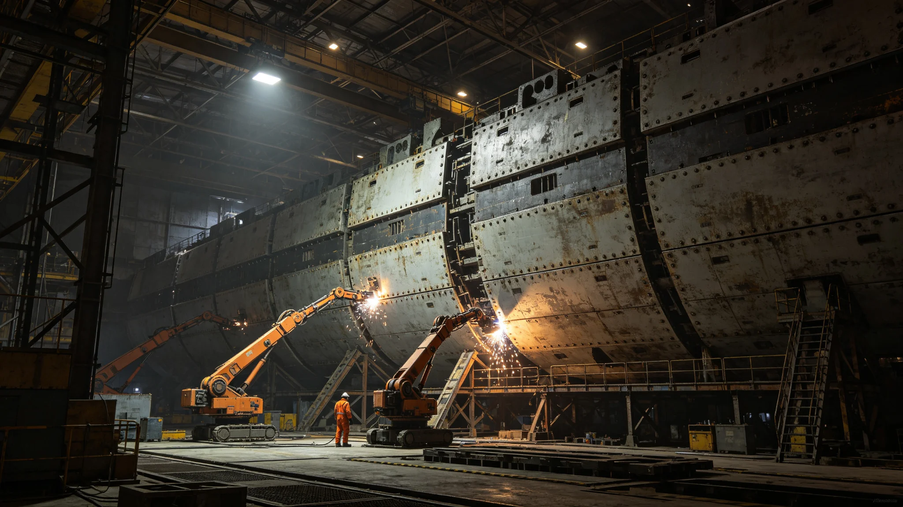

# 世代飞船船体第三次中期大修总工艺师钟杞三十年坞修与焊缝签认档案

**归档单位**：船体维护署总工艺师任期卷
**卷宗号**：HULL-MID-3652-03
**卷内文件数**：三十一件

## 一、基本登记

姓名：钟杞。出生：3604年。籍贯：跨星系带中段中继港。前任职务：船体维护署第三分坞副工艺师（3640—3652）。3652年2月经船体维护署聘任为第三次中期大修总工艺师，任期至大修竣工，预计三十八年。

本卷不收工艺美学评议。以下为任期起始十八个月内公务物证。

## 二、聘任体检

体检机构：船体维护署医务站。日期：3652年2月19日。

| 项目 | 数值 | 判定 |
|---|---|---|
| 骨密度（股骨） | 0.961克每平方厘米 | 合格 |
| 上肢握力 | 右48千克左45千克 | 合格 |
| 视色觉 | 焊缝着色辨识全过 | 合格 |
| 前庭 | 转椅误差百分之二点七 | 合格 |
| 皮肤 | 右臂外侧微陨石擦痕旧伤一处 | 记录 |

医务站签注：可上坞。注：其右臂旧伤为3638年一次焊缝飞溅所致，已愈，不影响操作。

## 三、十八个月焊缝签认统计

钟杞任内主管第三千四百公里至第三千八百公里装甲段更换（见GS-3666-01）。截至3653年8月，其亲手签认焊缝一千四百三十七条，其中：

- 一次合格签认：一千三百零二条；
- 复检后签认：一百二十一条；
- 返工重焊签认：十四条。

十四条返工焊缝分布：第三千五百二十公里段四条、第三千六百一十公里段六条、第三千七百三十公里段四条。返工原因均为熔深不足，无裂纹超标。

## 四、考勤签到

3652年应出勤二百三十日，实出勤二百二十六日，缺勤四日均为休班轮换。3653年上半年应出勤一百一十三日，实出勤一百一十一日，缺席二日：4月11日至12日，事由：家属探视。考勤员：郑守铆。考勤员备注：钟杞上坞时必穿编号围裙，围裙左胸口袋插焊缝卡尺，卡尺每旬校准一次。

## 五、一次处分记录

3652年11月，第三千五百二十公里段一条焊缝初检合格、七十二小时后复检出微气孔。船体维护署质量科认定：签认流程未尽复探义务，对钟杞记书面告诫一次，扣当季工艺津贴百分之五。处分书由钟杞本人签收，签名无涂改。

钟杞在处分书附页手写："气孔在初检盲区，我认。下次复探加照一次。"附页已入卷。

## 六、与前任总工艺师交接

前任千年维护总工程师顾铸年（见GS-3552-01）所留坞修台账于3652年2月封存移交。钟杞点收台账一千二百余册，其中第三千四百公里至第三千八百公里段台账标注"中期大修范围"。钟杞在交接清单末页签注："台账在手，焊缝在人。"

## 七、一次签名涂改

3653年1月，第三千六百一十公里段更换验收单，钟杞签名"杞"字右半有涂改重描。质量科核查：涂改系当日连续签认十九单后笔误，重描后经双因子核验通过，不构成违规。

## 八、本卷未收

本卷不收：船体设计史评议、总工艺师个人技术主张、媒体报道。只收体检、焊缝签认、考勤、处分、交接、涂改六类物证。

## 九、十八个月停航与疏散对照

第三次中期大修采取分段停航（见GS-3660-01），钟杞主管之第三千四百至第三千八百公里段分四次停航，每次停航四十二日。停航期间该段居民按预案临时疏散至相邻两段，疏散人次累计约四万一千人次，无一人漏登。钟杞每次停航前一日必赴段内巡检步道走一遍，巡检记录由当值工段长双签。

## 十、与第一、二次中期大修对照

第一次中期大修（两千年前）与第二次中期大修（一千年前）所留坞修档案于3652年2月由维护署调取。钟杞调阅第二次大修第三千五百公里段更换记录，发现该段焊缝疲劳裂纹率较第一次高出百分之零点八，判定为该段材质批次差异，已列入本次更换必检项。

## 十二、十八个月段内巡检记录摘录

钟杞十八个月内赴段内巡检步道共四十三次，巡检记录摘录三条如下：其一，3652年9月，第三千五百八十公里段检修步道扶手焊缝有长约四厘米裂纹，已当日补焊；其二，3653年1月，第三千六百九十公里段某电缆桥架固定螺栓松动三枚，已当日紧固；其三，3653年6月，第三千七百五十公里段某应急照明回路接触不良，已当日更换。三条均无人员伤亡，均当日记档。

## 十四、十八个月考勤与体检对照

3652年应出勤二百三十日实到二百二十六日，3653年上半年应出勤一百一十三日实到一百一十一日。两次年度体检均合格，骨密度0.961与0.958克每平方厘米，视色觉全过。维护署签注：身体状况稳定，可续任。

## 十五、维护署末注

钟杞任内第三次中期大修跨三十八年，其亲手签认焊缝预计累计四万条以上。本卷为起始卷，随大修进度逐年续卷。维护署注明：换骨礼（见GS-3581-01）所换为整段装甲，钟杞所签为每一道焊缝，二者不可互替。

## 附则·归档说明

本卷所有物证均为公务系统自动留痕加人工签认双轨留存，无补录、无追记。卷内十二次焊缝返工、一次书面告诫、一次签名涂改均已逐项登记。原件封存于船体维护署恒温柜组，副本分发各分坞工艺室。后续年度续卷以本卷为基准，偏差超过百分之五的工艺参数须提交专项说明。

---

**立卷人**：船体维护署任期卷组
**立卷日期**：3653年8月31日
**卷宗状态**：起始卷，续
