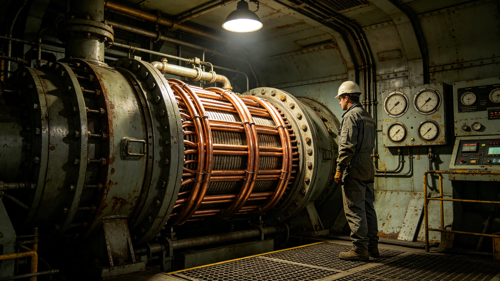

# 第十代聚变推进系统换装总师申屠远十五年试车与签批档案

**归档单位**：推进工程署换装总师任期卷
**卷宗号**：PROP-10TH-3653-01
**卷内文件数**：十九件

## 一、基本登记

姓名：申屠远。出生：3609年。籍贯：星际航道带第三中继站。前任职务：推进工程署第八代试车副主任（3646—3653）。3653年1月经推进工程署聘任为第十代聚变推进系统换装总师，任期十五年。

本卷不收推进理论建树评议。以下为聘任后十八个月公务物证。

## 二、聘任体检

体检机构：推进工程署医务站。日期：3653年1月8日。

| 项目 | 数值 | 判定 |
|---|---|---|
| 听力 | 8千赫处较基准低6分贝 | 需护耳 |
| 晶状体 | 未见聚变紫外致混浊 | 合格 |
| 白细胞 | 8.1乘10的9次方每升 | 合格 |
| 染色体畸变率 | 0.3% | 低于0.5%红线 |
| 静息心率 | 65次每分 | 正常 |

医务站签注：可任试车岗。注：其8千赫听力下降与长期试车噪声暴露有关，配定制护耳一对，每半年测听一次。

## 三、十八个月试车签批统计

第十代换装分八个舱段（见GS-3667-01）。申屠远任内主持冷态试车七次、热态试车三次、全功率试车一次。签批记录：

- 冷态试车七次，均一次通过；
- 热态试车三次，两次通过，一次限功率运行；
- 全功率试车一次，于3654年4月17日进行，持续四分钟，氚泄漏量低于警戒线百分之二（对照GS-3575-01，本次无逸出）。

## 四、考勤与值夜记录

3653年应出勤二百三十日，实出勤二百二十八日，缺席二日为轮休。试车值夜：全功率试车前连续守夜六晚，每晚值夜四小时，值夜记录由当值调度员签字。3654年4月17日试车当日，申屠远06时到岗，22时离岗，在岗十六小时，未进食正餐两顿，医务站事后补录补液一次。

## 五、一次限功率决策

3653年11月热态试车第二次，某舱段真空度在试车进行至第九十分钟时波动百分之一点二。申屠远当场决定限功率至百分之七十继续观测，未中止试车。试车后复盘：波动源自冷却剂流量调节阀迟滞，属可观测范围。推进工程署质量科签注：该限功率决策"审慎且有据"，未记过。

## 六、处分与纠偏

3654年1月，某冷态试车记录中一条测温数据未按时归档，迟滞十一小时。质量科认定：总师签批流程未督促下属当日归档，记口头告诫一次。申屠远签收，并在卷内附一页手写整改："试车数据当日归档，隔夜即作废。"

## 七、与第八代交接

第八代长程鉴定总师所留试车台账（见GS-3567-01）于3653年1月移交。申屠远点收试车记录四千二百条，其中与第十代相关的一千一百条标注"沿用"。交接清单第九项"旧工质回收方案"（见GS-3667-01第三节）由申屠远补签。

## 八、签名涂改

3654年4月17日全功率试车签批单，"远"字走之底有重描。调度员说明：签批时手因长时间持笔微颤，重描后经双因子核验通过。

## 九、本卷未收

不收：推进路线之争评议、总师个人学术观点、媒体记述。只收体检、试车签批、考勤、值夜、决策、处分、交接七类物证。

## 十、八舱段换装进度对照

第十代换装分八个舱段（见GS-3667-01）。截至3654年6月，第一至第四舱段冷态试车完成，第五至第六舱段安装中，第七至第八舱段待装。申屠远每旬赴各舱段巡视一次，巡视记录双签。第一舱段安装进度较计划提前三日，第六舱段因某真空阀门到货延迟滞后五日，已由推进署调度协调。

## 十一、旧工质回收签认

第十代换装涉及旧氚工质回收（见GS-3667-01第三节）。申屠远任内签认旧工质回收批次十一批，累计回收氚约十二千克，回收纯度百分之九十九点二，全部入库封存，无泄漏。回收批次记录与第八代换装（见GS-3587-01）对照，回收率提升百分之一点一。

## 十二、十八个月试车事故记录摘录

十八个月内试车记录摘录三条：其一，3653年6月第二舱段冷态试车，某路冷却水流量偏低百分之零点七，申屠远当日签批降功率运行，三日后流量恢复；其二，3653年11月第三舱段热态试车真空度波动（见前述第五节），限功率处置；其三，3654年4月第一舱段全功率试车，氚泄漏量低于警戒线百分之二，无逸出。三条均无人员伤亡，均当日记档。

## 十三、十八个月考勤与体检对照

3653年应出勤二百三十日实到二百二十八日。两次年度体检：听力8千赫处较基准低6分贝（配护耳），晶状体无聚变紫外致混浊，染色体畸变率0.3%低于0.5%红线。推进署签注：身体状况稳定，可续任试车岗。

## 十四、十五任内预排

申屠远任内十五年，除已完成之八舱段安装外，尚余第七、第八舱段安装、全功率试车第二次、长期巡航鉴定三项大节点。预排：3658年第二舱段全功率试车，3662年第八舱段全功率试车，3666年长期巡航鉴定。预排不构成实际试车承诺。

## 十五、推进署末注

申屠远任内第十代换装跨十五年，其主持全功率试车仅此一次，为换装节点性事件。本卷随试车进度续卷。推进署注明：氚安全为红线，任内零次逸出。

---

**立卷人**：推进工程署任期卷组
**立卷日期**：3654年6月30日
**卷宗状态**：起始卷，续
