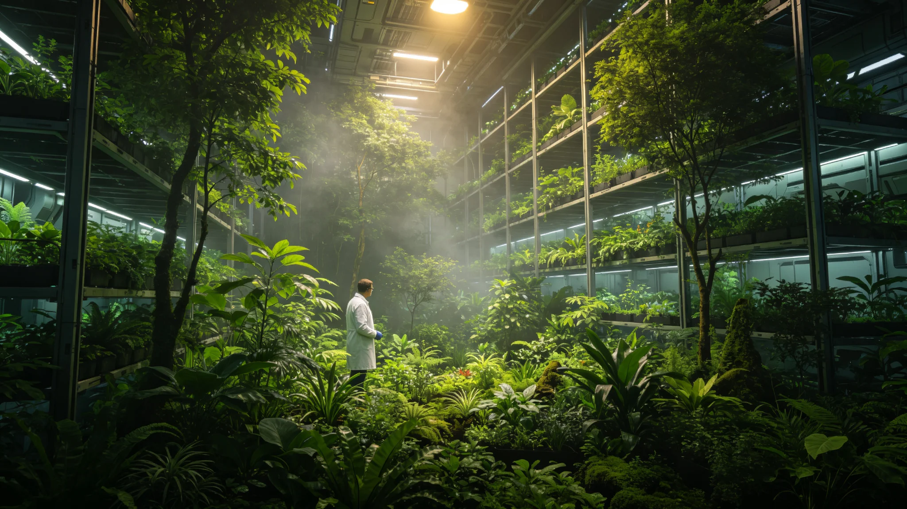

# 世代飞船生态系统第十次大轮换首席生保官贺知讯四十年菌剂签认档案

**归档单位**：生保工程署首席生保官任期卷
**卷宗号**：ECO-10TH-3654-01
**卷内文件数**：二十二件

## 一、基本登记

姓名：贺知讯。出生：3600年。籍贯：跨星系带农业环区。前任职务：生保工程署菌剂科副科长（3642—3654）。3654年1月经生保工程署聘任为第十次大轮换首席生保官，任期四十年。

本卷不收生态哲学评议。以下为聘任后十八个月公务物证。

## 二、聘任体检

| 项目 | 数值 | 判定 |
|---|---|---|
| 肺功能 | FVC占预计值百分之九十八 | 合格 |
| 皮肤 | 无真菌致敏斑 | 合格 |
| 嗅觉 | 十种生保菌剂气味辨识全过 | 合格 |
| 血清IgE | 82国际单位每毫升 | 正常 |
| 静息心率 | 68次每分 | 正常 |

医务站签注：可任菌剂岗。注：其嗅觉辨识考核为任职门槛，不合格者不得签认菌剂批次。

## 三、十八个月菌剂签认统计

第十次大轮换分六批菌剂（见GS-3669-01）。贺知讯任内签认菌剂批次一百三十一批，其中：

- 一次合格：一百一十九批；
- 复检合格：十批；
- 退回销毁：两批。

两批退回销毁：第一批为3654年7月某舱木腐菌剂，杂菌率超标千分之三；第二批为3655年2月某水培藻种，光合效率低于备案值百分之四。两批均于签认前检出，未进入舱段。

## 四、考勤

3654年应出勤二百三十日，实出勤二百二十七日，缺席三日：2月19日至21日，事由：轮休。贺知讯每周必下舱一次，下舱日穿编号防护服，防护服外侧编号与签到卡一致。

## 五、一次减产处置

3654年9月，某水培舱更换新菌剂后第三周，作物生长速率下降百分之六。贺知讯当日赴舱采样，判定为菌剂与原根际菌竞争延迟，非GS-3578-01式全面减产。处置：暂停该舱新菌剂全量推广，维持原菌剂半量过渡六周。六周后生长速率恢复百分之九十八。生保工程署签注：处置得当，未记过。

## 六、签名涂改

3655年1月，一批菌剂验收单，"讯"字言字旁有重描。下属说明：当日下舱归来手湿，重描后经双因子核验通过。

## 七、与第九代交接

第九代菌剂轮换首席叶归根（见GS-3555-01）所留菌剂谱系台账于3654年1月移交。贺知讯点收菌种档案四千三百条，其中与第十次轮换相关的一千八百条标注"沿用"，五百条标注"淘汰"。交接清单末项"本土物种引入准入"（见GS-3563-01）由贺知讯续签。

## 八、一次口头告诫

3654年11月，某舱菌剂监测记录迟交一日。质量科认定：首席生保官未督促当值采样员当日送检，记口头告诫一次。贺知讯签收，附页手写："采样当日送检，隔夜菌落即变。"

## 九、六批菌剂轮换进度对照

第十次大轮换分六批菌剂（见GS-3669-01）。截至3655年6月，第一批至第三批已完成舱段更换，第四批种植中，第五批待引种，第六批待审批。贺知讯每月赴各批种植舱巡视一次，巡视记录双签。第二批更换后某水培舱减产百分之六（见前述第五节），第四批已调整菌剂配比，预演两轮，未再减产。

## 十、与第九代菌剂谱系对照

第九代菌剂（见GS-3570-01）谱系中，第十次大轮换沿用一千八百条，淘汰五百条，新增二百三十条。新增二百三十条中，一百条为跨系引种本土光合藻类（见GS-3591-01）经准入后引入，八十条为基因测序网（见GS-3471-01）新鉴定菌株，五十条为实验室内驯化新菌。

## 十一、本卷未收

不收：生态演替理论评议、首席生保官个人学术主张、媒体记述。只收体检、菌剂签认、考勤、减产处置、交接、告诫六类物证。

## 十二、十八个月舱内巡视记录摘录

贺知讯十八个月内下舱巡视共五十九次，巡视记录摘录三条：其一，3654年8月某水培舱藻膜厚度偏薄，已调整营养液磷比；其二，3654年12月某种植层某伴生昆虫种群密度偏高，已释放天敌控制；其三，3655年4月某菌剂储罐温控偏高零点三度，已当日校准。三条均无舱段污染，均当日记档。

## 十四、十八个月考勤与体检对照

3654年应出勤二百三十日实到二百二十七日。两次年度体检：肺功能FVC占预计值百分之九十八，皮肤无真菌致敏斑，嗅觉十种菌剂气味辨识全过。生保署签注：身体状况稳定，可续任菌剂岗。

## 十五、四十年任内预排

贺知讯任内四十年，除已完成之六批菌剂轮换外，尚余第四批全舱推广、第五批引种、第六批审批三项。预排：3658年第四批全舱推广，3662年第五批引种，3666年第六批审批。预排不构成实际推广承诺。

## 十六、生保署末注

贺知讯任内第十次大轮换跨四十年，其签认菌剂批次预计累计三千批以上。本卷随轮换进度续卷。生保署注明：任内零次因菌剂事故致舱段污染。

## 附则·归档说明

本卷所有物证均为公务系统自动留痕加人工签认双轨留存，无补录、无追记。卷内两批菌剂退回销毁、一次减产处置、一次口头告诫均已逐项登记。原件封存于生保工程署恒温柜组，副本分发各水培舱值班室。后续年度续卷以本卷为基准，偏差超过百分之五的菌群参数须提交专项说明。

---

**立卷人**：生保工程署任期卷组
**立卷日期**：3655年6月30日
**卷宗状态**：起始卷，续
