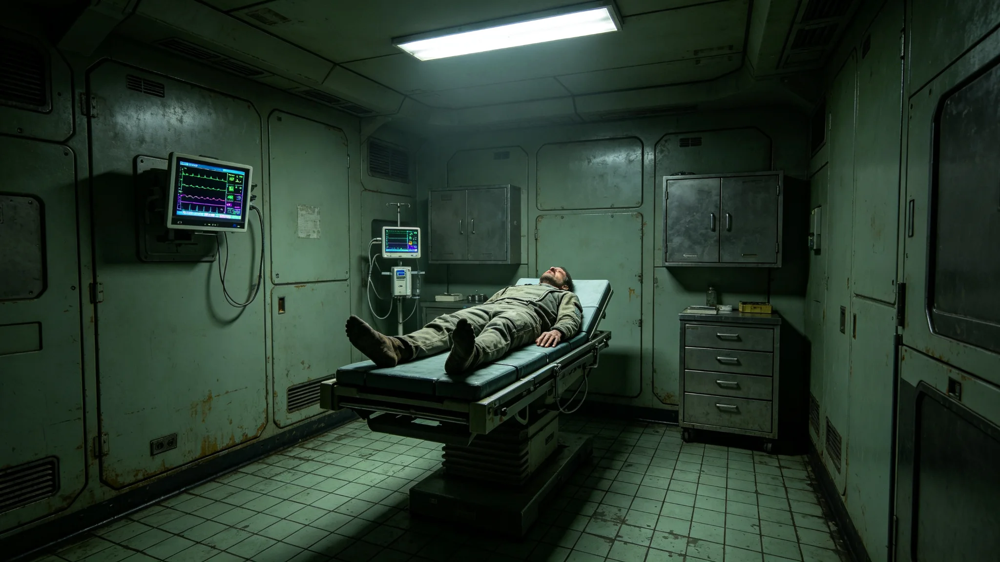

# 跨星系长期居住心理学总站首任首席心理学家魏雨氛二十年问卷与处分档案

**归档单位**：长期居住心理学总站首席任期卷
**卷宗号**：PSYCH-3655-01
**卷内文件数**：二十六件

## 一、基本登记

姓名：魏雨氛。出生：3601年。籍贯：鲸鱼座τ星地下城第三居住层。前任职务：联合体医务署心理科科长（3643—3655）。3655年1月经联合体人事署聘任为长期居住心理学总站首任首席心理学家，任期二十年。

本卷不收心理学流派评议。以下为聘任后十八个月公务物证。

## 二、聘任体检

| 项目 | 数值 | 判定 |
|---|---|---|
| 抑郁自评量表 | 31分 | 低于53分临床线 |
| 焦虑自评量表 | 29分 | 正常 |
| 睡眠 | 平均6.8小时每夜 | 正常 |
| 静息心率 | 70次每分 | 正常 |
| 共情耗损量表 | 44分 | 低于60分警戒 |

医务署签注：可任职。注：共情耗损量表接近警戒，建议每季度自测一次，任内安排督导每月一次。

## 三、十八个月问卷签认统计

心理学总站运行跨星系长期居住者心理负荷问卷第六代（见GS-3670-01）。魏雨氛任内审阅问卷异常报告四百三十一份，其中：

- 标记为正常波动：三百七十二份；
- 转介心理干预：四十八份；
- 转介医务：十一份。

十一份医务转介中，三份检出抑郁倾向需药物干预，八份检出睡眠呼吸暂停。无自杀倾向报告。

## 四、考勤

3655年应出勤二百三十日，实出勤二百二十一日，缺席九日：其中六日为督导与研修，三日为轮休。魏雨氛每周主持个案讨论会一次，每次九十分钟，讨论记录双签。

## 五、一次处分

3655年11月，某舱段群体性舱居倦怠预警（见GS-3676-01关联），魏雨氛未在预警发出当日即上报心理总站，迟滞两日。人事署认定：预警响应流程未即时启动，记书面告诫一次，扣当季津贴百分之三。魏雨氛签收，附页手写："预警当日即报，隔夜人已散。"

## 六、签名涂改

3656年2月，一份转介单，"氛"字气字头有重描。秘书说明：当日连续签署三十一份转介单，笔误重描，双因子核验通过。

## 七、与医务署交接

原医务署心理科卷宗于3655年1月移交心理学总站。魏雨氛点收历年问卷数据十二万条，其中与长期居住倦怠相关的三万八千条标注"沿用分析"。交接清单末项"跨星心理健康数据互认"（见GS-3661-01）由魏雨氛牵头起草。

## 八、一次干预记录

3656年3月，某跨星系航行接驳艇上一名乘员问卷异常率连续三周上升。魏雨氛通过艇载视频咨询两次，每次四十分钟，乘员于第四周异常率回落。咨询记录双签，未公开乘员身份。

## 九、三系问卷异常率对照

心理学总站跨三系运行第六代问卷（见GS-3670-01）。截至3656年6月，三系问卷异常率：比邻星地表带百分之三点一，鲸鱼座τ地下城带百分之二点七，跨星系航道带百分之三点六。跨星系航道带异常率略高，与长航程密闭舱居住有关。魏雨氛已就航道带异常率偏高提交专项说明，建议加密舱段心理支持频次。

## 十、与第三代健康监测网对照

第三代长期居住健康监测中心（见GS-3455-01）数据于3655年1月接入心理学总站。魏雨氛调阅其中与骨密度骤降（见GS-3476-01）相关的心理数据，发现骨松预警乘员同期问卷异常率较平均高百分之四点二，已列入联合监测项。

## 十一、本卷未收

不收：心理学流派之争、首席个人学术观点、来访者隐私。只收体检、问卷审阅、考勤、处分、干预、交接六类物证。

## 十二、十八个月典型个案摘录

十八个月内典型个案摘录三条：其一，3655年10月某跨系船员连续航行九十天后问卷异常率上升，经视频咨询两次后回落；其二，3656年1月某地下城居民因邻层施工噪声致睡眠紊乱，转介医务后未达临床线，建议调整施工时段；其三，3656年5月某年轻居民问卷出现拒认老地球叙事倾向（对照GS-3527-01），经两次访谈后情绪缓和。三条均未公开当事人身份，均双签存档。

## 十四、十八个月考勤与体检对照

3655年应出勤二百三十日实到二百二十一日。两次年度体检：抑郁自评31分、焦虑自评29分，均低于临床线；共情耗损量表44分，低于60分警戒。心理学总站签注：身体与心理状况稳定，可续任。

## 十五、二十年任内预排

魏雨氛任内二十年，除已完成之第六代问卷运行外，尚余第七代问卷预研、跨星心理健康数据互认制度起草两项。预排：3662年第七代问卷预研启动，3666年数据互认制度报秘书处备案。预排不构成实际制度生效承诺。

## 十六、心理学总站末注

魏雨氛任内二十年，心理学总站将从建站走向制度化。本卷随问卷年度续卷。总站注明：任内零次因心理干预失误致意外事件。

## 附则·归档说明

本卷所有物证均为公务系统自动留痕加人工签认双轨留存，无补录、无追记。卷内十一份医务转介、一次书面告诫、三次典型个案均已逐项登记。来访者身份全程保密，卷内不以姓名列示。原件封存于心理学总站恒温柜组，副本仅分发督导。后续年度续卷以本卷为基准，问卷异常率偏差超过百分之零点五须提交专项说明。

---

**立卷人**：心理学总站首席卷组
**立卷日期**：3656年7月31日
**卷宗状态**：起始卷，续
