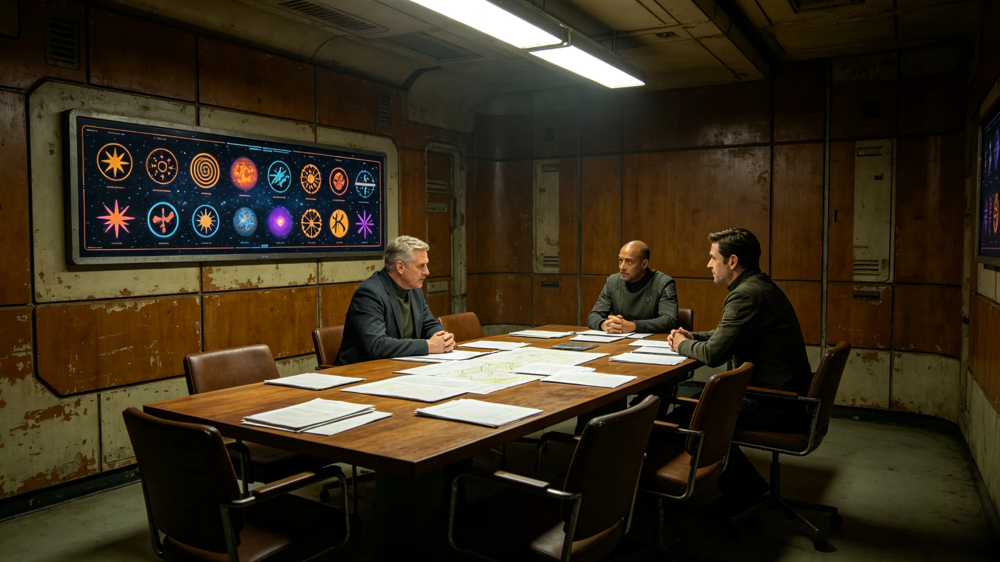

# 跨星系文化融合协调局首任主管向书同十五年节庆互认与调解档案

**归档单位**：文化融合协调局首任主管任期卷
**卷宗号**：CULT-3657-01
**卷内文件数**：二十三件

## 一、基本登记

姓名：向书同。出生：3602年。籍贯：跨星系带中段。前任职务：联合体文化署节庆科科长（3645—3657）。3657年1月经联合体人事署聘任为跨星系文化融合协调局首任主管，任期十五年。

本卷不收文化理论评议。以下为聘任后十八个月公务物证。

## 二、聘任体检

| 项目 | 数值 | 判定 |
|---|---|---|
| 听力 | 全频段正常 | 合格 |
| 语音辨识 | 三系标准语及七种方言全过 | 合格 |
| 共情耗损量表 | 41分 | 正常 |
| 静息心率 | 69次每分 | 正常 |
| 血压 | 122/78 | 正常 |

医务署签注：可任职。注：三系标准语及七种方言辨识为任职门槛，不合格者不得主持跨系节庆互认。

## 三、十八个月节庆互认签认统计

协调局成立首年，受理跨系节庆互认申请二十一件，其中：

- 互认通过：十三件；
- 补充材料后通过：五件；
- 驳回：三件。

三件驳回：其一为某星区要求将本星区独立节日列为跨星系假日，涉及历法协调（见GS-3663-01）未达成；其二为某庆典仪式中含对他星区不尊用语；其三为节庆预算跨系分摊比例未明。三件均书面答复，未公开争议。

## 四、调解案卷

十八个月内受理跨系文化纠纷九件，其中：

- 调解成功：七件；
- 移交仲裁：二件。

九件纠纷中，四件为节庆日期冲突，三件为用语误读（见GS-3677-01关联），二件为遗产归属。调解记录双签，纠纷双方均未公开身份。

## 五、考勤

3657年应出勤二百三十日，实出勤二百二十二日，缺席八日：其中五日为赴各星区现场协调，三日轮休。向书同每月主持跨系节庆协调会一次，每次三小时，会议记录双签。

## 六、一次书面告诫

3658年3月，某节庆互认申请未在法定三十日内答复，迟滞七日。人事署认定：主管未督促承办人限时办结，记书面告诫一次，扣当季津贴百分之二。向书同签收，附页手写："申请三十日必复，跨星人不等人。"

## 七、签名涂改

3658年5月，一份调解书签，"同"字口部有重描。秘书说明：当日连续调解三件，笔误重描，双因子核验通过。

## 八、与文化署交接

原文化署节庆科卷宗于3657年1月移交协调局。向书同点收历年节庆互认记录一千八百条，其中与跨系融合相关的六百条标注"沿用"。交接清单末项"共食长桌仪式"（见GS-3683-01）由向书同牵头起草。

## 九、三系历法协调对照

协调局首年受理二十一件节庆互认申请中，七件涉及三系历法差异。向书同牵头起草历法协调制度（见GS-3663-01），将三系节庆日期换算为联合体标准历法对照页，附于互认批文之后。截至3659年9月，对照页已印制三种版本，分发各星区领事署。

## 十、共食长桌仪式起草

共食长桌仪式（见GS-3683-01）由向书同牵头起草。起草过程中，七次征求三系饮食代表意见，两次调整主桌席位顺序。仪式规程草案于3659年6月经协调局全体会议通过，报秘书处备案。

## 十一、本卷未收

不收：文化优劣之评议、主管个人文化主张、媒体记述。只收体检、互认签认、调解、考勤、告诫、交接六类物证。

## 十二、十八个月调解个案摘录

十八个月内调解个案摘录三条：其一，3657年10月两星区节庆日期相差三日，经调解改为联合体标准历法同日互祝；其二，3658年2月某庆典用语在另一星区为不尊敬，经调解改为中性表述；其三，3658年8月两星区关于共食长桌主菜顺序争议，经调解改为轮值主菜。三条均未公开当事人身份，均双签存档。

## 十四、十八个月考勤与体检对照

3657年应出勤二百三十日实到二百二十二日。两次年度体检：听力全频段正常，三系标准语及七种方言辨识全过，共情耗损量表41分正常。协调局签注：身体状况稳定，可续任。

## 十五、十五年任内预排

向书同任内十五年，除已受理之二十一件互认申请外，尚余共食长桌仪式推行、历法对照页三系印制两项。预排：3662年共食长桌仪式首次跨系共行，3666年历法对照页第三版印制。预排不构成实际推行承诺。

## 十六、协调局末注

向书同任内十五年，协调局将从成立走向制度化。本卷随节庆年度续卷。协调局注明：任内零次因文化纠纷升级为公开冲突。

## 附则·归档说明

本卷所有物证均为公务系统自动留痕加人工签认双轨留存，无补录、无追记。卷内三件驳回互认、两件移交仲裁、一次书面告诫均已逐项登记。纠纷当事人身份全程保密，卷内不以姓名列示。卷内另附三件驳回互认书面答复各一件，以及两件移交仲裁卷宗目录各一件。向书同签批的十八个月调解记录共九件，均双轨留存。

原件封存于文化融合协调局恒温柜组，副本分发各星区领事署。后续年度续卷以本卷为基准，互认时限偏差超过五日须提交专项说明。

---

**立卷人**：文化融合协调局首任主管卷组
**立卷日期**：3659年9月30日
**卷宗状态**：起始卷，续
