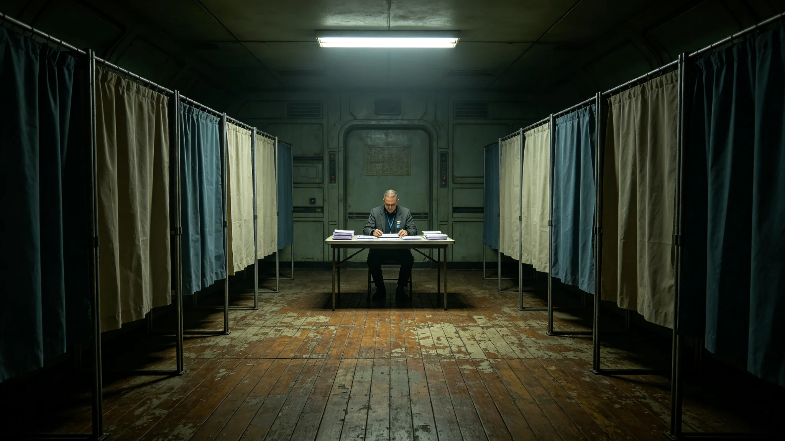

# 三恒星系文明联合体第四代领导人任期轮换与换届制度修订公报

**发布机构**：三恒星系文明联合体秘书处
**发布日期**：3659年1月20日
**文件等级**：跨星系公开

## 一、修订背景

第三代换届制度（见GS-3459-01）施行五十八年以来，完成两次平稳换届。3651年第四代首任秘书长就职（见GS-3651-01），秘书处会同公民大会主席团对原制度作第二次修订。修订起因有三：其一，原制度未规定第四代领导人任期内中期大修、聚变换装、通信升级三项大工程与领导人任期的衔接；其二，原制度对长寿命公民连续参选间隔未作上限规定；其三，原制度对计票双机比对差异处理未细化（对照GS-3479-01、GS-3679-01）。

## 二、修订条款

**第一条 任期衔接**。第四代领导人任期四十年内，如遇船体中期大修等跨期大工程，领导人任期届满而工程未竣者，经公民大会三分之二多数，可延长任期一次，延长不超过十年。延长期间领导人不得再参选。

**第二条 参选间隔**。长寿命公民参选秘书长，两届间隔不得少于二十年。曾任秘书长者，卸任后二十年内不得再参选。

**第三条 计票差异处理**。双机比对差异超过千分之一时，须停机人工重计；差异超过千分之三时，须暂缓公布结果，由监票长会同双机运维方联合复核。

**第四条 信任投票**。第四代首任秘书长首季信任投票制度沿用（见GS-3651-01），其后每十年举行一次。

**第五条 交接清单**。领导人交接清单逐项点收，标注"待续"项不得超过交接清单总数百分之三。

## 三、与原制度对照

| 条款 | 原制度（3459） | 修订后（3659） |
|---|---|---|
| 任期延长 | 未规定 | 经三分之二多数可延一次十年 |
| 参选间隔 | 未规定 | 两届间隔不少于二十年 |
| 计票差异 | 未细化 | 千分之一停机，千分之三暂缓 |
| 信任投票 | 首季一次 | 首季一次，其后每十年 |
| 交接待续 | 未规定 | 不超过总数百分之三 |

## 四、生效与过渡

本修订自3659年2月1日起生效。3651年就职之第八任秘书长任期内，本修订第二条、第三条即行适用。本修订不溯及既往。

## 五、公民大会审议记录

本修订经公民大会第十七次全体会议审议，出席率百分之九十二，赞成率百分之七十八。审议中反对意见主要集中于第一条任期延长，认为延长易致长期掌权。秘书处答复：延长须经三分之二多数且不得再参选，已设双限。

## 六、与换届监票长职责衔接

第四代轮换制下首任监票官职责另见GS-3651-01首季信任投票记录。本修订第三条计票差异处理，由监票长会同双机运维方执行。

## 七、附则

本修订由秘书处负责解释，自生效日起执行。各星区领事署、深空航道安全站、各中继站须于3659年3月1日前将本修订张贴公示。原件封存于联合体档案馆恒温柜组第三排第七柜，归档号GS-3659-01。

## 八、审议记录摘录

公民大会第十七次全体会议审议本修订，出席率百分之九十二，赞成率百分之七十八。审议中，反对意见集中于第一条任期延长。反对方认为：延长一次十年，叠加原四十年任期，总长可达五十年，易致长期掌权。秘书处答复：延长须经三分之二多数且不得再参选，双限已设。赞成方认为：中期大修跨三十八年，领导人任期与工程衔接不可无据。

## 九、与前次修订对照

原第三代换届制度（见GS-3459-01）未规定任期延长、参选间隔、计票差异三项。本次修订补此三项。修订后制度共五条，较原制度增加三条。

## 十一、修订全文要点摘要

本次修订共五条，要点如下：一、第四代领导人任期四十年内，遇跨期大工程经三分之二多数可延一次十年，延长期不得再参选；二、长寿命公民两届参选间隔不少于二十年，曾任者卸任后二十年内不得再参选；三、双机计票差异超千分之一停机人工重计，超千分之三暂缓公布；四、第四代首任秘书长首季信任投票后，其后每十年一次；五、交接清单待续项不得超过总数百分之三。五条均自3659年2月1日起适用。

## 十二、与前三次换届对照

联合体成立以来共经历三次换届（见GS-3451、GS-3550）。前三次换届均按原制度平稳完成。本次修订系第四次修订，针对长寿命公民长期掌权风险与跨期工程衔接两项新问题。

## 十三、配套文件清单

本修订配套文件三件：一、第四代领导人任期延长申请流程图；二、长寿命公民参选间隔计算表；三、双机计票差异人工重计操作规程。三件配套文件随本修订同时发布。各星区须于3659年3月1日前完成内部培训。

## 十四、秘书处末注

秘书处注明：本修订非为某任领导人而设，乃为长寿命公民社会之长期掌权风险与跨期大工程衔接两项新问题而立。修订生效后，第四代首任秘书长林卓臣（见GS-3651-01）任期内遇跨期大修，可依第一条申请延长，但延长期不得再参选。

## 十、附则补

本修订自3659年2月1日起生效。各星区须于3659年3月1日前张贴公示。后续换届以本修订为基准，出席率偏差超过百分之五须提交专项说明。

---

**发布人**：秘书处秘书长办公厅
**日期**：3659年1月20日
