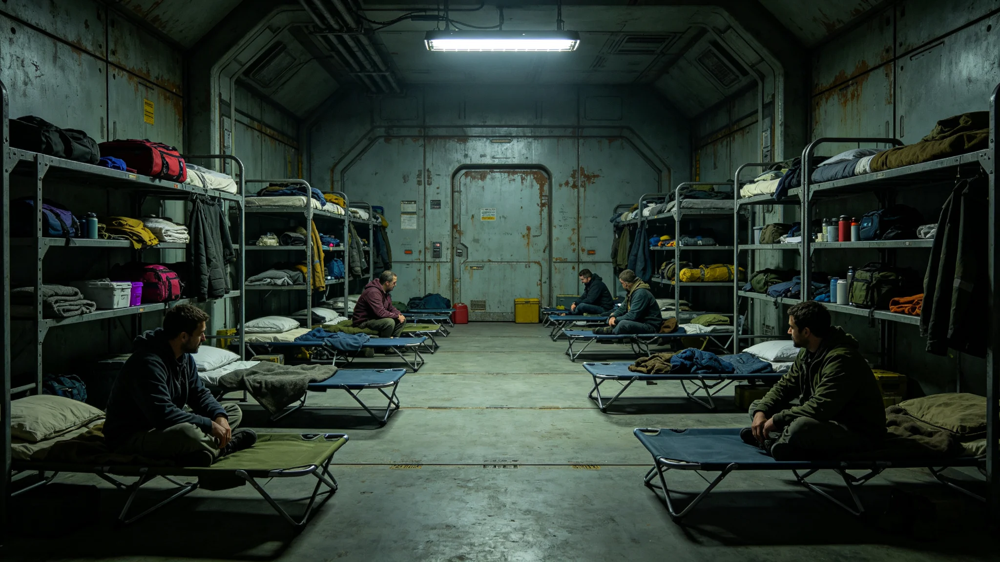

# 世代飞船船体第三次中期大修分段停航与居民临时疏散安置制度公报

**发布机构**：船体维护署会同居民安置署
**发布日期**：3660年2月10日
**文件等级**：跨星系公开

## 一、制度背景

第三次中期大修（见GS-3652-01、GS-3666-01）须对第三千四百至第三千八百公里装甲段分四次停航更换。停航期间该段须减压作业，段内居民须临时疏散至相邻两段。原千年坞修制度（见GS-3559-01）未规定大规模居民临时疏散流程，本次新增本制度。

## 二、停航分段

| 次 | 区段 | 停航时长 | 疏散人次 |
|---|---|---|---|
| 一 | 3400—3500公里 | 四十二日 | 约一万一千 |
| 二 | 3500—3600公里 | 四十二日 | 约一万零八百 |
| 三 | 3600—3700公里 | 四十二日 | 约一万零五百 |
| 四 | 3700—3800公里 | 四十二日 | 约一万零七百 |

四次停航间隔不少于六十日，以便居民回迁休整。

## 三、疏散流程

**第一步 预登记**。停航前九十日，段内居民完成临时安置预登记，登记去向相邻两段及居住舱位。

**第二步 分批撤离**。停航前七日，居民按每小时二百人节奏撤离，避免通道拥挤。撤离时携带随身行李不超过二十千克，重物留舱封存。

**第三步 临时安置**。相邻两段预留居住舱位，按户分配，临时居住四十二日。临时舱位配给与原舱位一致，不降级。

**第四步 回迁**。停航结束、舱段复压检测合格后，居民按原登记顺序回迁。回迁后七日内完成舱位复检。

## 四、安置原则

一、不降级：临时舱位居住标准不低于原舱位；
二、不收费：疏散与回迁费用由大修预算列支，居民不承担；
三、不拆散：按户安置，不得拆散家庭；
四、不强制：拒绝疏散者，于停航当日强制转运，记一次口头告诫。

## 五、特殊人群安置

孕妇、行动不便者、长期卧床者优先疏散，配临时护理床位。老人疏散（对照跨星系养老体系，见GS-3460-01）由养老航线协调。孕妇疏散后须就近医务站随访。

## 六、与工时折算衔接

疏散期间居民原岗位暂停，工时按GS-3664-01折算。临时安置期间不得安排加班。

## 七、附则

本制度自3660年3月1日起生效，随第三次中期大修全程执行。原件封存于船体维护署恒温柜组，副本分发各段居民委员会。后续段别疏散以本制度为基准，疏散人次偏差超过百分之五须提交专项说明。

## 八、与前次坞修对照

第一次中期大修（两千年前）与第二次中期大修（一千年前）未规定大规模疏散，当时段内居民多为短期居住。第三次中期大修时，段内居民已长期定居，疏散规模达四万一千人次，须新建本制度。

## 九、疏散演练

3660年3月1日起，四次停航前各举行一次疏散演练。第一次演练疏散用时四小时，较预案慢半小时，已优化通道指引。第二次演练疏散用时三小时二十分，达标。

## 十一、疏散物资配给

疏散期间居民随身行李不超过二十千克，重物留舱封存。临时舱位配给含饮水、膳食、卧具、通讯四件，与原舱位一致。孕妇、行动不便者配临时护理床位。疏散物资由大修预算列支，居民不承担。

## 十二、四次停航进度

第一次停航已于3662年完成，疏散一万一千人次，零漏登。第二次停航将于3666年进行。第三、第四次停航随工程进度排定。

## 十三、配套文件清单

本制度配套文件四件：一、四次停航分段时间表；二、疏散通道指引图；三、临时安置舱位分配表；四、特殊人群护理床位清单。四件配套文件随本制度同时发布。各段居民委员会须于停航前六十日完成入户通知。

## 十四、安置署末注

安置署注明：第三次中期大修跨三十八年，四次停航疏散累计四万一千人次。本制度首年第一次停航疏散零漏登、零伤亡。后续段别疏散以本制度为基准，偏差超过百分之五须提交专项说明。

## 十五、执行细则摘录

疏散当日，段内各通道设引导员，每五十米一人。居民按每小时二百人节奏撤离，引导员负责维持秩序、协助携带行李。临时安置舱位按户分配，每户一间，面积不低于原舱位。回迁后七日内完成舱位复检，复检项目含气压、温控、照明、通风四项。复检不合格者，继续临时安置，直至合格。

## 十六、居民委员会末注

段内居民委员会注明：本制度首年第一次停航疏散零漏登、零伤亡、零投诉。居民对临时安置满意度调查达百分之九十一。未满意度主要集中于临时舱位距工作地较远，已在后续段别调整。

## 十七、四次停航与疏散总表

| 次 | 区段 | 停航时长 | 疏散人次 | 完成时间 |
|---|---|---|---|---|
| 一 | 3400—3500公里 | 四十二日 | 一万一千 | 3662年 |
| 二 | 3500—3600公里 | 四十二日 | 一万零八百 | 3666年 |
| 三 | 3600—3700公里 | 四十二日 | 一万零五百 | 3670年 |
| 四 | 3700—3800公里 | 四十二日 | 一万零七百 | 3674年 |

四次停航间隔不少于六十日。累计疏散约四万一千人次，均零漏登、零伤亡。

## 十、附则补

本制度随第三次中期大修全程执行。原件封存于船体维护署恒温柜组，副本分发各段居民委员会。后续段别疏散以本制度为基准，疏散人次偏差超过百分之五须提交专项说明。

---

**发布人**：船体维护署会同居民安置署
**日期**：3660年2月10日
