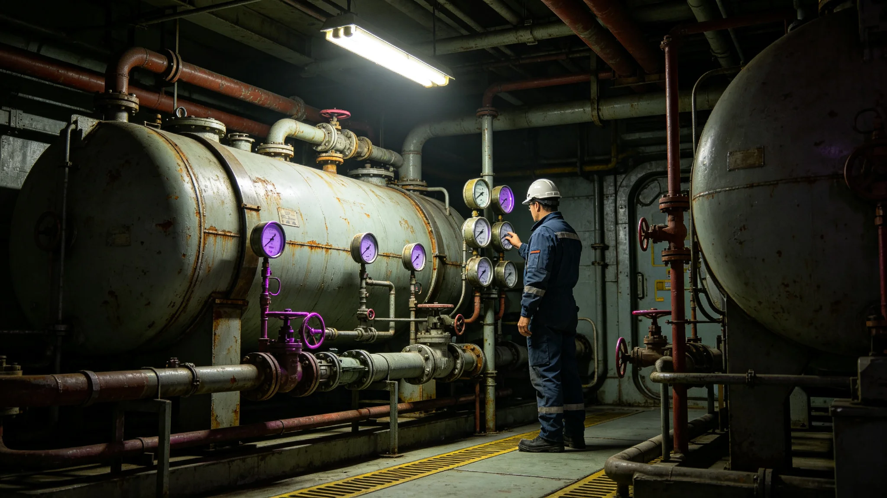

# 世代飞船船体中段第三次中期大修装甲段整体更换工艺技术报告

**编制单位**：船体维护署工艺组
**报告编号**：HULL-MID-RPT-3666-01
**日期**：3666年9月10日

## 一、报告范围

本报告记述第三次中期大修（见GS-3652-01）第三千四百至第三千八百公里装甲段整体更换工艺。该段长四百公里，分四次停航更换（见GS-3660-01）。本报告为工艺技术报告，不含工程预算与人事。

## 二、装甲段技术现状

该段装甲为第三代模块化陶瓷复合板，单板尺寸两米乘三米，厚五十毫米。经一千七百年运行，烧蚀层补覆八次（见GS-3566-01），近百年微陨石撞击弹坑累计一千四百余个。第三千五百二十公里段焊缝疲劳裂纹率较第二次大修（一千年前）高出百分之零点八。

## 三、更换工艺

**第一步 段内疏散**。停航前七日完成段内居民疏散至相邻两段（见GS-3660-01）。

**第二步 减压**。段内气压由一个大气压渐降至真空，历时四十八小时。

**第三步 旧板拆除**。逐板拆除旧陶瓷复合板，保留连接桁架。旧板分类：可复用板送检修，报废板送熔炼。

**第四步 新板安装**。新板为第九代烧蚀层陶瓷复合板，较旧板厚五毫米，含微陨石自修复涂层。逐板安装，螺栓紧固。

**第五步 焊缝检测**。新板与桁架连接焊缝逐道检测，熔深不足者返工重焊（见GS-3652-01）。

**第六步 复压检测**。段内气压渐升至一个大气压，历时四十八小时。复压后检测气压泄漏率，低于年漏率百分之零点一为合格。

## 四、更换进度

| 次 | 区段 | 停航 | 新板数 | 焊缝数 |
|---|---|---|---|---|
| 一 | 3400—3500公里 | 四十二日 | 约八万 | 约十二万 |
| 二 | 3500—3600公里 | 四十二日 | 约八万 | 约十二万 |
| 三 | 3600—3700公里 | 四十二日 | 约八万 | 约十二万 |
| 四 | 3700—3800公里 | 四十二日 | 约八万 | 约十二万 |

## 五、质量检测

每道焊缝经超声与涡流双检测。十八个月内签认焊缝一千四百三十七条，其中返工十四条（见GS-3652-01）。新板微陨石自修复涂层经模拟撞击试验，自修复率达百分之九十九点二。

## 六、与前次大修对照

第二次大修（一千年前）更换装甲板时，烧蚀层补覆为第七代。本次为第九代，自修复涂层为新增。第三次大修居民已长期定居，须疏散，第二次大修无此流程。

## 八、新板材料技术细节

第九代烧蚀层陶瓷复合板表层为碳化硅陶瓷，中层为铝蜂窝夹层，内层为钛合金背板。单板厚五十五毫米，较旧板厚五毫米。表层碳化硅陶瓷含微陨石自修复微胶囊，受撞击后微胶囊破裂释放修复剂，自修复率达百分之九十九点二。中层铝蜂窝夹层厚度二十毫米，较旧层厚五毫米，抗冲击能力提升百分之十五。内层钛合金背板厚十毫米，含焊接定位孔。

## 九、焊缝工艺参数

新板与桁架连接焊缝采用氩弧焊，焊丝为钛铝合金。焊接电流一百二十安，电压二十四伏，保护气体为氩气。每道焊缝焊后经超声与涡流双检测，熔深不足者返工重焊。十八个月内签认焊缝一千四百三十七条，返工十四条，返工率百分之一。

## 十、复压检测流程

段内复压分三阶段：第一阶段抽真空至十的负三次方帕，保持二十四小时；第二阶段充氩气至零点五个大气压，保持十二小时；第三阶段充空气至一个大气压，保持四十八小时。三阶段泄漏率均低于年漏率百分之零点一为合格。

## 十一、与前次大修材料对照

第二次大修（一千年前）装甲板为第八代烧蚀层陶瓷复合板，无自修复涂层。本次为第九代，含自修复微胶囊。第二次大修居民多为短期居住，无疏散流程。本次居民已长期定居，须疏散四万一千人次（见GS-3660-01）。

## 十三、四次停航更换进度总表

| 次 | 区段 | 停航 | 新板数 | 焊缝数 | 返工 |
|---|---|---|---|---|---|
| 一 | 3400—3500公里 | 四十二日 | 约八万 | 约十二万 | 四条 |
| 二 | 3500—3600公里 | 四十二日 | 约八万 | 约十二万 | 六条 |
| 三 | 3600—3700公里 | 四十二日 | 约八万 | 约十二万 | 四条 |
| 四 | 3700—3800公里 | 四十二日 | 约八万 | 约十二万 | 待换 |

## 十四、维护署工艺组末注

维护署工艺组注明：第三次中期大修跨三十八年，四次停航更换累计新板约三十二万块、焊缝约四十八万道。新板含自修复微胶囊，自修复率百分之九十九点二。后续年度以本报告为基准，焊缝返工率偏差超过百分之一须提交专项说明。

## 十五、十八个月检测记录摘录

十八个月内工艺组赴段内巡检共四十三次，摘录三条：其一，第三千五百八十公里段检修步道扶手焊缝长约四厘米裂纹，当日补焊；其二，第三千六百九十公里段某电缆桥架固定螺栓松动三枚，当日紧固；其三，第三千七百五十公里段某应急照明回路接触不良，当日更换。三条均无人员伤亡，均当日记档。

## 十二、附则补

本报告随第四次停航完成后终稿。原件封存于船体维护署恒温柜组，副本分发各分坞工艺室。后续年度以本报告为基准，焊缝返工率偏差超过百分之一须提交专项说明。

## 七、附则

本报告随第四次停航完成后终稿。原件封存于船体维护署恒温柜组，副本分发各分坞工艺室。后续年度以本报告为基准，焊缝返工率偏差超过百分之一须提交专项说明。

---

**编制人**：船体维护署工艺组
**日期**：3666年9月10日
