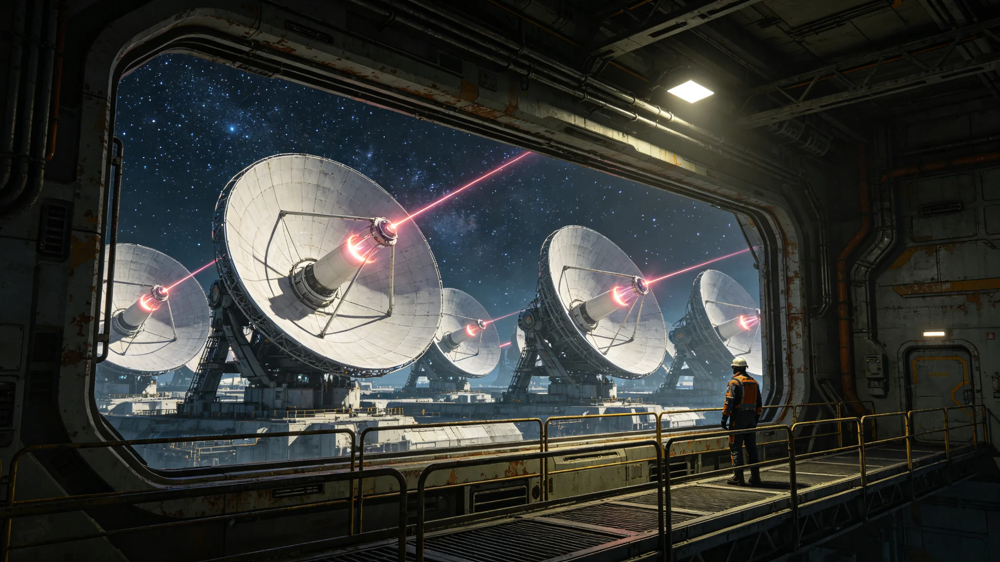

# 第十代聚变推进系统换装与旧工质回收技术报告

**编制单位**：推进工程署工艺组
**报告编号**：PROP-10TH-RPT-3667-01
**日期**：3667年10月20日

## 一、报告范围

本报告记述第十代聚变推进系统换装工艺与旧氚工质回收流程。换装分八个舱段（见GS-3653-01），旧工质回收为换装配套。

## 二、第十代推进系统技术参数

| 项目 | 第八代（旧） | 第十代（新） |
|---|---|---|
| 比冲 | 约两百千秒 | 约三百千秒 |
| 氚自持 | 不足 | 自持 |
| 真空室壁 | 钨 | 钨镧合金 |
| 点火频率 | 每日一次 | 每日三次 |
| 寿命 | 约十二万小时 | 约十八万小时 |

## 三、换装工艺

**第一步 旧舱段停机**。旧推进系统降至冷态，历时七十二小时。

**第二步 旧工质回收**。旧氚工质经气体回收回路抽出，纯度百分之九十九点二，入库封存。

**第三步 旧舱段拆除**。拆除旧真空室壁与磁线圈，分类送检修或熔炼。

**第四步 新舱段安装**。新真空室壁为钨镧合金，磁线圈为第三代超导。逐件安装。

**第五步 冷态试车**。新舱段冷态试车，检测真空度与磁线圈。

**第六步 热态试车**。热态试车至百分之七十功率，检测等离子体约束。

**第七步 全功率试车**。全功率试车四分钟，氚泄漏量低于警戒线百分之二（见GS-3653-01）。

## 四、旧工质回收

十八个月内签认旧工质回收批次十一批，累计回收氚约十二千克。回收率较第八代换装（见GS-3587-01）提升百分之一点一。回收氚纯度百分之九十九点二，全部入库封存，无泄漏。

## 五、安全记录

十八个月内冷态试车七次、热态试车三次、全功率试车一次。氚泄漏量低于警戒线，零次逸出（对照GS-3575-01）。染色体畸变率0.3%，低于0.5%红线。

## 六、与第八代对照

第八代比冲约两百千秒，第十代约三百千秒。第八代氚自持不足，第十代自持。第八代寿命约十二万小时，第十代约十八万小时。

## 八、第十代真空室壁技术细节

第十代真空室壁为钨镧合金，较旧钨壁耐中子辐照寿命提升百分之五十。壁厚二十毫米，内表面覆铍涂层。磁线圈为第三代高温超导，临界电流密度较第二代提升百分之三十。真空室直径六米，高十二米。

## 九、氚自持流程

第十代氚自持流程：聚变反应产生中子轰击锂增殖剂产生氚，氚经气体回收回路抽出，纯化后回充真空室。自持氚量约百分之九十五，外购氚量降至百分之五。旧第八代自持氚量约百分之七十，外购百分之三十。

## 十、试车流程细节

冷态试车：真空度抽至十的负六次方帕，磁线圈励磁，无等离子体。热态试车：注入氘氚气体，等离子体约束至百分之七十功率，持续五分钟。全功率试车：等离子体约束至百分之百功率，持续四分钟，氚泄漏量低于警戒线百分之二。

## 十一、工质回收安全

旧氚工质回收经气体回收回路，纯度百分之九十九点二。回收过程中监控氚泄漏量，十八个月内零次逸出。回收氚入库封存，标注批次与纯度。

## 十三、八舱段换装进度总表

| 舱段 | 安装 | 冷态 | 热态 | 全功率 |
|---|---|---|---|---|
| 一 | 完成 | 完成 | 完成 | 完成 |
| 二 | 完成 | 完成 | 完成 | 待试 |
| 三 | 完成 | 完成 | 完成 | 待试 |
| 四 | 完成 | 完成 | 待试 | 待试 |
| 五 | 安装中 | 待试 | 待试 | 待试 |
| 六 | 安装中 | 待试 | 待试 | 待试 |
| 七 | 待装 | 待试 | 待试 | 待试 |
| 八 | 待装 | 待试 | 待试 | 待试 |

## 十四、推进署工艺组末注

推进署工艺组注明：第十代换装跨十五年，氚自持率百分之九十五。十八个月内零次氚逸出。后续年度以本报告为基准，氚泄漏量偏差超过警戒线须提交专项说明。

## 十五、十八个月试车记录摘录

十八个月内试车记录摘录三条：其一，第二舱段冷态试车某路冷却水流量偏低百分之零点七，降功率运行三日后恢复；其二，第三舱段热态试车真空度波动，限功率处置；其三，第一舱段全功率试车氚泄漏量低于警戒线百分之二。三条均无人员伤亡，均当日记档。

## 十六、配套文件清单

本报告配套文件三件：一、八舱段换装时间表；二、旧工质回收流程图；三、试车安全操作规程。三件配套文件随本报告同时发布。各舱段值班室须于试车前完成安全培训。

## 十七、推进署工艺组末注

推进署工艺组注明：第十代换装跨十五年，氚自持率百分之九十五。十八个月内零次氚逸出。后续年度以本报告为基准，氚泄漏量偏差超过警戒线须提交专项说明。

## 十二、附则补

本报告随第八舱段全功率试车后终稿。原件封存于推进工程署恒温柜组，副本分发各舱段值班室。后续年度以本报告为基准，氚泄漏量偏差超过警戒线须提交专项说明。

## 七、附则

---

**编制人**：推进工程署工艺组
**日期**：3667年10月20日
