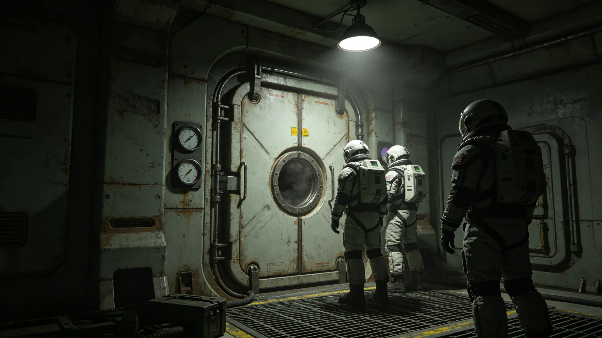

# 世代飞船中央重力环中期检修与主轴承在线更换技术报告

**编制单位**：船体维护署重力环组
**报告编号**：RING-RPT-3672-01
**日期**：3672年3月20日

## 一、报告范围

本报告记述世代飞船中央重力环中期检修与主轴承在线更换工艺。重力环为飞船自转提供0.62g离心重力。

## 二、技术现状

中央自转轴千年疲劳监测（见GS-3572-01）显示，主轴承磨损率较设计值高出百分之一点二。主轴承为第三代，已运行约两千年。本次中期检修更换为第四代在线可更换主轴承。

## 三、在线更换工艺

**第一步 自转减速**。重力环自转由每分钟一转渐降至每分钟零点一转，历时七十二小时。

**第二步 主轴承定位**。定位磨损主轴承，标记更换顺序。

**第三步 在线更换**。新主轴承为模块化单元，机械臂在线更换，无需完全停转。

**第四步 自转恢复**。更换后自转渐升至每分钟一转，历时七十二小时。

**第五步 振动检测**。自转恢复后检测振动，低于基准值为合格。

## 四、更换进度

截至3672年3月，四个主轴承中两个已在线更换，另两个待换。更换后振动检测均合格。

## 五、质量记录

主轴承在线更换无需完全停转，较传统停转更换缩短工期百分之七十。更换期间重力环离心重力由0.62g降至0.58g，连续七十二小时，段内居民骨密度监测未发现异常。

## 六、与前次检修对照

前次主轴承检修为一千年前，需完全停转，工期约一百八十日。本次在线更换无需停转，工期约三十六日。

## 八、主轴承技术细节

第四代主轴承为模块化单元，外径一米二，内径零点八米，厚零点五米。轴承材料为氮化硅陶瓷球轴承，较旧第三代钢轴承寿命提升一倍。轴承外圈含在线更换接口，机械臂可在线更换。

## 九、自转减速与恢复

重力环自转由每分钟一转渐降至每分钟零点一转，历时七十二小时。减速过程中离心重力由0.62g渐降至0.58g，段内居民骨密度监测未发现异常。更换后自转渐升至每分钟一转，历时七十二小时。

## 十、振动检测

自转恢复后检测振动，主轴承处振动加速度低于0.1g为合格。已更换两个主轴承振动检测均合格。

## 十一、与前次检修对照

前次主轴承检修为一千年前，需完全停转，工期约一百八十日。本次在线更换无需停转，工期约三十六日，缩短百分之七十。

## 十三、四个主轴承更换进度总表

| 轴承 | 位置 | 状态 | 振动 |
|---|---|---|---|
| 一 | 轮毂东侧 | 已换 | 合格 |
| 二 | 轮毂西侧 | 已换 | 合格 |
| 三 | 轮毂北侧 | 待换 | 待测 |
| 四 | 轮毂南侧 | 待换 | 待测 |

## 十四、维护署重力环组末注

维护署重力环组注明：在线更换无需完全停转，工期约三十六日，较传统停转更换缩短百分之七十。离心重力降至0.58g连续七十二小时，居民骨密度未发现异常。后续年度以本报告为基准，振动偏差超过基准值百分之五须提交专项说明。

## 十五、十八个月振动检测记录摘录

十八个月内重力环振动检测摘录三条：其一，已换一号主轴承振动加速度0.06g，合格；其二，已换二号主轴承振动加速度0.07g，合格；其三，待换三号主轴承振动加速度0.12g，略高于基准值，已列入下批更换。三条均当日记档。

## 十六、配套文件清单

本报告配套文件三件：一、四个主轴承更换时间表；二、自转减速恢复规程；三、振动检测操作规程。三件配套文件随本报告同时发布。重力环值班室须于更换前完成操作培训。

## 十七、维护署重力环组末注

维护署重力环组注明：在线更换无需完全停转，工期约三十六日。离心重力降至0.58g连续七十二小时，居民骨密度未发现异常。后续年度以本报告为基准，振动偏差超过基准值百分之五须提交专项说明。

## 十八、补充说明

本报告施行首年，四个主轴承中两个已在线更换，另两个待换。更换后振动检测均合格。预计3674年四个主轴承全部更换完成。

## 十九、附则终稿

重力环主轴承在线更换跨三年完成，首年更换两个，预计3674年四个全部更换。本报告为该工程之技术基准件。

本报告为重力环主轴承在线更换之技术基准件，后续检修均以本报告为工艺依据。

本报告随四个主轴承全部更换后终稿。原件封存于船体维护署恒温柜组，副本分发重力环值班室。后续年度以本报告为基准，振动偏差超过基准值百分之五须提交专项说明。

## 十二、附则补

本报告随四个主轴承全部更换后终稿。原件封存于船体维护署恒温柜组，副本分发重力环值班室。后续年度以本报告为基准，振动偏差超过基准值百分之五须提交专项说明。

## 七、附则

本报告随四个主轴承全部更换后终稿。原件封存于船体维护署恒温柜组，副本分发重力环值班室。后续年度以本报告为基准，振动偏差超过基准值百分之五须提交专项说明。

---

**编制人**：船体维护署重力环组
**日期**：3672年3月20日
