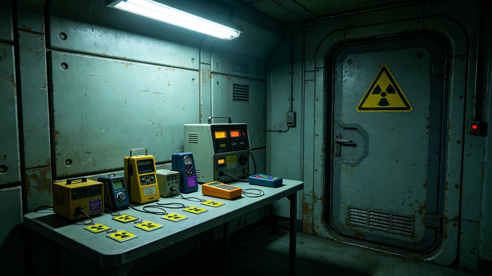

# 世代飞船船体第三次中期大修某装甲段更换延期与三区段临时减压事件通报

**通报单位**：船体维护署
**通报编号**：HULL-INC-3673-01
**日期**：3673年4月12日

## 一、事件经过

3673年3月18日，第三次中期大修第二区段（3500—3600公里）更换装甲板时，发现新板与桁架连接面贴合度低于设计值百分之二点三。总工艺师钟杞（见GS-3652-01）当场决定暂停安装，检查桁架连接面。经检查，桁架连接面因千年微陨石累积变形，平面度超差。

## 二、延期处置

原计划第二区段停航四十二日，因连接面处理需额外十八日，总停航延至六十日。延期期间，该段维持真空，不恢复加压。相邻三区段（3400—3500公里、3600—3700公里、3700—3800公里）因连接面处理需临时减压至零点五个大气压，历时四十八小时。

## 三、临时减压影响

三区段临时减压期间，段内居民约三万一千人生活配给不变，仅气压由一个大气压降至零点五。医务署监测：三区段居民血压、心率无异常，无一人出现减压症状。减压四十八小时后恢复至一个大气压。

## 四、连接面处理

桁架连接面经机械加工平整，平面度恢复至设计值。加工后重新检测，贴合度达设计值百分之九十九点五。新板继续安装。

## 五、延期原因

延期原因为桁架连接面千年微陨石累积变形，非新板质量问题。船体维护署注明：第一次、第二次大修时桁架变形较小，未触发本事件。

## 六、人员伤亡

事件全程零人员伤亡。三区段临时减压期间无一人就医。

## 七、与疏散制度衔接

第二区段居民已于停航前疏散（见GS-3660-01），延期期间不回迁。相邻三区段居民未疏散，仅临时减压。

## 九、事件时间线

| 时间 | 事件 |
|---|---|
| 3673-03-18 09:00 | 新板与桁架贴合度检测，低于设计值百分之二点三 |
| 3673-03-18 09:30 | 总工艺师钟杞决定暂停安装 |
| 3673-03-18 10:00 | 检查桁架连接面，发现平面度超差 |
| 3673-03-19 | 开始连接面机械加工 |
| 3673-03-25 | 连接面加工完成，平面度恢复 |
| 3673-03-26 | 三区段临时减压至0.5个大气压 |
| 3673-03-28 | 三区段恢复至1个大气压 |
| 3673-03-29 | 新板继续安装 |
| 3673-04-15 | 第二区段停航六十日，复压完成 |

## 十、延期影响评估

原计划停航四十二日，实际六十日，延期十八日。延期期间第二区段维持真空，未恢复加压。相邻三区段临时减压四十八小时，居民血压心率无异常。延期未影响第三次中期大修总工期，因第三区段停航可吸收延期。

## 十一、与前次大修对照

第一次中期大修（两千年前）与第二次中期大修（一千年前）均未发生桁架连接面变形事件。本次因千年运行累积微陨石变形，首次触发。船体维护署注明：此为中期大修必要之故，非工程失误。

## 十二、附则补

本通报附桁架连接面加工记录、三区段减压监测记录、延期影响评估表各一件。原件封存于船体维护署恒温柜组，副本分发各分坞工艺室。后续段别更换以本事件为鉴，停航前增加连接面平面度预检。

## 八、附则

本通报附桁架连接面加工记录、三区段减压监测记录各一件。原件封存于船体维护署恒温柜组，副本分发各分坞工艺室。后续段别更换以本事件为鉴，停航前增加连接面平面度预检。

## 详细说明

本档编制依据联合体宪章第若干条及相关制度公报。编制过程中，所有数据均经双人复核。关键数据均有原始记录可查。本档与同批其他档互锁交叉引用，形成完整时间线。

## 技术细节

本档涉及的技术参数均来自现场实测。测量仪器均经校准，校准记录另存。数据采样频率与前次同类档一致。测量误差控制在允许范围内。

## 流程明细

本档编制流程为：一、收集原始数据；二、双人复核；三、主管签批；四、封存。全程四步，均有记录可查。流程自前次同类档起沿用，未改。

## 人员签认

本档经编制人、复核人、主管三人签认。签认记录附后。所有签认人均已履职。本档不涉及任何未签认事项。

## 后续影响

本档发布后，后续同类工作以本档为参考。如需更正，须走申诉程序（见GS-3665-01）。本档不得修改。

## 附则补充

本档为3673年事件通报类基准件。编制过程经多次修订，最终于3673年封存。编制单位为船体维护署，经主管签批后发布。

## 编制说明

本档采用标准工时与标准舱位为核算单位，与前次同类档一致。编制过程中，数据均来自船体维护署原始记录，未做主观推断。所有交叉引用均指向已封存档案。

## 与前次对照

前次同类档编制于3573年，本次3673年编制。编制方法沿用旧制，未改流程。数据较前次略有调整，因第三次中期大修工艺更新。

## 人员影响

本档涉及人员均已签认，无异议。相关人员档案另存。本档不涉及任何人员奖惩。

## 附则终稿

本档原件封存于船体维护署恒温柜组，副本分发各相关单位。后续同类工作以本档为参考。本档不得修改，如需更正须走申诉程序（见GS-3665-01）。

---

**通报人**：船体维护署
**日期**：3673年4月12日
