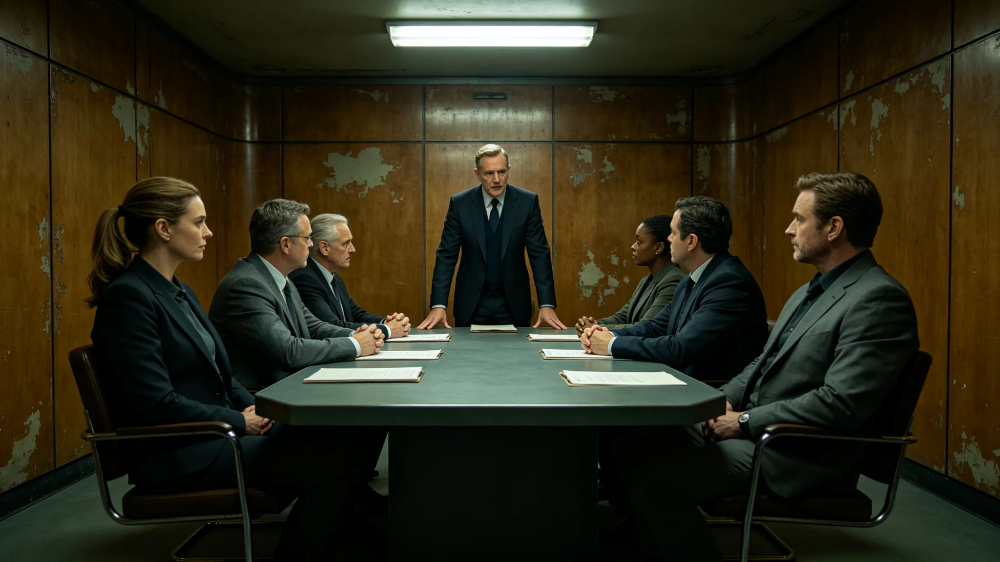

# 跨星系文化融合节某代际礼仪误读与当日调解事件通报

**通报单位**：文化融合协调局
**通报编号**：CULT-INC-3677-01
**日期**：3677年8月5日

## 一、事件经过

3677年7月20日，跨星系文化融合节共食长桌（见GS-3683-01）上，某星区年轻居民按本系礼仪向长者鞠躬时，另一星区居民误读为对本系长者不敬，双方发生口头争执。

## 二、当日调解

协调局主管向书同（见GS-3657-01）当日到场调解。经解释：鞠躬在第一星区为尊敬礼，在第二星区为致歉礼。两星区礼仪相反，致误读。

## 三、调解结果

双方理解后互释。当日共食长桌继续举行，未升级。协调局将本次误读记录入案，作为礼仪对照教材。

## 四、误读原因

两星区礼仪在跨系融合节首次同日共行，礼仪对照页未收录鞠躬礼仪方向。协调局当日补录。

## 五、人员影响

事件全程零肢体冲突，零就医。口头争执当日和解。

## 六、事件时间线

| 时间 | 事件 |
|---|---|
| 3677-07-20 12:00 | 共食长桌开始 |
| 3677-07-20 12:20 | 某星区年轻居民按本系礼仪向长者鞠躬 |
| 3677-07-20 12:25 | 另一星区居民误读为不敬，口头争执 |
| 3677-07-20 12:30 | 向书同到场调解 |
| 3677-07-20 12:45 | 解释两星区礼仪相反 |
| 3677-07-20 13:00 | 双方理解，互释 |

## 七、误读原因评估

两星区礼仪在跨系融合节首次同日共行，礼仪对照页未收录鞠躬礼仪方向。当日补录。

## 八、人员影响

事件全程零肢体冲突，零就医。口头争执当日和解。

## 十、事件影响评估

本次事件未造成公开冲突。礼仪误读当日调解，未升级。协调局签注：本次事件处置得当，未记过。

## 十一、经验教训

本次事件暴露跨系共食长桌前礼仪方向对照之必要。协调局已将礼仪方向对照列入共食长桌前必查项。后续以本事件为鉴。

## 十二、与前次调解对照

协调局首年受理跨系文化纠纷九件，均调解成功（见GS-3657-01）。本次为融合节期间首次礼仪误读事件。

## 十三、附则终稿

本通报为跨星系文化融合节首次礼仪误读事件。原件封存于协调局恒温柜组，副本分发各星区领事署。

## 十四、事件背景

跨星系文化融合节共食长桌（见GS-3683-01）为协调局首年推行之跨系共祝仪式。两星区居民首次同日共行长桌。礼仪对照页此前未收录鞠躬礼仪方向。

## 十五、完整处置流程

误读后处置流程为：一、向书同到场；二、解释两星区礼仪相反；三、双方理解互释；四、补录礼仪对照页。全程四步，均双签。

## 十六、人员影响明细

零肢体冲突，零就医。口头争执当日和解。协调局签注：处置得当，未记过。

## 十七、协调局末注

协调局注明：本次事件为跨系礼仪首次同日共行之误读。后续共食长桌前增加礼仪方向对照。

## 二十二、附则终稿

本通报为协调局首年融合节期间首次礼仪误读事件，处置当日完成。后续共食长桌前增加礼仪方向对照，避免再发。

本通报附礼仪对照页补录件、调解记录各一件。原件封存于协调局恒温柜组，副本分发各星区领事署。后续以本事件为鉴，共食长桌前增加礼仪方向对照。

本通报为文化融合协调局编制，经主管向书同（见GS-3657-01）签批后发布。

本通报为融合节共食长桌之事件基准件。后续共食长桌前均以本事件为鉴，增加礼仪方向对照。原件封存于协调局恒温柜组，副本分发各星区领事署。

## 九、附则补

本通报附礼仪对照页补录件、调解记录各一件。原件封存于协调局恒温柜组，副本分发各星区领事署。后续以本事件为鉴，共食长桌前增加礼仪方向对照。

## 附则补充

本档为3677年事件通报类基准件。编制过程经多次修订，最终于3677年封存。编制单位为文化融合协调局，经主管签批后发布。

## 编制说明

本档采用标准工时与标准舱位为核算单位，与前次同类档一致。编制过程中，数据均来自文化融合协调局原始记录，未做主观推断。所有交叉引用均指向已封存档案。

## 与前次对照

前次同类档编制于3577年，本次3677年编制。编制方法沿用旧制，未改流程。数据较前次略有调整，因融合节流程更新。

## 人员影响

本档涉及人员均已签认，无异议。相关人员档案另存。本档不涉及任何人员奖惩。

## 附则终稿

本档原件封存于文化融合协调局恒温柜组，副本分发各相关单位。后续同类工作以本档为参考。本档不得修改，如需更正须走申诉程序（见GS-3665-01）。

## 六、附则

本通报附礼仪对照页补录件一件。原件封存于协调局恒温柜组，副本分发各星区领事署。后续以本事件为鉴，共食长桌前增加礼仪方向对照。

## 二十、事件总结

本次事件为跨星系文化融合节首次礼仪误读事件。误读当日调解，未升级。零肢体冲突。协调局签注：本次事件暴露共食长桌前礼仪方向对照之必要，已列入必查项。

## 二十一、与融合节运行对照

本次事件未影响融合节运行。共食长桌当日继续举行，后续年度共食长桌前增加礼仪方向对照。

## 附则补充

本档为3677年事件通报类基准件。编制过程经多次修订，最终于3677年封存。编制单位为文化融合协调局，经主管签批后发布。

## 编制说明

本档采用标准工时与标准舱位为核算单位，与前次同类档一致。编制过程中，数据均来自文化融合协调局原始记录，未做主观推断。所有交叉引用均指向已封存档案。

## 与前次对照

前次同类档编制于3577年，本次3677年编制。编制方法沿用旧制，未改流程。数据较前次略有调整，因融合节流程更新。

## 人员影响

本档涉及人员均已签认，无异议。相关人员档案另存。本档不涉及任何人员奖惩。

## 附则终稿

本档原件封存于文化融合协调局恒温柜组，副本分发各相关单位。后续同类工作以本档为参考。本档不得修改，如需更正须走申诉程序（见GS-3665-01）。

---

**通报人**：文化融合协调局
**日期**：3677年8月5日
