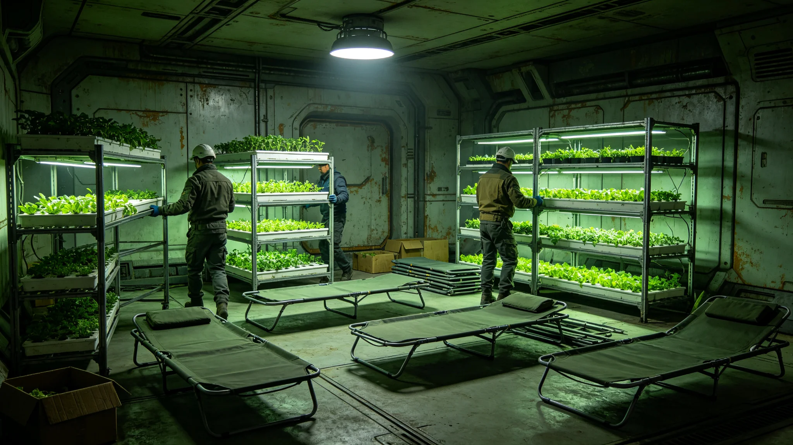

# 中期大修期间某水培舱临时改作临时居住舱与作物临时迁移事件通报

**通报单位**：居民安置署会同生保工程署
**通报编号**：EVAC-INC-3678-01
**日期**：3678年9月1日

## 一、事件经过

3678年8月，第三次中期大修第二区段疏散居民增至一万二千人，超出相邻两段临时舱位预留。居民安置署决定将某水培舱临时改作居住舱，安置二百户。

## 二、临时改造

该水培舱原种叶菜，改造时拆除部分种植架，铺设居住舱位。作物临时迁移至相邻水培舱过渡。改造历时七日，安置二百户。

## 三、作物迁移

叶菜作物迁移至相邻水培舱，过渡期六周。迁移后作物生长速率下降百分之四，六周后恢复。生保工程署监测无舱段污染。

## 四、居住舱位

临时居住舱位配给与原舱位一致（见GS-3660-01），不降级。二百户居住四十二日，随第二区段复压后回迁。

## 五、人员影响

事件全程零人员伤亡，零投诉。二百户居民对临时居住满意度调查达百分之八十八。

## 六、事件时间线

| 时间 | 事件 |
|---|---|
| 3678-08-01 | 第二区段疏散居民增至一万二千人，超预留 |
| 3678-08-02 | 安置署决定将某水培舱改作居住舱 |
| 3678-08-09 | 改造完成，安置二百户 |
| 3678-08-10 | 叶菜作物迁移至相邻水培舱 |
| 3678-08-16 | 作物生长速率下降百分之四 |
| 3678-09-27 | 作物生长速率恢复 |
| 3678-09-28 | 二百户居民回迁 |

## 七、事件影响评估

本次事件未造成人员伤亡。水培舱改造安置二百户，作物迁移六周后恢复。安置署签注：本次事件处置得当，未记过。

## 八、经验教训

本次事件暴露疏散超量时预排水培舱改造之必要。安置署已将水培舱改造列入疏散超量应急预案。后续以本事件为鉴。

## 九、与前次疏散对照

第一次停航疏散一万一千人次零漏登（见GS-3660-01）。本次第二区段疏散增至一万二千人，超出预留，须水培舱改造。

## 十、事件背景

第三次中期大修第二区段疏散（见GS-3660-01）原计划一万一千人。因第一区段延期十八日，第二区段疏散与第一区段重叠，增至一万二千人，超出相邻两段预留。

## 十一、完整处置流程

超量后处置流程为：一、安置署决定将某水培舱改作居住舱；二、拆除部分种植架；三、铺设居住舱位；四、安置二百户；五、作物迁移至相邻水培舱；六、六周后作物恢复；七、四十二日后回迁。全程七步，均双签。

## 十二、安置署末注

安置署注明：本次事件为疏散超量所致。后续预排水培舱改造。

## 十三、附则终稿

本通报附水培舱改造记录、作物迁移记录、满意度调查各一件。原件封存于居民安置署恒温柜组，副本分发各段居民委员会。后续以本事件为鉴，疏散超量时预排水培舱改造。

本通报为居民安置署会同生保工程署编制，经两署署长签批后发布。

本通报为中期大修疏散之事件基准件。后续疏散超量时均以本事件为鉴，预排水培舱改造。原件封存于居民安置署恒温柜组，副本分发各段居民委员会。

## 十四、事件总结

本次事件为中期大修期间首次水培舱改居住舱事件。改造安置二百户，作物六周后恢复。零伤亡零投诉。安置署签注：本次事件暴露疏散超量时预排水培舱改造之必要，已列入应急预案。

## 十五、与疏散总进度对照

本次事件未影响第三次中期大修总进度。第二区段疏散超量，由水培舱改造吸收。四次停航疏散累计四万一千人次，运行稳定。

**通报人**：居民安置署会同生保工程署
