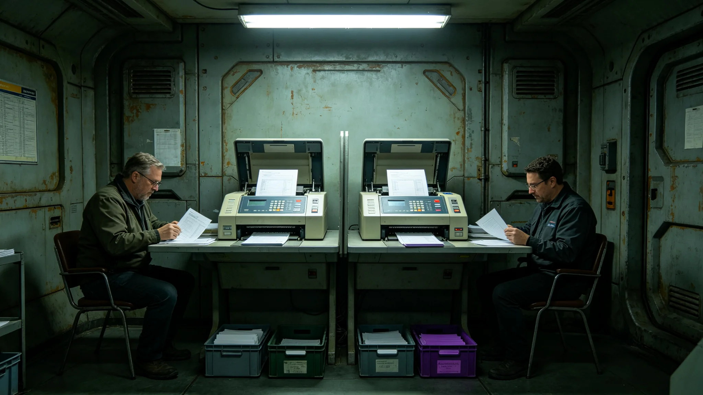

# 第四代领导人换届计票某节点双机比对差异与停机人工重计事件通报

**通报单位**：公民大会监票长办公室
**通报编号**：ELECT-INC-3679-01
**日期**：3679年10月1日

## 一、事件经过

3679年9月15日，第四代领导人换届中期信任投票计票时，某节点双机比对差异达千分之一点四，超过千分之一停机线（见GS-3659-01修订第三条）。监票长当场决定停机人工重计。

## 二、停机重计

停机后，监票长会同双机运维方人工重计该节点选票。重计用时三小时。重计结果：双机差异原因为某机读数系统误差，非选票本身错误。重计后数据一致，未暂缓公布（差异未超千分之三）。

## 三、差异原因

差异原因为某机读数系统误差，非人为舞弊。当日校准该机，复计其余节点无差异。

## 四、结果公布

重计后当日公布结果，较原定延迟三小时。未发生GS-3479-01式十一小时延迟。

## 五、人员影响

事件全程零舞弊嫌疑。监票长签注：双机比对制度（见GS-3659-01）有效拦截系统误差。

## 六、事件时间线

| 时间 | 事件 |
|---|---|
| 3679-09-15 09:00 | 中期信任投票计票开始 |
| 3679-09-15 10:30 | 某节点双机比对差异达千分之一点四 |
| 3679-09-15 10:32 | 监票长决定停机人工重计 |
| 3679-09-15 10:40 | 停机，人工重计开始 |
| 3679-09-15 13:40 | 重计完成，数据一致 |
| 3679-09-15 14:00 | 当日公布结果 |

## 七、与GS-3479对照

3479年计票延迟十一小时（见GS-3479-01）。本次延迟三小时，未发生十一小时延迟。双机比对制度（见GS-3659-01）有效拦截系统误差。

## 八、事件影响评估

本次事件未影响换届结果公布。双机比对差异三小时后重计一致，当日公布。监票长签注：本次事件处置及时，未再延迟十一小时。

## 九、经验教训

本次事件暴露计票前双机读数系统校准之必要。监票长办公室已将双机校准列入计票前必检项。后续换届以本事件为鉴。

## 十、与前次计票对照

3479年计票延迟十一小时（见GS-3479-01）。本次延迟三小时，双机比对制度（见GS-3659-01）有效拦截。

## 十一、事件背景

第四代领导人中期信任投票（见GS-3659-01修订第四条）于3679年9月举行。双机比对制度为3659年修订新增。某节点双机比对差异达千分之一点四，超千分之一停机线。

## 十二、完整处置流程

差异后处置流程为：一、监票长决定停机人工重计；二、停机；三、人工重计三小时；四、发现读数系统误差；五、校准该机；六、复计一致；七、当日公布结果。全程七步，均双签。

## 十三、监票长办公室末注

监票长办公室注明：本次事件为读数系统误差所致。后续计票前增加双机校准。

## 十四、附则终稿

本通报为第四代轮换制下首次双机比对差异事件，处置三小时完成。后续计票前增加双机读数系统校准，避免再发。

本通报附双机比对记录、人工重计记录各一件。原件封存于监票长办公室恒温柜组，副本分发公民大会秘书处。后续换届以本事件为鉴，计票前增加双机读数系统校准。

本通报为公民大会监票长办公室编制，经监票长签批后发布。

本通报为第四代换届之事件基准件。后续换届计票前均以本事件为鉴，增加双机读数系统校准。原件封存于监票长办公室恒温柜组，副本分发公民大会秘书处。

## 十五、事件总结

本次事件为第四代轮换制下首次双机比对差异事件。差异三小时后重计一致，当日公布。零舞弊嫌疑。监票长签注：双机比对制度有效拦截系统误差。

## 十六、与换届总进度对照

本次事件未影响换届结果公布。延迟三小时，未发生3479式十一小时延迟。第四代领导人换届运行稳定。

**通报人**：公民大会监票长办公室
