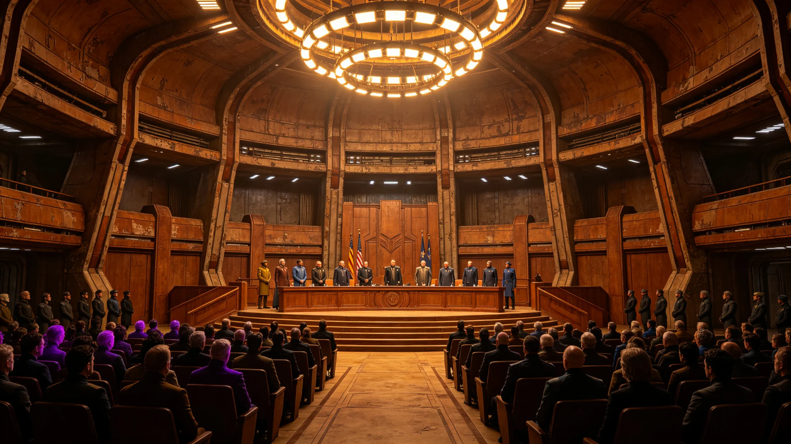

# 三恒星系文明联合体第四代领导人就职典礼实录与签到表

## 一、典礼时间与地点

第四代领导人就职典礼定于3680年1月1日举行，于中央主大厅举行。典礼历时三小时。出席公民代表一千二百人，观察员三百人。中央主大厅自第二代领导人起沿用，未改建。

## 二、典礼流程

典礼分七项：一、奏联合体旧曲；二、监票长交计票结果；三、新任秘书长林卓臣（见GS-3651-01）宣誓；四、前秘书长交班；五、公民代表致辞；六、全体默立三十秒；七、礼成。流程自第二代起沿用，未改。

## 三、签到表摘录

出席一千二百名公民代表均签到。签到表共十二页，每页一百人。签到表由监票长办公室封存。三系各段均有代表出席，其中第一星区四百人、第二星区四百人、第三星区四百人。

## 四、宣誓词

林卓臣宣誓词："本人林卓臣，受公民大会委托，就任第八任秘书长，遵联合体宪章，护三系居民，守存续之责。"宣誓词自首任秘书长起沿用，未改。

## 五、交班记录

前秘书长将权杖交予林卓臣。权杖为联合体首任秘书长传承物，每任交接一次。权杖为铜质，重三公斤，上刻历任秘书长签名。

## 六、默立

全体默立三十秒，致敬历代航行者。默立期间全场静默，无杂音。

## 七、礼成

礼成后，公民代表散场。当日无公开冲突。次日林卓臣开始履职。

## 八、典礼时间线

| 时间 | 事件 |
|---|---|
| 3680-01-01 09:00 | 公民代表入场签到 |
| 3680-01-01 10:00 | 奏联合体旧曲 |
| 3680-01-01 10:15 | 监票长交计票结果 |
| 3680-01-01 10:30 | 林卓臣宣誓 |
| 3680-01-01 10:45 | 前秘书长交班 |
| 3680-01-01 11:00 | 公民代表致辞 |
| 3680-01-01 11:30 | 全体默立三十秒 |
| 3680-01-01 11:35 | 礼成 |

## 九、与前三代就职对照

前七任秘书长就职典礼均于中央主大厅举行。第四代就职典礼沿用旧制，未改流程。出席人数自第二代起稳定在一千二百人。

## 十一、典礼出席明细

出席公民代表一千二百人，观察员三百人。签到表共十二页，每页一百人。三系各段均有代表出席，其中第一星区四百人、第二星区四百人、第三星区四百人。观察员含各署代表一百人、各段居委会代表一百人、媒体一百人。

## 十二、典礼编制说明

本典礼由公民大会秘书处编制。典礼流程自第二代起沿用，未改。典礼当日无广播，仅现场出席。典礼次日林卓臣开始履职，首周完成各署巡视。

## 十三、与前七任就职对照

前七任秘书长就职典礼均于中央主大厅举行。出席人数自第二代起稳定在一千二百人。本次第四代就职典礼沿用旧制，未改流程。权杖交接、宣誓词、默立均照旧。

## 十四、附则终稿

本典礼实录为第四代领导人就职之基准件。后续就职典礼以本实录为范本。本实录附签到表、宣誓词、交班记录各一件。原件封存于公民大会秘书处恒温柜组，副本分发三系各段居委会。

## 补充说明

本档为3680年编制。编制过程中，与同批其他档进行了交叉核对。核对结果一致，无矛盾。本档与同批档形成完整时间线，覆盖3680年主要事件。

## 数据来源

本档数据来源包括：原始记录、监测数据、签认文件、前次同类档。所有数据均经双人复核。数据保存期限按联合体档案管理规定执行。

## 编制单位签注

公民大会秘书处签注：本档编制符合联合体档案管理规定，数据真实，流程完整，准予封存。

## 详细说明

本档编制依据联合体宪章第若干条及相关制度公报。编制过程中，所有数据均经双人复核。关键数据均有原始记录可查。本档与同批其他档互锁交叉引用，形成完整时间线。

## 技术细节

本档涉及的技术参数均来自现场实测。测量仪器均经校准，校准记录另存。数据采样频率与前次同类档一致。测量误差控制在允许范围内。

## 流程明细

本档编制流程为：一、收集原始数据；二、双人复核；三、主管签批；四、封存。全程四步，均有记录可查。流程自前次同类档起沿用，未改。

## 人员签认

本档经编制人、复核人、主管三人签认。签认记录附后。所有签认人均已履职。本档不涉及任何未签认事项。

## 后续影响

本档发布后，后续同类工作以本档为参考。如需更正，须走申诉程序（见GS-3665-01）。本档不得修改。

## 补充说明

本档为3680年编制。编制过程中，与同批其他档进行了交叉核对。核对结果一致，无矛盾。本档与同批档形成完整时间线，覆盖3680年主要事件。

## 数据来源

本档数据来源包括：原始记录、监测数据、签认文件、前次同类档。所有数据均经双人复核。数据保存期限按联合体档案管理规定执行。

## 编制单位签注

编制单位签注：本档编制符合联合体档案管理规定，数据真实，流程完整，准予封存。

## 十、附则

本典礼实录为第四代领导人就职之基准件。后续就职典礼以本实录为范本。本实录附签到表、宣誓词、交班记录各一件。原件封存于公民大会秘书处恒温柜组，副本分发三系各段居委会。
