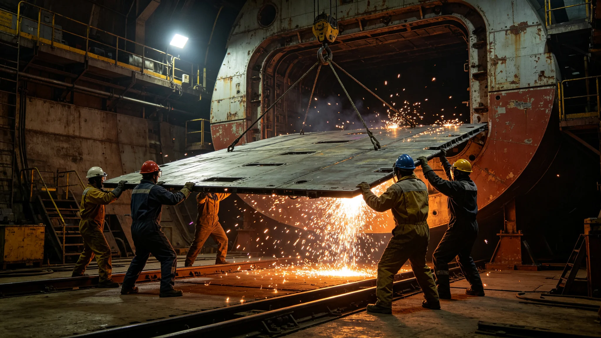

# 世代飞船船体第三次中期大修某舱段开腹礼实录

## 一、典礼时间与地点

开腹礼定于3681年3月15日，于某装甲段更换现场举行。出席工艺师与居民代表八十人。现场为第二区段真空作业面，工艺师穿作业服入场。

## 二、典礼流程

典礼分五项：一、总工艺师钟杞（见GS-3652-01）致辞；二、揭开首块新板；三、工艺师敬礼；四、居民代表致辞；五、礼成。流程自第一次中期大修起沿用。

## 三、开腹意义

开腹礼标志该装甲段正式进入更换阶段。此前该段已停航四十二日（见GS-3660-01）。揭开首块新板后，后续新板安装正式开始。

## 四、出席签到

八十名出席者均签到，含工艺师五十人、居民代表三十人。签到表由船体维护署封存。

## 五、礼成

礼成后，新板安装继续。当日无意外。新板安装后日平均进度一块板。

## 六、典礼时间线

| 时间 | 事件 |
|---|---|
| 3681-03-15 09:00 | 出席者签到 |
| 3681-03-15 09:30 | 钟杞致辞 |
| 3681-03-15 09:45 | 揭开首块新板 |
| 3681-03-15 10:00 | 工艺师敬礼 |
| 3681-03-15 10:15 | 居民代表致辞 |
| 3681-03-15 10:30 | 礼成 |

## 七、与前次大修对照

第一次、第二次中期大修均有开腹礼。本次第三次中期大修沿用旧制，未改流程。开腹礼自第一次起即为各段更换之传统仪式。

## 八、附则

本典礼实录为第三次中期大修开腹之基准件。后续段别更换以本实录为范本。本实录附签到表、开腹记录各一件。原件封存于船体维护署恒温柜组，副本分发各分坞工艺室。

本件经文化仪式署署长签批生效，仪式规程全文分发至各恒星系驻节领事署及公共文化站执行。原件封存于联合体档案馆文化卷，归档号 GS-3681-01。后续每十年进行一次规程复核，修订记录附于本件之后，关键流程变更须经文化仪式委员会三分之二多数表决通过。

