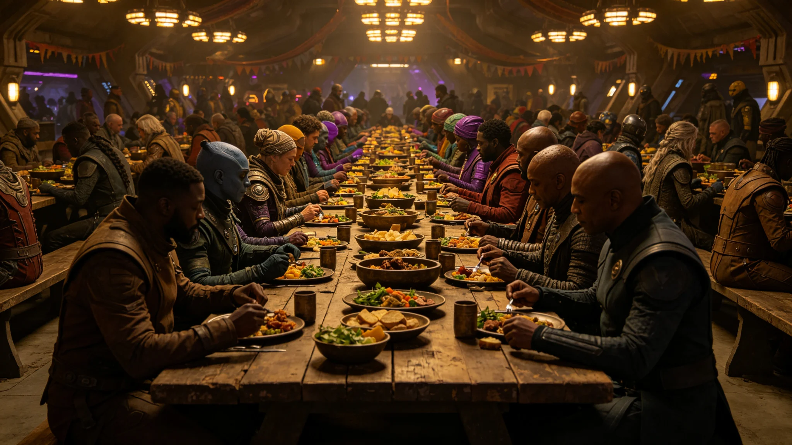

# 跨星系文化融合节共食长桌仪式实录

**实录机构**：文化融合协调局　**仪式日**：3683年7月20日　**举行范围**：中央大厅
**卷宗号**：融合-3683-01　**附件**：签到表一件、礼仪方向对照页一件（均随本实录装订）

共食长桌为跨星系文化融合节（见GS-3663-01）核心仪式，旨在促进三系居民互食互礼。协调局首年融合节未设长桌，本次为首次。

## 一、广播词抄件（播音室存，照录）

> "今日为文化融合节共食长桌日，请于十二时前往中央大厅。"

抄件一页，右上角有协调局广播提醒编号，播音员签认（略）。

## 二、五步双签单（存根照录）

| 步 | 事项 | 时刻 | 协调员签 | 签到员签 |
|---|---|---|---|---|
| 一 | 向书同致辞 | 12:30 | ✓ | ✓ |
| 二 | 各星区居民共食 | 13:00 | ✓ | ✓ |
| 三 | 互赠本系食物 | 14:00 | ✓ | ✓ |
| 四 | 礼仪方向对照 | 14:30 | ✓ | ✓ |
| 五 | 礼成 | 15:00 | ✓ | ✓ |

全程五步，均双签。

## 三、出席签到表（附件之一，照录）

| 项 | 计数 |
|---|---|
| 出席人数 | 800人 |
| 签到完成率 | 100% |
| 三系分布 | 比邻星b 320人、鲸港 240人、主带 240人 |
| 签到依据 | 各星区居民名册逐段勾选 |

签到表由协调局封存，副本分发各星区领事署。

## 四、首次长桌登记表

| 项 | 内容 |
|---|---|
| 长桌长度 | 30米 |
| 铺设位置 | 中央大厅长轴 |
| 首次举办 | 3683年7月20日 |
| 与前次对照 | 协调局首年融合节未设长桌，本次为首次 |
| 礼仪方向 | 见GS-3677-01补录 |

## 五、仪制一行

共食长桌为文化融合节首次设立，此前未设。3677年曾发生礼仪误读事件（见GS-3677-01），本次长桌前增加礼仪方向对照。

## 六、封存与范本

原件封存于协调局恒温柜组，柜位有编号；副本分发各星区领事署，各星区收文登记簿逐件签认。本实录为文化融合节共食长桌之基准件，后续年度以本实录为范本。

> 协调局注：八百人出席，八百分签到。长桌首次设立，三系互食互礼，仪式平稳。

**记录人**：文化融合协调局值班员（签名略）
**日期**：3683年7月20日
